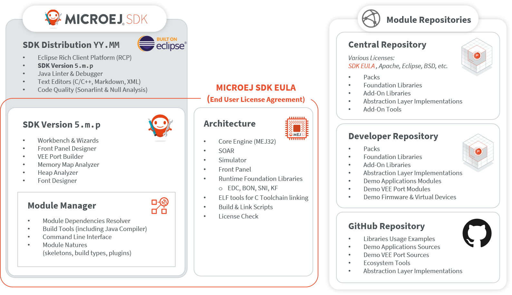

.. _sdk_user_guide:

SDK User Guide
==============

MICROEJ SDK is an integrated environment to create software applications for MicroEJ-ready devices.
The SDK provides tools to write applications and run them on a virtual (simulated) or real device.
The capability to execute an application in a simulated environment allows to quickly test changes done 
in the application code and hence provide a short development feedback loop.

Since the purpose of the SDK is to develop for targeted MCU/MPU computers (IoT, wearable, etc.), it is a cross-development tool.
But unlike standard low-level cross-development tools, 
the SDK offers unique services like hardware simulation and local deployment to the target hardware.

.. figure:: images/1_overview.png
   :alt: MicroEJ Application Development Overview
   :align: center
   :scale: 50%

   MicroEJ Application Development Overview

The SDK is composed of the following main elements:

- **SDK Version 5.x**, an Integrated Development Environment for writing Applications and Firmwares.
  It is based on Eclipse Java edition and relies on the integrated Java compiler (JDT).
  
  It is also packaged with Eclipse to produce a **SDK Distribution**.

- **MicroEJ Module Manager**, the module and build manager used to compile and package any kind of :ref:`MicroEJ modules natures <module_natures>`.
  It provides a Command Line Interface to build modules, especially used in a Continuous Integration environment.
  See :ref:`mmm` section for more details.

- **Architecture**, the software package that includes the MEJ32 port to a target instruction set and a C compiler, SOAR, core libraries and Simulator.
  See :ref:`architecture_overview` section for more details.

The SDK allows to connect repositories hosting software modules in source and binary form. 
By default, it is configured with the repositories provided MicroEJ Corp.: 

- **Central and Developer Repository**, the modules repositories containing all the libraries required to
  develop an Application. See :ref:`module_repositories` section for more details.

- **Github Repositories**, source repositories with examples and demos See :ref:`github` section for more details.

   SDK Detailed View

.. toctree::
   :hidden:
   :maxdepth: 1

   install
   systemRequirements
   workspace
   version
   licenses
   mmm
   sdkReleaseNotes
   sdkChangeLog
   sdkMigrationNotes
   troubleshooting
   
..
   | Copyright 2021-2022, MicroEJ Corp. Content in this space is free 
   for read and redistribute. Except if otherwise stated, modification 
   is subject to MicroEJ Corp prior approval.
   | MicroEJ is a trademark of MicroEJ Corp. All other trademarks and 
   copyrights are the property of their respective owners.
