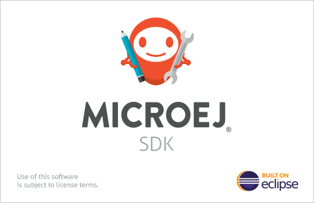

.. _sdk_install:

Installation
============

This chapter will guide you to install the SDK Distribution on your workstation.

If you want to evaluate MicroEJ, we recommend to refer to the :ref:`getting_started` chapter which will guide you to install a SDK Distribution compatible with the Getting Started page.

   SDK Splash Screen

.. toctree::

   installSDKDistributionLatest
   updateSDKVersion
   installSDKDistributionOther
   systemRequirements
   installSDKDistributionTroubleshooting
   

..
   | Copyright 2021-2022, MicroEJ Corp. Content in this space is free 
   for read and redistribute. Except if otherwise stated, modification 
   is subject to MicroEJ Corp prior approval.
   | MicroEJ is a trademark of MicroEJ Corp. All other trademarks and 
   copyrights are the property of their respective owners.
