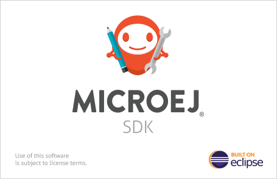

.. warning::

  This documentation is for SDK 5. The latest major version is :ref:`SDK 6 <sdk_6_user_guide>`.
  SDK 5 is in maintenance mode since the release of :ref:`SDK 5.8.0 <changelog-5.8.0>`.
  Consequently, as stated in the :ref:`SDK End User License Agreement (EULA) <sdk_eula>`, the SDK will reach the end of its life by July 2028.
  Contact :ref:`our support team <get_support>` for assistance with migrating to the new SDK, or your sales representative if you require an extension of SDK maintenance as a service.

.. _sdk_install:

Installation
============

This chapter will guide you through the installation process of the SDK Distribution on your workstation.

If you want to evaluate MicroEJ, we recommend that you refer to the :ref:`sdk_6_getting_started` chapter, 
which will guide you to install an SDK Distribution compatible with the Getting Started tutorials.

Otherwise, follow the instructions of the :ref:`sdk_installation_latest` page to install the latest SDK Distribution compatible with your needs.

   SDK Splash Screen

.. toctree::
   :hidden:

   installSDKDistributionLatest
   updateSDKVersion
   installSDKDistributionOther
   systemRequirements   
   troubleshooting
   

..
   | Copyright 2021-2025, MicroEJ Corp. Content in this space is free 
   for read and redistribute. Except if otherwise stated, modification 
   is subject to MicroEJ Corp prior approval.
   | MicroEJ is a trademark of MicroEJ Corp. All other trademarks and 
   copyrights are the property of their respective owners.
