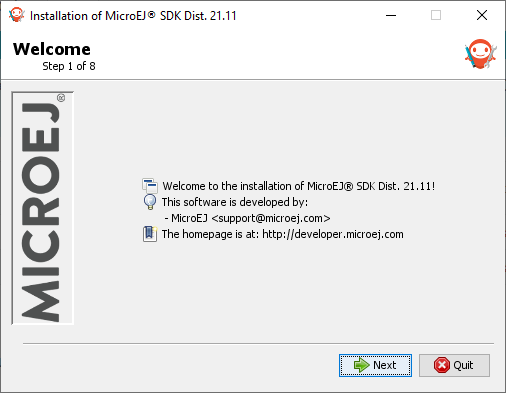
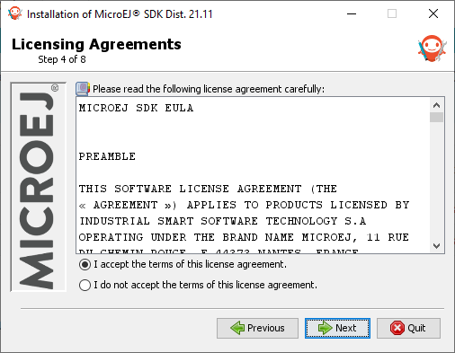
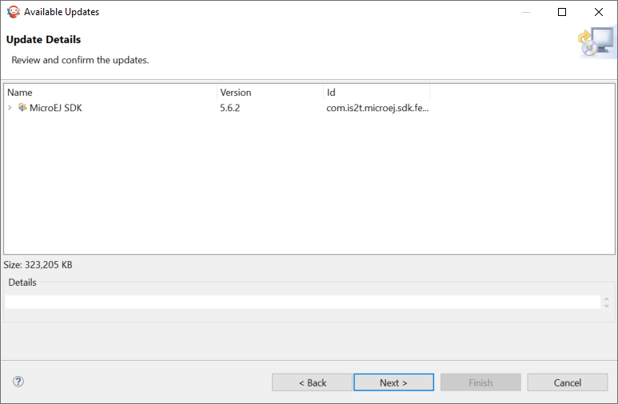

.. _sdk_install:

Download and Install
====================

.. _sdk_download:

Download SDK Distribution
-------------------------

If you are evaluating MicroEJ, you must install the SDK Distribution mentioned in the Getting Started page.
If you are starting a new project, we recommend to install the latest SDK Distribution ``22.06``.

.. note::

   SDK Distribution ``22.06`` requires an :ref:`Architecture <architecture_overview>` ``7.17.0`` or higher for JDK 11 compatibility.
   Check the :ref:`system-requirements` page for the list of supported environments.

.. list-table::
   :widths: 10 5 30 30 30 30 10

   * - **SDK Distribution**
     - **JDK Version**
     - **Windows**
     - **Linux**
     - **macOS x86_64 (Intel chip)**
     - **macOS aarch64 (M1 chip)**
     - **Eclipse Version**
   * - ``22.06``
     - ``11``
     - `Download for Windows <https://repository.microej.com/packages/SDK/22.06/MicroEJ-SDK-Installer-Win64-22.06.exe>`__
     - `Download for Linux <https://repository.microej.com/packages/SDK/22.06/MicroEJ-SDK-Installer-Linux64-22.06.zip>`__
     - `Download for macOS Intel <https://repository.microej.com/packages/SDK/22.06/MicroEJ-SDK-Installer-MacOS-22.06.zip>`__
     - `Download for macOS M1 <https://repository.microej.com/packages/SDK/22.06/MicroEJ-SDK-Installer-MacOS-A64-22.06.zip>`__
     - ``2022-03``
   * - ``21.11``
     - ``8``
     - `Download for Windows <https://repository.microej.com/packages/SDK/21.11/MicroEJ-SDK-Installer-Win64-21.11.exe>`__
     - `Download for Linux <https://repository.microej.com/packages/SDK/21.11/MicroEJ-SDK-Installer-Linux64-21.11.zip>`__
     - `Download for macOS Intel <https://repository.microej.com/packages/SDK/21.11/MicroEJ-SDK-Installer-MacOS-21.11.zip>`__
     - `N/A`
     - ``2020-06``

Once downloaded, execute the installer and follow the installation process.

If you need an older distribution of the SDK, it is available in the `SDK Downloads Page <https://repository.microej.com/packages/SDK/>`_.

.. _sdk_installation_installer:

Install SDK Distribution
------------------------

.. note:: 

   Launching the SDK Distribution installer requires administrator privileges. If you don't have them, please jump to :ref:`sdk_installation_portable` section.

- Launch the installer 

   Welcome to the installer

-  Click on the :guilabel:`Next` button.

- Select :guilabel:`I accept the terms of this license agreement.`. Then click on the :guilabel:`Next` button.

   Accept the terms of this license agreement

- Select the installation path of your SDK. By default it is ``C:/Program Files/MicroEJ/MicroEJ-SDK-{SDK_VERSION}`` for Windows. Then click on the :guilabel:`Next` button.

.. figure:: images/installation_process/installation_path_screen.png
   :alt: Installation path screen
   :align: center

   Choose the installation path

- Click on the :guilabel:`OK` button to confirm the installation path.

.. figure:: images/installation_process/installation_validation_screen.png
   :alt: Confirm path screen
   :align: center

   Confirm your installation path

- Wait until the installation is done. Then click on the :guilabel:`Next` button.

.. figure:: images/installation_process/installation_progress_screen.png
   :alt:  Installation screen
   :align: center

   Installation in progress

- Select options depending on your own preferences. Then click on the :guilabel:`Next` button.

.. figure:: images/installation_process/options_screen.png
   :alt: Options screen
   :align: center

   Select the options

- The installation has completed successfully. Click on the :guilabel:`Done` button.

.. figure:: images/installation_process/installation_finished_screen.png
   :alt: End screen
   :align: center

   Your installation has completed successfully

The SDK Distribution is now installed on your computer. You can launch it from your application launcher or by executing the :guilabel:`MicroEJ` executable in the installation path.

Now you can check if there is a newer SDK version available.

.. _sdk_update:

Update SDK Version
------------------

SDK versions are uploaded to an Eclipse P2 repository located at https://repository.microej.com/p2/sdk/.

.. note::

   To get the current SDK version installed in your SDK Distribution, see the :ref:`get_sdk_version` chapter.

To update your SDK Distribution to a newer SDK version, follow the next steps:

- Select :guilabel:`Help` > :guilabel:`Check for updates`.

.. figure:: images/installation_process/check_update.png
   :alt: End screen
   :align: center
   :scale: 75%

   Check for updates

- If your SDK is up-to-date, you will see the following screen:

.. figure:: images/installation_process/no_update.png
   :alt: End screen
   :align: center

   No update available

- If an update is available, you will see the following screen: 

.. figure:: images/installation_process/update_available.png
   :alt: End screen
   :align: center

   Update available

- Check the version you want to install. Then click on the :guilabel:`Next` button.
- Review and confirm the updates. Then click on the :guilabel:`Next` button.

   Review the updates

- Select :guilabel:`I accept the terms of the license agreements.`. Then click on the :guilabel:`Finish` button.

.. figure:: images/installation_process/license_update.png
   :alt: End screen
   :align: center

   Accept the terms of the license agreement

- Wait until the Software Update pop-up appears. Then click on the :guilabel:`Restart Now` button.

.. figure:: images/installation_process/restart_update.png
   :alt: End screen
   :align: center

   Restart your SDK.

The update of your SDK is done. 

.. _sdk_installation_portable:

Install Portable SDK Distribution 
---------------------------------

- Download the portable package:

.. list-table::
   :widths: 10 5 30 30 30 30 10

   * - **SDK Distribution**
     - **JDK Version**
     - **Windows**
     - **Linux**
     - **macOS x86_64 (Intel chip)**
     - **macOS aarch64 (M1 chip)**
     - **Eclipse Version**
   * - ``22.06``
     - ``11``
     - `Download Portable for Windows <https://repository.microej.com/packages/SDK/22.06/zip/microej-sdk-22.06-win_x86_64.zip>`__
     - `Download Portable for Linux <https://repository.microej.com/packages/SDK/22.06/zip/microej-sdk-22.06-linux_x86_64.zip>`__
     - `Download Portable for macOS Intel <https://repository.microej.com/packages/SDK/22.06/zip/microej-sdk-22.06-macosx_x86_64.zip>`__
     - `Download Portable for macOS M1 <https://repository.microej.com/packages/SDK/22.06/zip/microej-sdk-22.06-macosx_aarch64.zip>`__
     - ``2022-03``
   * - ``21.11``
     - ``8``
     - `Download Portable for Windows <https://repository.microej.com/packages/SDK/21.11/zip/microej-sdk-21.11-win_x86_64.zip>`__
     - `Download Portable for Linux <https://repository.microej.com/packages/SDK/21.11/zip/microej-sdk-21.11-linux_x86_64.zip>`__
     - `Download Portable for macOS Intel <https://repository.microej.com/packages/SDK/21.11/zip/microej-sdk-21.11-macosx_x86_64.zip>`__
     - `N/A`
     - ``2020-06``

- Extract the zip file in the directory of your choice
- Edit ``MicroEJ-SDK.ini`` file
- Configure the path to the compatible JDK by adding the option ``-vm`` at the beginning of the file:

  .. code-block:: xml
     :emphasize-lines: 1,2
     
      -vm
      [path_to_jdk11]/bin
      -startup
      plugins/org.eclipse.equinox.launcher_1.6.400.v20210924-0641.jar
      ...
- Execute ``MicroEJ-SDK.exe`` on Windows or ``MicroEJ-SDK`` to start the SDK.

..
   | Copyright 2021-2022, MicroEJ Corp. Content in this space is free 
   for read and redistribute. Except if otherwise stated, modification 
   is subject to MicroEJ Corp prior approval.
   | MicroEJ is a trademark of MicroEJ Corp. All other trademarks and 
   copyrights are the property of their respective owners.
