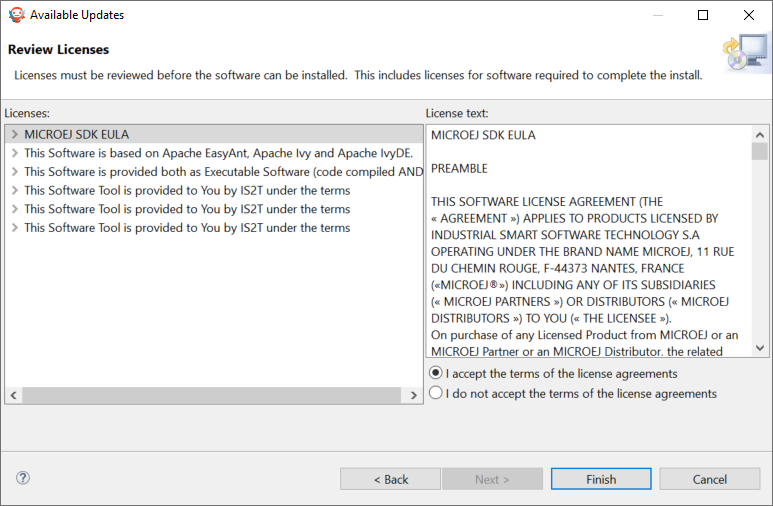

.. _sdk_install:

Download and Install
====================

.. _sdk_download:

Download
--------

.. list-table::
   :widths: 10 5 10 30 30 30 30 

   * - **SDK Distribution**
     - **JDK Version**
     - **Eclipse Version**
     - **Windows**
     - **Linux**
     - **macOS x86_64 (Intel chip)**
     - **macOS aarch64 (M1 chip)**
   * - ``21.11``
     - ``8``
     - ``2020-06``
     - `Download for Windows <https://repository.microej.com/packages/SDK/21.11/MicroEJ-SDK-Installer-Win64-21.11.exe>`__
     - `Download for Linux <https://repository.microej.com/packages/SDK/21.11/MicroEJ-SDK-Installer-Linux64-21.11.zip>`__
     - `Download for macOS Intel <https://repository.microej.com/packages/SDK/21.11/MicroEJ-SDK-Installer-MacOS-21.11.zip>`__
     - `N/A`
   * - ``22.06``
     - ``11``
     - ``2022-03``
     - `Download for Windows <https://repository.microej.com/packages/SDK/22.06/MicroEJ-SDK-Installer-Win64-22.06.exe>`__
     - `Download for Linux <https://repository.microej.com/packages/SDK/22.06/MicroEJ-SDK-Installer-Linux64-22.06.zip>`__
     - `Download for macOS Intel <https://repository.microej.com/packages/SDK/22.06/MicroEJ-SDK-Installer-MacOS-22.06.zip>`__
     - `Download for macOS M1 <https://repository.microej.com/packages/SDK/22.06/MicroEJ-SDK-Installer-MacOS-A64-22.06.zip>`__

Check the :ref:`system-requirements` page for the list of supported environments.

.. note::

   SDK Distribution ``22.06`` requires to have an :ref:`Architecture <architecture_overview>` ``7.17`` or more.
   So make sure to use the right Architecture version if you want to use this newer SDK Distribution version.

Once downloaded, execute the installer and follow the installation process.

If you need an older distribution of the SDK, it is available in the `SDK Downloads Page <https://repository.microej.com/packages/SDK/>`_.

.. _sdk_installation_process:

Installation
------------

- Launch the installer and click on the :guilabel:`Next` button.

.. figure:: images/installation_process/welcome_screen.png
   :alt: Welcome screen
   :align: center

   Welcome to the installer

- Be aware of the licensing agreement.
- Select :guilabel:`I accept the terms of this license agreement.`. Then click on the :guilabel:`Next` button.

.. figure:: images/installation_process/license_screen.png
   :alt: License screen
   :align: center

   Accept the terms of this license agreement

- Select the installation path of your SDK. By default it is ``C:/Program Files/MicroEJ/MicroEJ-SDK-{SDK_VERSION}`` for Windows. Then click on the :guilabel:`Next` button.

.. figure:: images/installation_process/installation_path_screen.png
   :alt: Installation path screen
   :align: center

   Choose the installation path

- Click on the :guilabel:`OK` button to confirm the installation path.

.. figure:: images/installation_process/installation_validation_screen.png
   :alt: Confirm path screen
   :align: center

   Confirm your installation path

- Wait until the installation is done. Then click on the :guilabel:`Next` button.

.. figure:: images/installation_process/installation_progress_screen.png
   :alt:  Installation screen
   :align: center

   Installation in progress

- Select options depending on your own preferences. Then click on the :guilabel:`Next` button.

.. figure:: images/installation_process/options_screen.png
   :alt: Options screen
   :align: center

   Select the options

- The installation has completed successfully. Click on the :guilabel:`Done` button.

.. figure:: images/installation_process/installation_finished_screen.png
   :alt: End screen
   :align: center

   Your installation has completed successfully

The SDK is now installed on your computer. You can launch it from your application launcher or by executing the :guilabel:`MicroEJ` executable in the installation path.

At the first launch, please check if there is a newer version available. If so, please update your SDK. 

.. _sdk_update:

Update the version
------------------

- Select :guilabel:`Help` > :guilabel:`Check for updates`.

   Check for updates

- If there is no update available, you will see the following screen:

   No update available

- If there is an update available, you will see the following screen: 

.. figure:: images/installation_process/update_available.png
   :alt: End screen
   :align: center

   Update available

- Check the update you want to install. Then click on the :guilabel:`Next` button.
- Review and confirm the updates. Then click on the :guilabel:`Next` button.

.. figure:: images/installation_process/review_update.png
   :alt: End screen
   :align: center

   Review the updates

- Be aware of the licensing agreement.
- Select :guilabel:`I accept the terms of the license agreements.`. Then click on the :guilabel:`Finish` button.

   Accept the terms of the license agreement

- Wait until the Software Update pop-up appears. Then click on the :guilabel:`Restart Now` button.

.. figure:: images/installation_process/restart_update.png
   :alt: End screen
   :align: center

   Restart your SDK.

The update of your SDK is done. 

..
   | Copyright 2021-2022, MicroEJ Corp. Content in this space is free 
   for read and redistribute. Except if otherwise stated, modification 
   is subject to MicroEJ Corp prior approval.
   | MicroEJ is a trademark of MicroEJ Corp. All other trademarks and 
   copyrights are the property of their respective owners.
