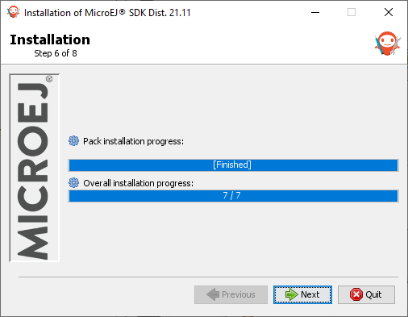
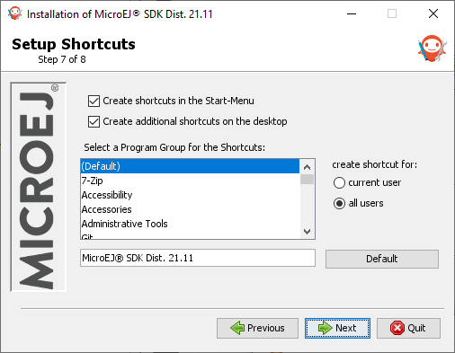

.. _sdk_install:

Download and Install
====================

.. _sdk_download:

Download
--------

The SDK is available for download at https://developer.microej.com/microej-sdk-software-development-kit. Check the :ref:`system-requirements` page for the list of supported environments.

.. note::

   The SDK Distribution proposed by default is the version ``21.11``.
   A newer version, the ``22.06``, is also available in the `SDK Downloads Page <https://repository.microej.com/packages/SDK/>`_ but it requires to have an :ref:`Architecture <architecture_overview>` ``7.17`` or more.
   So make sure to use the right Architecture version if you want to use this newer SDK Distribution version.

Once downloaded, execute the installer and follow the :ref:`installation process <sdk_installation_process>`.

.. _sdk_installation_process:

Installation
--------------------

- Launch the installer and click on :guilabel:`Next` button.

.. figure:: images/installation_process/welcome_screen.png
   :alt: Welcome screen
   :align: center

   Welcome to the installer

- Be aware of the licensing agreement.
- Select :guilabel:`I accept the terms of this license agreement.`. Click on :guilabel:`Next` button.

.. figure:: images/installation_process/license_screen.png
   :alt: License screen
   :align: center

   Accept the terms of this license agreement

- Select the installation path of your SDK. By default it is ``C:/Program Files/MicroEJ/MicroEJ-SDK-{SDK_VERSION}`` for Windows. Click on :guilabel:`Next` button.

.. figure:: images/installation_process/installation_path_screen.png
   :alt: Installation path screen
   :align: center

   Choose the installation path

- Click on :guilabel:`OK` button to confirm the installation path.

.. figure:: images/installation_process/installation_validation_screen.png
   :alt: Confirm path screen
   :align: center

   Confirm your installation path

- Wait until the installation is done. Click on :guilabel:`Next` button.

   Installation in progress

- Select options depending on your own preferences. Click on :guilabel:`Next` button.

   Select the options

- The installation has completed successfully. Click on :guilabel:`Done` button.

.. figure:: images/installation_process/installation_finished_screen.png
   :alt: End screen
   :align: center

   Your installation has completed successfully

The SDK is now installed on your computer. You can launch it from your application launcher or by executing the :guilabel:`MicroEJ` executable in the installation path.

At the first launch, please check if there is a newer version available (Select :guilabel:`Help` > :guilabel:`Check for updates`. If so, please install it. 

..
   | Copyright 2021-2022, MicroEJ Corp. Content in this space is free 
   for read and redistribute. Except if otherwise stated, modification 
   is subject to MicroEJ Corp prior approval.
   | MicroEJ is a trademark of MicroEJ Corp. All other trademarks and 
   copyrights are the property of their respective owners.
