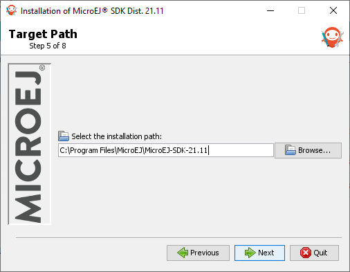

.. _sdk_installation_21_11:

Install SDK Distribution 21.11
==============================

This section will guide you through the installation process of the SDK Distribution ``21.11`` using the step-by-step executable installer.

The SDK Distribution ``21.11`` requires a JRE or a JDK 8 and is not available for macOS with M1 chips.
See the :ref:`system-requirements` page for more information on the list of supported environments.

.. note:: 

   Launching the SDK Distribution installer requires administrator privileges and a JDK 8 installed by default on your workstation.
   If you don't have one of them or if you do not want to modify your default settings, please jump to :ref:`sdk_installation_portable` section.

Download SDK Distribution
-------------------------

Download the SDK Distribution ``21.11`` installer for your operating system:

   - `Windows (.exe) <https://repository.microej.com/packages/SDK/21.11/MicroEJ-SDK-Installer-Win64-21.11.exe>`__
   - `Linux (.zip) <https://repository.microej.com/packages/SDK/21.11/MicroEJ-SDK-Installer-Linux64-21.11.zip>`__
   - `macOS x86_64 - Intel chip (.zip) <https://repository.microej.com/packages/SDK/21.11/MicroEJ-SDK-Installer-MacOS-21.11.zip>`__

Check JDK Version
-----------------

The SDK Distribution ``21.11`` installer requires a JDK 8 installed by default on your workstation.
If you don't have any JDK installed, see the :ref:`get_jdk` section.

Check the default Java version by running the following command in a new terminal:

.. code-block::
   :emphasize-lines: 3
     
   > java -version
     
   java version "1.8.0_281"
   Java(TM) SE Runtime Environment (build 1.8.0_281-b09)
   Java HotSpot(TM) 64-Bit Server VM (build 25.281-b09, mixed mode)

Now you can proceed with the installation steps.

Install SDK Distribution
------------------------

- Launch the installer executable
  
  - On Windows, start ``MicroEJ-SDK-Installer-Win64-21.11.exe``.
  - On Linux, unzip ``MicroEJ-SDK-Installer-Linux64-21.11.zip`` and start ``MicroEJ-SDK-Installer-Linux64-21.11.sh``.
  - On macOS, unzip ``MicroEJ-SDK-Installer-Linux64-21.11.zip`` and start ``MicroEJ-SDK-Installer-MacOS-21.11.app``.
    In case of error, check your app has not been put in quarantine (see :ref:`macOS troubleshooting <sdk_install_troubleshooting_macos>` section).

.. figure:: images/installation_process/SDK21_11/welcome_screen.png
   :alt: Welcome screen
   :align: center

   Welcome to the installer

-  Click on the :guilabel:`Next` button.

- Select :guilabel:`I accept the terms of this license agreement.`. Then click on the :guilabel:`Next` button.

.. figure:: images/installation_process/SDK21_11/license_screen.png
   :alt: License screen
   :align: center

   Accept the terms of this license agreement

- Select the installation path of your SDK. By default it is ``C:\Program Files\MicroEJ\MicroEJ-SDK-21.11`` for Windows. Then click on the :guilabel:`Next` button.

   Choose the installation path

- Click on the :guilabel:`OK` button to confirm the installation path.

.. figure:: images/installation_process/SDK21_11/installation_validation_screen.png
   :alt: Confirm path screen
   :align: center

   Confirm your installation path

- Wait until the installation is done. Then click on the :guilabel:`Next` button.

.. figure:: images/installation_process/SDK21_11/installation_progress_screen.png
   :alt:  Installation screen
   :align: center

   Installation in progress

- Select options depending on your own preferences. Then click on the :guilabel:`Next` button.

.. figure:: images/installation_process/SDK21_11/options_screen.png
   :alt: Options screen
   :align: center

   Select the options

- The installation has completed successfully. Click on the :guilabel:`Done` button.

.. figure:: images/installation_process/SDK21_11/installation_finished_screen.png
   :alt: End screen
   :align: center

   Your installation has completed successfully

The SDK Distribution is now installed on your computer. You can launch it from your application launcher or by executing the :guilabel:`MicroEJ` executable in the installation path.

Once the SDK is started, it is recommended to check if updates are available (see :ref:`sdk_update` section).
If your are running SDK on Windows OS, it is also strongly recommended to configure :ref:`Windows defender exclusion rules <sdk_install_troubleshooting_windows>`.

..
   | Copyright 2021-2022, MicroEJ Corp. Content in this space is free 
   for read and redistribute. Except if otherwise stated, modification 
   is subject to MicroEJ Corp prior approval.
   | MicroEJ is a trademark of MicroEJ Corp. All other trademarks and 
   copyrights are the property of their respective owners.
