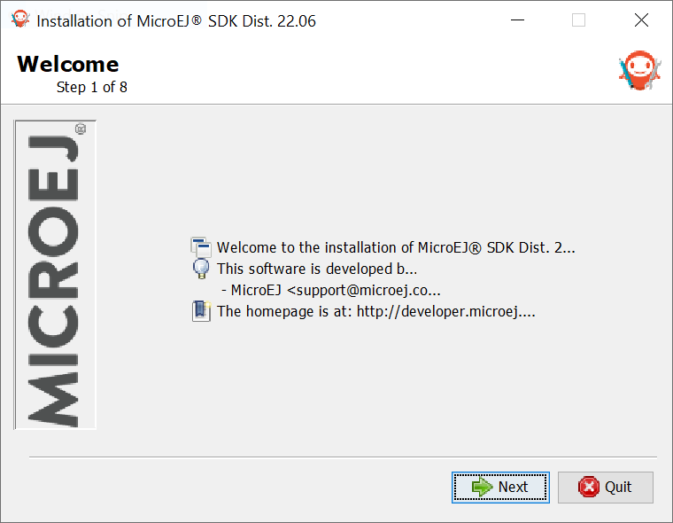
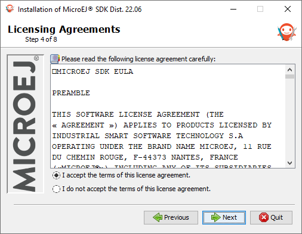
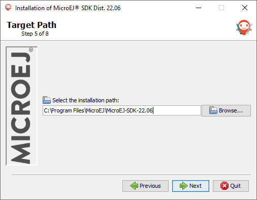
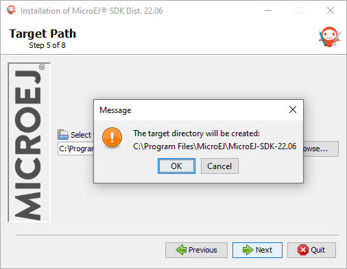
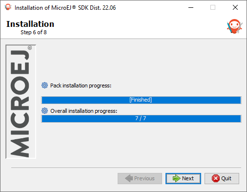
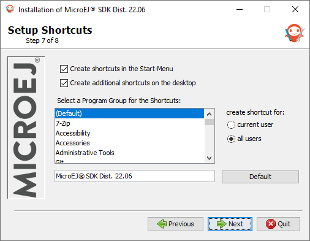
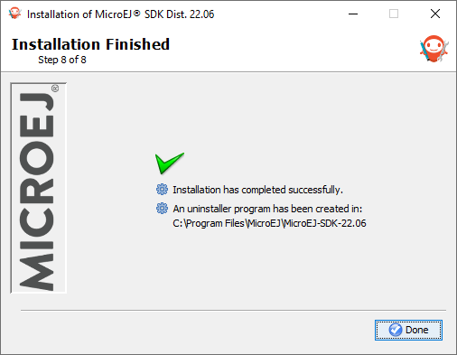

.. _sdk_installation_latest:

Install Latest SDK Distribution
===============================

This section will guide you through the installation process of the latest SDK Distribution ``23.02`` using the step-by-step executable installer.

The SDK Distribution ``23.02`` requires a JDK 11 and thus can only work with an :ref:`Architecture 7.17.0 <changelog-7.17.0>` or higher.
In all other cases, please jump to :ref:`sdk_installation_21_11` section.
See also the :ref:`system-requirements` page for more information on the list of supported environments.

.. note:: 

   Launching the SDK Distribution installer requires administrator privileges and a JDK 11 installed by default on your workstation.
   If you don't have one of them or if you do not want to modify your default settings, please jump to :ref:`sdk_installation_portable` section.

Download SDK Distribution
-------------------------

Download the SDK Distribution ``23.02`` installer for your operating system:

- `Windows (.exe) <https://repository.microej.com/packages/SDK/23.02/MicroEJ-SDK-Installer-Win64-23.02.exe>`__
- `Linux  (.zip) <https://repository.microej.com/packages/SDK/23.02/MicroEJ-SDK-Installer-Linux64-23.02.zip>`__
- `macOS x86_64 - Intel chip (.zip) <https://repository.microej.com/packages/SDK/23.02/MicroEJ-SDK-Installer-MacOS-23.02.zip>`__
- `macOS aarch64 - M1 chip (.zip) <https://repository.microej.com/packages/SDK/23.02/MicroEJ-SDK-Installer-MacOS-A64-23.02.zip>`__

Check JDK Version
-----------------

From the version ``22.06``, the SDK Distribution installer requires a JDK 11 installed by default on your workstation.
If you don't have any JDK installed, see the :ref:`get_jdk` section.

Check the default Java version by running the following command in a new terminal:

.. code-block::
   :emphasize-lines: 3
     
   > java -version
     
   openjdk version "11.0.15" 2022-04-19
   OpenJDK Runtime Environment Temurin-11.0.15+10 (build 11.0.15+10)
   OpenJDK 64-Bit Server VM Temurin-11.0.15+10 (build 11.0.15+10, mixed mode)

Now you can proceed with the installation steps.

Install SDK Distribution
------------------------

- Launch the installer executable
  
  - On Windows, start ``MicroEJ-SDK-Installer-Win64-22.06.exe``.
  - On Linux, unzip ``MicroEJ-SDK-Installer-Linux64-22.06.zip`` and start ``MicroEJ-SDK-Installer-Linux64-1.0.0.sh``.
  - On macOS, unzip ``MicroEJ-SDK-Installer-Linux64-22.06.zip`` and start ``MicroEJ-SDK-Installer-MacOS-1.0.0.app``. 
    In case of error, check your app has not been put in quarantine (see :ref:`macOS troubleshooting <sdk_install_troubleshooting_macos>` section)

   Welcome to the installer

-  Click on the :guilabel:`Next` button.

- Select :guilabel:`I accept the terms of this license agreement.`. Then click on the :guilabel:`Next` button.

   Accept the terms of this license agreement

- Select the installation path of your SDK. By default it is ``C:\Program Files\MicroEJ\MicroEJ-SDK-22.06`` for Windows. Then click on the :guilabel:`Next` button.

   Choose the installation path

- Click on the :guilabel:`OK` button to confirm the installation path.

   Confirm your installation path

- Wait until the installation is done. Then click on the :guilabel:`Next` button.

   Installation in progress

- Select options depending on your own preferences. Then click on the :guilabel:`Next` button.

   Select the options

- The installation has completed successfully. Click on the :guilabel:`Done` button.

   Your installation has completed successfully

The SDK Distribution is now installed on your computer. You can launch it from your application launcher or by executing the :guilabel:`MicroEJ` executable in the installation path.

Once the SDK is started, it is recommended to check if updates are available (see :ref:`sdk_update` section).
If your are running SDK on Windows OS, it is also strongly recommended to configure :ref:`Windows defender exclusion rules <sdk_install_troubleshooting_windows>`.

..
   | Copyright 2021-2023, MicroEJ Corp. Content in this space is free 
   for read and redistribute. Except if otherwise stated, modification 
   is subject to MicroEJ Corp prior approval.
   | MicroEJ is a trademark of MicroEJ Corp. All other trademarks and 
   copyrights are the property of their respective owners.
