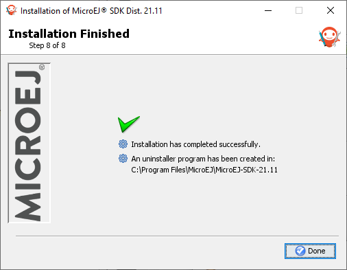

.. _sdk_installation_latest:

Install Latest SDK Distribution
===============================

This section will guide you to install the latest SDK Distribution ``22.06`` using the step-by-step executable installer.

The SDK Distribution ``22.06`` requires a JDK 11 and thus can only work with an :ref:`Architecture <architecture_overview>` ``7.17.0`` or higher.
If you want to evaluate MicroEJ, please refer to the :ref:`getting_started` chapter that will guide you to install a SDK Distribution compatible with the Getting Started page.
See also the :ref:`system-requirements` page for more information on the list of supported environments.

.. note:: 

   Launching the SDK Distribution installer requires administrator privileges and a JDK 11 installed by default on your workstation.
   If you don't have one of them or if you do not want to modify your default settings, please jump to :ref:`sdk_installation_portable` section.

Download SDK Distribution
-------------------------

Download the SDK Distribution ``22.06`` installer for your operating system:

- `Windows (.exe) <https://repository.microej.com/packages/SDK/22.06/MicroEJ-SDK-Installer-Win64-22.06.exe>`__
- `Linux  (.zip) <https://repository.microej.com/packages/SDK/22.06/MicroEJ-SDK-Installer-Linux64-22.06.zip>`__
- `macOS Intel (.zip) <https://repository.microej.com/packages/SDK/22.06/MicroEJ-SDK-Installer-MacOS-22.06.zip>`__
- `macOS M1 (.zip) <https://repository.microej.com/packages/SDK/22.06/MicroEJ-SDK-Installer-MacOS-A64-22.06.zip>`__

Check JDK Version
-----------------

The SDK Distribution ``22.06`` installer requires a JDK 11 installed by default on your workstation.
If you don't have any JDK installed, see the :ref:`get_jdk` section.

Check the default Java version by running the following command in a new terminal:

.. code-block::
   :emphasize-lines: 3
     
   > java -version
     
   openjdk version "11.0.15" 2022-04-19
   OpenJDK Runtime Environment Temurin-11.0.15+10 (build 11.0.15+10)
   OpenJDK 64-Bit Server VM Temurin-11.0.15+10 (build 11.0.15+10, mixed mode)

Now you can proceed with the installation steps.

Install SDK Distribution
------------------------

- Launch the installer executable
  
  - On Windows, start ``MicroEJ-SDK-Installer-Win64-22.06.exe``.
  - On Linux, unzip ``MicroEJ-SDK-Installer-Linux64-22.06.zip`` and start ``MicroEJ-SDK-Installer-Linux64-1.0.0.sh``.
  - On macOS, unzip ``MicroEJ-SDK-Installer-Linux64-22.06.zip`` and start ``MicroEJ-SDK-Installer-MacOS-1.0.0.app``.

.. figure:: images/installation_process/welcome_screen.png
   :alt: Welcome screen
   :align: center

   Welcome to the installer

-  Click on the :guilabel:`Next` button.

- Select :guilabel:`I accept the terms of this license agreement.`. Then click on the :guilabel:`Next` button.

.. figure:: images/installation_process/license_screen.png
   :alt: License screen
   :align: center

   Accept the terms of this license agreement

- Select the installation path of your SDK. By default it is ``C:/Program Files/MicroEJ/MicroEJ-SDK-{SDK_VERSION}`` for Windows. Then click on the :guilabel:`Next` button.

.. figure:: images/installation_process/installation_path_screen.png
   :alt: Installation path screen
   :align: center

   Choose the installation path

- Click on the :guilabel:`OK` button to confirm the installation path.

   Confirm your installation path

- Wait until the installation is done. Then click on the :guilabel:`Next` button.

.. figure:: images/installation_process/installation_progress_screen.png
   :alt:  Installation screen
   :align: center

   Installation in progress

- Select options depending on your own preferences. Then click on the :guilabel:`Next` button.

.. figure:: images/installation_process/options_screen.png
   :alt: Options screen
   :align: center

   Select the options

- The installation has completed successfully. Click on the :guilabel:`Done` button.

   Your installation has completed successfully

The SDK Distribution is now installed on your computer. You can launch it from your application launcher or by executing the :guilabel:`MicroEJ` executable in the installation path.

Now you can check if there is a newer SDK version available.

..
   | Copyright 2021-2022, MicroEJ Corp. Content in this space is free 
   for read and redistribute. Except if otherwise stated, modification 
   is subject to MicroEJ Corp prior approval.
   | MicroEJ is a trademark of MicroEJ Corp. All other trademarks and 
   copyrights are the property of their respective owners.
