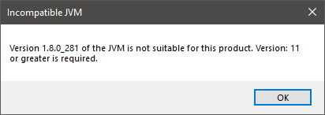

Troubleshooting
---------------

Incompatible Default Java Version
^^^^^^^^^^^^^^^^^^^^^^^^^^^^^^^^^

When launching the installer, you may get the following error: :guilabel:`The application you are trying to install requires a JDK11`.

.. figure:: images/installation_process/incompatible_default_java_version_installer.png
   :align: center

Or when launching the SDK, you may get the following error: :guilabel:`Version: 11 or greater is required`.

The default Java version installed on your system is not compatible. You have two options:

- either install a JDK 11 as your default JVM,
- or install the :ref:`portable SDK Distribution <sdk_installation_portable>` if you don't want to modify your default JVM version. 
  
This latter case is recommended if you are installing SDK Dist. ``22.06`` while you already have active projects based on SDK Dist. ``21.11``.

..
   | Copyright 2021-2022, MicroEJ Corp. Content in this space is free 
   for read and redistribute. Except if otherwise stated, modification 
   is subject to MicroEJ Corp prior approval.
   | MicroEJ is a trademark of MicroEJ Corp. All other trademarks and 
   copyrights are the property of their respective owners.
