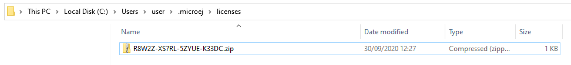
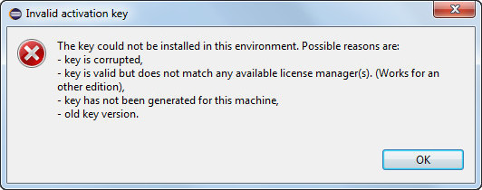
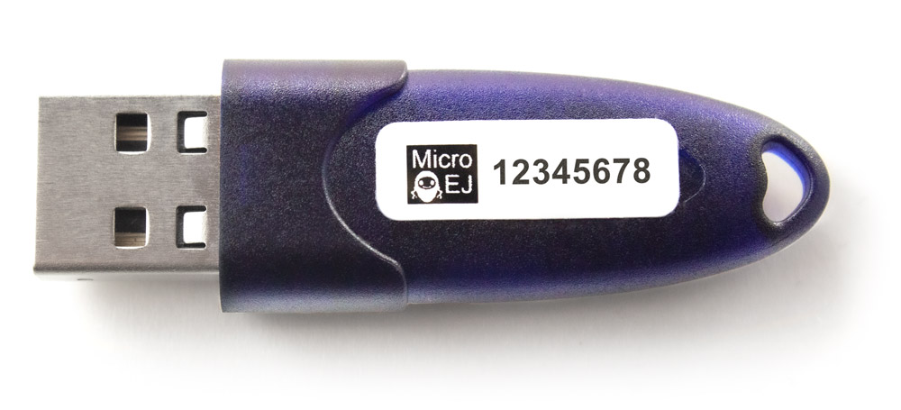
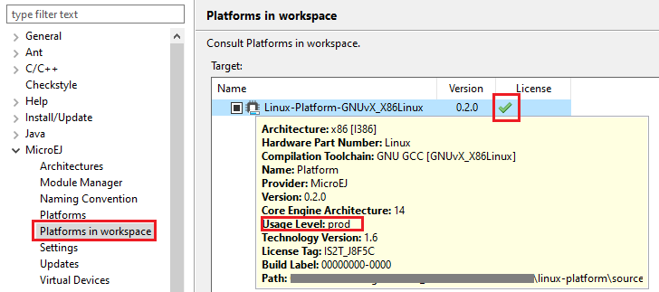

Licenses
========

.. _license_manager:

License Manager Overview
------------------------

MicroEJ Architectures are distributed in two different versions:

- Evaluation Architectures, associated with a software license key. They can be downloaded at `<https://repository.microej.com/modules/com/microej/architecture/>`_.
- Production Architectures, associated with a hardware license key stored on a USB dongle. They can be requested to :ref:`our support team <get_support>`.

The license manager is provided with MicroEJ Architectures and then integrated into Platforms, consequently:

- Evaluation licenses will be shown only if at least one Evaluation Architecture or Platform built from an Evaluation Architecture 
  has been imported in the SDK.
- Production licenses will be shown only if at least one Production Architecture or Platform built from a Production Architecture 
  has been imported in the SDK.

The list of installed licenses is available in the SDK preferences dialog page in :guilabel:`Window`
> :guilabel:`Preferences` > :guilabel:`MicroEJ`:

.. figure:: images/preferences/licenses.jpg
   :alt: MicroEJ Licenses View
   :align: center

   MicroEJ Licenses View

License Check
-------------

The table below summarizes where the license is checked.

.. list-table::
   :widths: 30 10 10

   * - **Application**
     - **Run on Simulator**
     - **Build on Device**
   * - Standalone Application
     - NO
     - **YES**
   * - Sandboxed Application
     - NO
     - NO

.. _evaluation_license:

Evaluation Licenses
-------------------

This section should be considered when using Evaluation Architectures, which
use software license keys. A machine UID needs to be provided
to activate an Evaluation license on the MicroEJ Licenses Server. The machine UID is a 16 hexadecimal digits number.

Get your Machine UID
~~~~~~~~~~~~~~~~~~~~

Retrieving the machine UID depends on the kind of MicroEJ Platform being evaluated.

If your MicroEJ Platform is already :ref:`imported in Package Explorer <source_platform_import>` and built with :ref:`mmm`, the MicroEJ Architecture has been automatically imported.
The machine UID will be displayed when building a :ref:`MicroEJ Standalone Application on device <device_build>`.

.. code-block:: console
   :emphasize-lines: 1

   [INFO ] Launching in Evaluation mode. Your UID is XXXXXXXXXXXXXXXX.
   [ERROR] Invalid license check (No license found).

Otherwise, a MicroEJ Architecture or Platform should have been manually imported from the SDK preferences page. 
The machine UID can be retrieved as follows:

- Go to :guilabel:`Window` > :guilabel:`Preferences` > :guilabel:`MicroEJ`,
- Select either :guilabel:`Architectures` or :guilabel:`Platforms`, 
- Click on one of the available Architectures or Platforms,
- Press the :guilabel:`Get UID` button to get the machine UID.

.. note:: 

   To access this :guilabel:`Get UID` option, at least one Evaluation Architecture or Platform must have been imported before (see :ref:`license_manager`).

Copy the UID. It will be needed when requesting a license.

.. figure:: images/preferences/uid.jpg
   :alt: Machine UID for Evaluation License
   :align: center
   :width: 532px
   :height: 172px

   Machine UID for Evaluation License

Request your Activation Key
~~~~~~~~~~~~~~~~~~~~~~~~~~~

- Go to MicroEJ Licenses Server https://license.microej.com.
- Click on :guilabel:`Create a new account` link.
- Create your account with a valid email address. You will receive a confirmation email a few minutes after. Click on the confirmation link in the email and log in with your new account.
- Click on :guilabel:`Activate a License`.
- Set :guilabel:`Product P/N:` to ``9PEVNLDBU6IJ``.
- Set :guilabel:`UID:` to the machine UID you copied before.
- Click on :guilabel:`Activate`.
- The license is being activated. You should receive your activation by email in less than 5 minutes. If not, please contact :ref:`our support team <get_support>`.
- Once received by email, save the attached zip file that contains your activation key.

Install the License Key
~~~~~~~~~~~~~~~~~~~~~~~

If your MicroEJ Platform is already :ref:`imported in Package Explorer <source_platform_import>` and built with :ref:`mmm`, 
the license key zip file must be simply dropped to the ``~/.microej/licenses/`` directory (create it if it doesn't exist).

   MicroEJ Shared Licenses Directory

.. note::
  
   The SDK Preferences page will be automatically refreshed when building a :ref:`MicroEJ Standalone Application on device <device_build>`.

Otherwise, the license key must be installed as follows:

- Go back to the SDK.
- Select the :guilabel:`Window` > :guilabel:`Preferences` > :guilabel:`MicroEJ` menu.
- Press :guilabel:`Add...`.
- Browse the previously downloaded activation key archive file.
- Press OK. A new license is successfully installed.
- Go to Architectures sub-menu and check that all Architectures are now activated (green check).
- Your SDK is successfully activated.

If an error message appears, the license key could not be installed. (see
section :ref:`evaluation_license_troubleshooting`).
A license key can be removed from the key-store by selecting it and by
clicking on :guilabel:`Remove` button.

.. _evaluation_license_troubleshooting:

Troubleshooting
~~~~~~~~~~~~~~~

Consider this section when an error message appears while adding the
Evaluation license key. Before contacting :ref:`our support team <get_support>`, please check the
following conditions:

-  Key is corrupted (wrong copy/paste, missing characters, or extra
   characters)

-  Key has not been generated for the installed environment

-  Key has not been generated with the machine UID

-  Machine UID has changed since submitting license request and no
   longer matches license key

-  Key has not been generated for one of the installed Architectures (no
   license manager able to load this license)

   Invalid License Key Error Message

.. _production_license:

Production Licenses
-------------------

This section should be considered when using Production Architectures,
which use hardware license keys stored on a USB dongle.

   MicroEJ USB Dongle

.. note :: 

   If your USB dongle has been provided to you by your sales representative and you don't have received an activation certificate by email, it may be a pre-activated dongle.
   Then you can skip the activation steps and directly jump to the :ref:`production_license_check` section.

Request your Activation Key
~~~~~~~~~~~~~~~~~~~~~~~~~~~

- Go to `license.microej.com <https://license.microej.com/>`_.
- Click on :guilabel:`Create a new account` link.
- Create your account with a valid email address. You will receive a confirmation email a few minutes after. Click on the confirmation link in the email and login with your new account.
- Click on :guilabel:`Activate a License`.
- Set :guilabel:`Product P/N:` to **The P/N on the activation certificate**.
- Enter your UID: serial number printed on the USB dongle label (8 alphanumeric char.).
- Click on :guilabel:`Activate` and check the confirmation message.
- Click on :guilabel:`Confirm your registration`.
- Enter the **Registration Code provided on the activation certificate**.
- Click on :guilabel:`Submit`.
- Your Activation Key will be sent to you by email as soon as it is available (12 business hours max.).

.. note:: 
   
   You can check the :guilabel:`My Products` page to verify your product registration status, the Activation Key availability, and download the Activation Key when available.

Once the Activation Key is available, download and save the Activation Key ZIP file to a local directory.

.. _production_license_activate:

Activate your USB Dongle
~~~~~~~~~~~~~~~~~~~~~~~~

This section contains instructions that will allow you to flash your
USB dongle with the proper activation key.

You shall ensure that the following prerequisites are met :

-  Your :ref:`operating system <system-requirements>` is Windows 

-  The USB dongle is plugged and recognized by your operating system
   (see :ref:`production_license_troubleshooting` section)

-  No more than one USB dongle is plugged into the computer while running the
   update tool

-  The update tool is not launched from a network drive or a USB
   key

-  The activation key you downloaded is the one for the dongle UID on
   the sticker attached to the dongle (each activation key is tied to
   the unique hardware ID of the dongle).

You can then proceed to the USB dongle update: 

- Unzip the ``Activation Key`` file to a local directory 
- Enter the directory just created by your ZIP extraction tool.
- Launch the executable program.
- Accept running the unsigned software if requested (Windows 10)
  
  .. figure:: images/dongle/updateWarningUnknownPublisher.png
     :scale: 80%    

- Click on the :guilabel:`Update` button (no password needed)

  .. figure:: images/dongle/updateTool.png
     :alt: Dongle Update Tool

     Dongle Update Tool

- On success, an ``Update successfully`` message shall appear. On failure, an
  ``Error key or no proper rockey`` message may appear.

  .. figure:: images/dongle/updateSuccessful.png
     :alt: Successful dongle update

     Successful Dongle Update

.. _production_license_check:

Check Activation on SDK
~~~~~~~~~~~~~~~~~~~~~~~

.. note::

   Production licenses will be shown only if at least one Production Architecture or Platform has been imported before (see :ref:`license_manager`).

- Go back to the SDK,
- Go to :guilabel:`Window` > :guilabel:`Preferences` > :guilabel:`MicroEJ`,
- Go to :guilabel:`Architectures` or :guilabel:`Platforms` sub-menu and check that all Production Architectures or Platforms are now activated (green check).

   Platform License Status OK

.. _production_license_troubleshooting:

Troubleshooting
~~~~~~~~~~~~~~~

This section contains instructions to check that your
operating system correctly recognizes your USB dongle.

GNU/Linux Troubleshooting
"""""""""""""""""""""""""

For GNU/Linux Users (Ubuntu at least), by default, the dongle access has
not been granted to the user, you have to modify udev rules. Please
create a ``/etc/udev/rules.d/91-usbdongle.rules`` file with the
following contents:

::

   ACTION!="add", GOTO="usbdongle_end"
       SUBSYSTEM=="usb", GOTO="usbdongle_start"
       SUBSYSTEMS=="usb", GOTO="usbdongle_start"
       GOTO="usbdongle_end"
       
       LABEL="usbdongle_start"
       
       ATTRS{idVendor}=="096e" , ATTRS{idProduct}=="0006" , MODE="0666"
       
       LABEL="usbdongle_end"

Then, restart udev: ``/etc/init.d/udev restart``

You can check that the device is recognized by running the ``lsusb``
command. The output of the command should contain a line similar to the
one below for each dongle:
``Bus 002 Device 003: ID 096e:0006 Feitian Technologies, Inc.``

Windows Troubleshooting
"""""""""""""""""""""""

- If the :ref:`dongle activation <production_license_activate>` failed with ``No rockey`` message, check there is one and only one dongle recognized with the following hardware ID :

  ::

     HID\VID_096E&PID_0006&REV_0201

  Go to the :guilabel:`Device Manager` > :guilabel:`Human Interface Devices` and
  check among the :guilabel:`USB Input Device` entries that the
  :guilabel:`Details` > :guilabel:`Hardware Ids` property match the ID mentioned before.

- If the :ref:`dongle activation <production_license_activate>` was successful with ``Update successfully`` message but the license does not appear in the SDK or is not updated, 
  try to activate again by starting the executable with administrator privileges:

  .. figure:: images/dongle/runAsAdministrator.png

- If the following error message is thrown when building a MicroEJ Firmware, either the dongle plugged is a verbatim dongle or it has not been successfully :ref:`activated <production_license_activate>`:

  .. code-block:: console

     Invalid license check (Dongle found is not compatible).

..
   | Copyright 2008-2022, MicroEJ Corp. Content in this space is free 
   for read and redistribute. Except if otherwise stated, modification 
   is subject to MicroEJ Corp prior approval.
   | MicroEJ is a trademark of MicroEJ Corp. All other trademarks and 
   copyrights are the property of their respective owners.

VirtualBox Troubleshooting
""""""""""""""""""""""""""

In a VirtualBox virtual machine, USB drives must be enabled to be recognized correctly.
Make sure to enable the USB dongle by clicking on it in the VirtualBox menu :guilabel:`Devices` > :guilabel:`USB`.

To make this setting persistent, go to :guilabel:`Devices` > :guilabel:`USB` > :guilabel:`USB Settings...`
and add the USB dongle in the :guilabel:`USB Devices Filters` list.

Remote USB Dongle Connection
~~~~~~~~~~~~~~~~~~~~~~~~~~~~

When the dongle cannot be physically plugged to the machine running the SDK (cloud builds, virtualization, missing permissions, ...),
it can be configured using USB redirection over IP network. 

There are many hardware and software solutions available on the market. Among others, this has been tested with https://www.net-usb.com/.
Please contact :ref:`our support team <get_support>` for more details.

..
   | Copyright 2008-2022, MicroEJ Corp. Content in this space is free 
   for read and redistribute. Except if otherwise stated, modification 
   is subject to MicroEJ Corp prior approval.
   | MicroEJ is a trademark of MicroEJ Corp. All other trademarks and 
   copyrights are the property of their respective owners.
