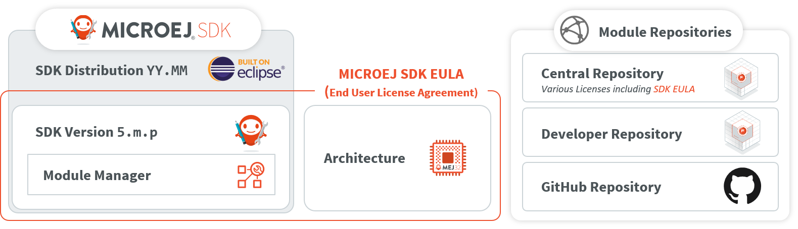

Licenses
========

.. _sdk_eula:

SDK EULA
--------

MICROEJ SDK is licensed under the SDK End User License Agreement (EULA), which covers the following elements:

- SDK Tools & Plugins packaged in the SDK `5.x` Version,
- Architectures,
- Modules published to the :ref:`central_repository` with the SDK EULA license, such as GUI or Networking Pack (see :ref:`Central Repository Licensing <central-repository-licensing>` for more details).



   SDK EULA Coverage

.. _license_manager:

License Manager Overview
------------------------

Architectures are distributed in two different versions:

- Evaluation Architectures, associated with a software license key. They can be downloaded at `<https://repository.microej.com/modules/com/microej/architecture/>`_.
- Production Architectures, associated with a hardware license key stored on a USB dongle. They can be requested to :ref:`our support team <get_support>`.

The license manager is provided with Architectures and then integrated into VEE Ports, consequently:

- Evaluation licenses will be shown only if at least one Evaluation Architecture or VEE Port built from an Evaluation Architecture 
  has been imported in the SDK.
- Production licenses will be shown only if at least one Production Architecture or VEE Port built from a Production Architecture 
  has been imported in the SDK.

The list of installed licenses is available in the SDK preferences dialog page in :guilabel:`Window`
> :guilabel:`Preferences` > :guilabel:`MicroEJ`:

.. figure:: images/preferences/licenses.jpg
   :alt: License Manager View
   :align: center

   License Manager View


License Check
-------------

The table below summarizes where the license is checked.

.. list-table::
   :widths: 30 10 10 20

   * - **Application**
     - **Run on Simulator**
       **(Virtual Device)**
     - **Build on Device**
     - **Documentation Link**
   * - Standalone Application or Kernel Application
     - NO
     - **YES**
     - :ref:`device_build`
   * - Sandboxed Application
     - NO
     - NO
     - :ref:`application_link`

.. _evaluation_license:

Evaluation Licenses
-------------------

This section should be considered when using Evaluation Architectures, which
use software license keys. A machine UID needs to be provided
to activate an Evaluation license on the MicroEJ Licenses Server. The machine UID is a 16 hexadecimal digits number.

Get your Machine UID
~~~~~~~~~~~~~~~~~~~~

Retrieving the machine UID depends on the kind of VEE Port being evaluated.

If your VEE Port is already :ref:`imported in Package Explorer <source_platform_import>` and built with :ref:`mmm`, the Architecture has been automatically imported.
The machine UID will be displayed when building a :ref:`Standalone Application on device <device_build>`.

.. code-block:: console
   :emphasize-lines: 1

   [INFO ] Launching in Evaluation mode. Your UID is XXXXXXXXXXXXXXXX.
   [ERROR] Invalid license check (No license found).

Otherwise, an Architecture or VEE Port should have been manually imported from the SDK preferences page. 
The machine UID can be retrieved as follows:

- Go to :guilabel:`Window` > :guilabel:`Preferences` > :guilabel:`MicroEJ`,
- Select either :guilabel:`Architectures`, :guilabel:`Platforms in workspace` or :guilabel:`Platforms`, 
- Click on one of the available items,
- Press the :guilabel:`Get UID` button to get the machine UID.

.. note:: 

   To access this :guilabel:`Get UID` option, at least one Evaluation Architecture or VEE Port must have been imported before (see :ref:`license_manager`).

Copy the UID. It will be needed when requesting a license.

.. figure:: images/preferences/uid.jpg
   :alt: Machine UID for Evaluation License
   :align: center
   :width: 532px
   :height: 172px

   Machine UID for Evaluation License


.. _evaluation_license_request_activation_key:

Request your Activation Key
~~~~~~~~~~~~~~~~~~~~~~~~~~~

- Go to MicroEJ Licenses Server https://license.microej.com.
- Click on :guilabel:`Create a new account` link.
- Create your account with a valid email address. You will receive a confirmation email a few minutes after. Click on the confirmation link in the email and log in with your new account.
- Click on :guilabel:`Activate a License`.
- Set :guilabel:`Product P/N:` to ``9PEVNLDBU6IJ``.
- Set :guilabel:`UID:` to the machine UID you copied before.
- Click on :guilabel:`Activate`.
- The license is being activated. You should receive your activation by email in less than 5 minutes. If not, please contact :ref:`our support team <get_support>`.
- Once received by email, save the attached zip file that contains your activation key.

.. _evaluation_license_install_license_key:

Install the License Key
~~~~~~~~~~~~~~~~~~~~~~~

If your VEE Port is already :ref:`imported in Package Explorer <source_platform_import>` and built with :ref:`mmm`, 
the license key zip file must be simply dropped to the ``~/.microej/licenses/`` directory (create it if it doesn't exist).


   MicroEJ Shared Licenses Directory

.. note::
  
   The SDK Preferences page will be automatically refreshed when building a :ref:`Standalone Application on device <device_build>`.

Otherwise, the license key must be installed as follows:

- Go back to the SDK.
- Select the :guilabel:`Window` > :guilabel:`Preferences` > :guilabel:`MicroEJ` menu.
- Press :guilabel:`Add...`.
- Browse the previously downloaded activation key archive file.
- Press OK. A new license is successfully installed.
- Go to Architectures sub-menu and check that all Architectures are now activated (green check).
- Your SDK is successfully activated.

If an error message appears, the license key could not be installed. (see
section :ref:`evaluation_license_troubleshooting`).
A license key can be removed from the key-store by selecting it and by
clicking on :guilabel:`Remove` button.

.. _evaluation_license_troubleshooting:

Troubleshooting
~~~~~~~~~~~~~~~

Unable to add an Evaluation license key in the SDK
""""""""""""""""""""""""""""""""""""""""""""""""""

Consider this section when an error message appears while adding the
Evaluation license key. Before contacting :ref:`our support team <get_support>`, please check the
following conditions:

-  Key is corrupted (wrong copy/paste, missing characters, or extra
   characters)

-  Key has not been generated for the installed environment

-  Key has not been generated with the machine UID

-  Machine UID has changed since submitting license request and no
   longer matches license key

-  Key has not been generated for one of the installed Architectures (no
   license manager able to load this license)

.. figure:: images/preferences/wrongkey.jpg
   :alt: Invalid License Key Error Message
   :align: center
   :width: 532px
   :height: 210px

   Invalid License Key Error Message

Machine UID has changed
"""""""""""""""""""""""

This can occur when the hardware configuration of the machine is changed (especially when the network interfaces have changed).

In this case, you can either request a new activation key for this new UID or go back to the previous hardware configuration.

.. _production_license:

Production Licenses
-------------------

This section should be considered when using Production Architectures,
which use hardware license keys stored on a USB dongle.

.. figure:: images/dongle/dongle.jpg
   :alt: MicroEJ USB Dongle
   :align: center
   :scale: 30%

   MicroEJ USB Dongle

.. note :: 

   If your USB dongle has been provided to you by your sales representative and you don't have received an activation certificate by email, it may be a pre-activated dongle.
   Then you can skip the activation steps and directly jump to the :ref:`production_license_check` section.

Request your Activation Key
~~~~~~~~~~~~~~~~~~~~~~~~~~~

- Go to `license.microej.com <https://license.microej.com/>`_.
- Click on :guilabel:`Create a new account` link.
- Create your account with a valid email address. You will receive a confirmation email a few minutes after. Click on the confirmation link in the email and login with your new account.
- Click on :guilabel:`Activate a License`.
- Set :guilabel:`Product P/N:` to **The P/N on the activation certificate**.
- Enter your UID: serial number printed on the USB dongle label (8 alphanumeric char.).
- Click on :guilabel:`Activate` and check the confirmation message.
- Click on :guilabel:`Confirm your registration`.
- Enter the **Registration Code provided on the activation certificate**.
- Click on :guilabel:`Submit`.
- Your Activation Key will be sent to you by email as soon as it is available (12 business hours max.).

.. note:: 
   
   You can check the :guilabel:`My Products` page to verify your product registration status, the Activation Key availability, and download the Activation Key when available.

Once the Activation Key is available, download and save the Activation Key ZIP file to a local directory.

.. _production_license_activate:

Activate your USB Dongle
~~~~~~~~~~~~~~~~~~~~~~~~

This section contains instructions that will allow you to flash your
USB dongle with the proper activation key.

You shall ensure that the following prerequisites are met :

-  Your :ref:`operating system <system-requirements>` is Windows 

-  The USB dongle is plugged and recognized by your operating system
   (see :ref:`production_license_troubleshooting` section)

-  No more than one USB dongle is plugged into the computer while running the
   update tool

-  The update tool is not launched from a network drive or a USB
   key

-  The activation key you downloaded is the one for the dongle UID on
   the sticker attached to the dongle (each activation key is tied to
   the unique hardware ID of the dongle).

You can then proceed to the USB dongle update: 

- Unzip the ``Activation Key`` file to a local directory 
- Enter the directory just created by your ZIP extraction tool.
- Launch the executable program.
- Accept running the unsigned software if requested (Windows 10/11)
  
  .. figure:: images/dongle/updateWarningUnknownPublisher.png
     :scale: 80%    

- Click on the :guilabel:`Update` button (no password needed)

  .. figure:: images/dongle/updateTool.png
     :alt: Dongle Update Tool

     Dongle Update Tool

- On success, an ``Update successfully`` message shall appear. On failure, an
  ``Error key or no proper rockey`` message may appear.

  .. figure:: images/dongle/updateSuccessful.png
     :alt: Successful dongle update

     Successful Dongle Update

.. _production_license_check:

Check Activation
~~~~~~~~~~~~~~~~

This section contains instructions that will allow you to verify that your USB dongle has been properly activated.

Check Activation in the SDK
"""""""""""""""""""""""""""

.. note::

   Production licenses will be shown only if at least one Production Architecture or VEE Port has been imported before (see :ref:`license_manager`).

In the SDK,

- Go to :guilabel:`Window` > :guilabel:`Preferences` > :guilabel:`MicroEJ`,
- Go to :guilabel:`Architectures`, :guilabel:`Platforms in workspace` or :guilabel:`Platforms` sub-menu and check that all items are now activated (green check).

.. figure:: images/dongle/platformLicenseDetails.png
   :alt: License Status OK
   :align: center
   
   License Status OK

If the license is still not recognized (red cross), check with the following command line tool to get more information.

.. _production_license_check_cli:

Check Activation with the Command Line Tool
"""""""""""""""""""""""""""""""""""""""""""

To get more details on connected USB dongle(s), run the debug tool as following:

#. Open a terminal.
#. Change directory to a Production VEE Port.
#. Execute the command:

.. tabs::

    .. tab:: Architecture ``8.1.x`` and higher
   
        .. code:: console

           java -Djava.library.path=resources/os/[OS_NAME] -jar licenseManager/licenseManagerProduct.jar

        with ``OS_NAME`` set to ``Windows64`` for Windows OS, ``Linux64`` for Linux OS, ``Mac`` for macOS x86_64 (Intel chip) or ``MacA64`` for macOS aarch64 (M1 chip).

    .. tab:: Architecture ``8.0.x`` and lower
   
        .. code:: console

           java -Djava.library.path=resources/os/[OS_NAME] -jar licenseManager/licenseManagerUsbDongle.jar

        with ``OS_NAME`` set to ``Windows64`` for Windows OS, ``Linux64`` for Linux OS, ``Mac`` for macOS x86_64 (Intel chip) or ``MacA64`` for macOS aarch64 (M1 chip).

If your USB dongle has been properly activated, you should get the following output:
   
.. code:: console

   [DEBUG] ===== MicroEJ Dongle Debug Tool =====
   [DEBUG] => Detected dongle UID: XXXXXXXX.
   [DEBUG] => Dongle UID has valid MicroEJ data: XXXXXXXX (only the first one is listed).
   [DEBUG] => Detected MicroEJ License XXXXX-XXXXX-XXXXX-XXXXX - valid until YYYY-MM-DD.
   [DEBUG] ===== SUCCESS =====

.. _production_license_linux:

USB Dongle on GNU/Linux
~~~~~~~~~~~~~~~~~~~~~~~

For GNU/Linux Users (Ubuntu at least), by default, the dongle access has not been granted to the user, you have to modify udev rules.
Please create a ``/etc/udev/rules.d/91-usbdongle.rules`` file with the following contents:

::

   ACTION!="add", GOTO="usbdongle_end"
       SUBSYSTEM=="usb", GOTO="usbdongle_start"
       SUBSYSTEMS=="usb", GOTO="usbdongle_start"
       GOTO="usbdongle_end"
       
       LABEL="usbdongle_start"
       
       ATTRS{idVendor}=="096e" , ATTRS{idProduct}=="0006" , MODE="0666"
       
       LABEL="usbdongle_end"

Then, restart udev: ``sudo /etc/init.d/udev restart``

You can check that the device is recognized by running the ``lsusb`` command.
The output of the command should contain a line similar to the one below for each dongle:
``Bus 002 Device 003: ID 096e:0006 Feitian Technologies, Inc.``

.. _production_license_docker_linux:

USB Dongle with Docker on Linux
~~~~~~~~~~~~~~~~~~~~~~~~~~~~~~~

If you use the `SDK Docker image <https://hub.docker.com/r/microej/sdk>`__ on a Linux host to build an Executable, 
the dongle must be mapped to the Docker container.
First, it requires to add a symlink on the dongle by following the instructions of the :ref:`production_license_linux` section but
with this ``/etc/udev/rules.d/91-usbdongle.rules`` file:

::

   ACTION!="add", GOTO="usbdongle_end"
       SUBSYSTEM=="usb", GOTO="usbdongle_start"
       SUBSYSTEMS=="usb", GOTO="usbdongle_start"
       GOTO="usbdongle_end"
       
       LABEL="usbdongle_start"
       
       ATTRS{idVendor}=="096e" , ATTRS{idProduct}=="0006" , MODE="0666" , SYMLINK+="microej_dongle"
       
       LABEL="usbdongle_end"

Then the symlink has to be mapped in the Docker container by adding the following option in the Docker container creation command line:

::

   --device /dev/microej_dongle:/dev/bus/usb/999/microej_dongle

The ``/dev/microej_dongle`` symlink can be mapped to any device path as long as it is in ``/dev/bus/usb``.

USB Dongle with WSL
~~~~~~~~~~~~~~~~~~~

.. note::
   The following steps have been tested on WSL2 with Ubuntu 22.04.2 LTS.

To use a USB dongle with WSL, you first need to install `usbipd` following the steps described in `Microsoft WSL documentation <https://learn.microsoft.com/fr-fr/windows/wsl/connect-usb#install-the-usbipd-win-project>`__:

First, check that WSL2 is installed on your system. If not, install it or update it following `Microsoft Documentation <https://learn.microsoft.com/fr-fr/windows/wsl/install>`__

Then, you need install usbipd-win on Windows from `usbipd-win Github repository <https://github.com/dorssel/usbipd-win/releases>`__.

And then, install usbipd and update hardware database inside you WSL installation:

   .. code-block:: console

      sudo apt install linux-tools-generic hwdata
      sudo update-alternatives --install /usr/local/bin/usbip usbip /usr/lib/linux-tools/*-generic/usbip 20

Add the udev rule described in :ref:`production_license_linux`, and restart udev:

   .. code-block:: console

      /etc/init.d/udev restart

You then need to unplug and plug your dongle again before attaching the dongle to WSL from powershell:

  .. code-block:: console

      usbipd.exe wsl attach --busid <BUSID>

The ``<BUSID>`` can be obtainted with the following powershell command:

  .. code-block:: console

      usbipd wsl list

.. note::
      You'll need to follow these steps each time you system is rebooted or the dongle is plugged/unplugged.

.. _production_license_troubleshooting:

Troubleshooting
~~~~~~~~~~~~~~~

This section contains instructions to check that your
operating system correctly recognizes your USB dongle.

Windows Troubleshooting
"""""""""""""""""""""""

- If the :ref:`dongle activation <production_license_activate>` failed with ``No rockey`` message, check there is one and only one dongle recognized with the following hardware ID :

  ::

     HID\VID_096E&PID_0006&REV_0201

  Go to the :guilabel:`Device Manager` > :guilabel:`Human Interface Devices` and
  check among the :guilabel:`USB Input Device` entries that the
  :guilabel:`Details` > :guilabel:`Hardware Ids` property match the ID mentioned before.


- If the :ref:`dongle activation <production_license_activate>` was successful with ``Update successfully`` message but the license does not appear in the SDK or is not updated, 
  try to activate again by starting the executable with administrator privileges:

  .. figure:: images/dongle/runAsAdministrator.png

- If the following error message is thrown when building an Executable, either the dongle plugged is a verbatim dongle or it has not been successfully :ref:`activated <production_license_activate>`:

  .. code-block:: console

     Invalid license check (Dongle found is not compatible).

VirtualBox Troubleshooting
""""""""""""""""""""""""""

In a VirtualBox virtual machine, USB drives must be enabled to be recognized correctly.
Make sure to enable the USB dongle by clicking on it in the VirtualBox menu :guilabel:`Devices` > :guilabel:`USB`.

To make this setting persistent, go to :guilabel:`Devices` > :guilabel:`USB` > :guilabel:`USB Settings...`
and add the USB dongle in the :guilabel:`USB Devices Filters` list.

WSL Troubleshooting
"""""""""""""""""""

Check that your dongle is attached to WSL from Powershell:

  .. code-block:: console

      usbipd wsl list

You should have a  line saying ``Attached - Ubuntu``:

  .. code-block:: console

      PS C:\Users\sdkuser> usbipd.exe wsl list
      BUSID  VID:PID    DEVICE                                                        STATE
      2-1    096e:0006  USB Input Device                                              Attached - Ubuntu
      2-6    0c45:6a10  Integrated Webcam                                             Not attached
      2-10   8087:0026  Intel(R) Wireless Bluetooth(R)                                Not attached
      3-1    045e:0823  USB Input Device                                              Not attached
      3-4    046d:c31c  USB Input Device                                              Not attached

In you WSL console, the dongle must also be recognized. Ckeck by using ``lsusb```:

   .. code-block:: console

      skduser@host:~/workspaces/docs$ lsusb
      Bus 002 Device 001: ID 1d6b:0003 Linux Foundation 3.0 root hub
      Bus 001 Device 003: ID 096e:0006 Feitian Technologies, Inc. HID Dongle (for OEMs - manufacturer string is "OEM")
      Bus 001 Device 001: ID 1d6b:0002 Linux Foundation 2.0 root hub

This might not be sufficient. If you're still facing license issues, restart udev, abd attach your dongle to WSL once again.

.. note::
   Hibernation may have unattached your dongle. Reload udev, unplug/plug your dongle and attach it from powershell.

Dongle not detected in the licenses screen
~~~~~~~~~~~~~~~~~~~~~~~~~~~~~~~~~~~~~~~~~~

If the USB dongle is plugged and activated but not visible in the menu :guilabel:`Window` > :guilabel:`Preferences` > :guilabel:`MicroEJ`,
please check that you have an active VEE Port in :guilabel:`Window` > :guilabel:`Preferences` > :guilabel:`MicroEJ` > :guilabel:`Platforms in workspace`.

Then, ensure that the VEE Port has been built in ``prod`` configuration, this can be checked with the architecture dependency inside the file ``module.ivy``.
If no VEE Ports are visible in your current workspace, please build a VEE Port configured to the ``prod`` mode and this should fix the issue.


Remote USB Dongle Connection
~~~~~~~~~~~~~~~~~~~~~~~~~~~~

When the dongle cannot be physically plugged to the machine running the SDK (cloud builds, virtualization, missing permissions, ...),
it can be configured using USB redirection over IP network. 

There are many hardware and software solutions available on the market. Among others, this has been tested with https://www.net-usb.com/ and https://www.virtualhere.com/.
Please contact :ref:`our support team <get_support>` for more details.

Sentinel License Management
-------------------------

Install Runtime Environment (RTE)
~~~~~~~~~~~~~~~~~~~~~~~~~~~~~~~~~

`Sentinel LDK Run-time Environment <https://docs.sentinel.thalesgroup.com/ldk/rte.htm>`__ is required on the end user's computer to enable your protected software to run by communicating with Sentinel protection keys. 

- Get ``Sentinel_RTE_Installation-1.0.0.zip`` installers here: xxxxx. It contains installer for Windows, macOS and Linux.

Installation for Windows 
""""""""""""""""""""""""

- Get ``haspdinst_37102.exe`` file.
- Type ``haspdinst_37102.exe -i`` in the command line. The installation or upgrade process is performed automatically. A message is displayed informing you that the Sentinel LDK Run-time Environment was successfully installed.

.. note::
	To uninstall Sentinel RTE, type ``haspdinst_37102.exe -r`` in the command line. A message is displayed informing you that the Sentinel LDK Run-time Environment was successfully removed.

Installation for Linux 
""""""""""""""""""""""

Get ``aksusbd_37102-9.14.1.tar.gz`` file and as root, enter the following command:

- For RedHat, SUSE, or CentOS 64-bit Intel systems: ``rpm -i aksusbd-9.14-1.x86_64.rpm``
- For Ubuntu or Debian 64-bit Intel systems: ``dpkg -i aksusbd_9.14-1_amd64.deb``
- Finally set ``LD_LIBRARY_PATH`` variable with command ``export LD_LIBRARY_PATH=/var/hasplm:$LD_LIBRARY_PATH``. This modification has to be setup at session startup  (e.g: using ``.bashrc`` file) to ensure that OS is properly configured to run a MicroEJ SDK or MicroEJ Architecture using Sentinel license manager.

NOTE: All install/uninstall commands must be executed with root rights. On Ubuntu, prefix the commands with the ``sudo`` command. On other Linux distributions, use the ``su`` utility to become root in the terminal window.

Installation for macOS
""""""""""""""""""""

- Get ``Sentinel_Runtime_37102.tar`` file.
- In ``SentinelRuntimeInstaller.framework/Versions/A/Resources/`` double-click on ``Sentinel_Runtime.dmg``.
- Double-click the Install Sentinel Runtime Environment disk image icon. The installer wizard is launched.
- Follow the instructions of the installer wizard until the installation is complete. The first time that you run Admin Control Center and submit configuration changes, ``hasplmd`` creates configuration files in ``/private/etc/hasplm/``.
- Finally set ``DYLD_LIBRARY_PATH`` variable with command ``export DYLD_LIBRARY_PATH=/var/hasplm:$DYLD_LIBRARY_PATH``. This modification has to be setup at session startup  (e.g: using ``.bashrc`` file) to ensure that OS is properly configured to run a MicroEJ SDK or MicroEJ Architecture using Sentinel license manager.


Activate your product 
~~~~~~~~~~~~~~~~~~~~~

.. _sentinel_install_vendor_libraries:

Install Vendor Libraries
""""""""""""""""""""""""

Unzip ``MicroEJ_library.zip`` file in the following location:

- For Windows 64-bit: ``%CommonProgramFiles(x86)%\Aladdin Shared\HASP\``. Put ``hasp_windows_x64_37102.dll`` file in the system folder (``%SystemRoot%\system32``) if you have administrator rights on your machine. Otherwise drop the ``hasp_windows_x64_37102.dll`` file beside ``java.exe`` executable of the Java Development Kit (JDK) used to launch the MICROEJ SDK.
- For macOS: ``/var/hasplm`` (By default, the ``/var`` path is hidden. You may need to modify the operating system View option to display all files and folders in order to access this path.)
- For Linux 64-bit: ``/var/hasplm``

.. _sentinel_activate_license:

Activate your license
"""""""""""""""""""""

- On the product computer open a web navigator and go to http://localhost:1947 (Sentinel Admin Control Center)
- Go to ``Sentinel key`` and click on ``fingerprint`` for Local key to download the C2V file.
- Send this file to MicroEJ, MicroEJ will send you a V2C file
- Go back to Sentinel Admin Control Center
- Click on ``Update/Attach`` and upload the V2C file
- Apply it with `Apply` button

Check Activation with the Command Line Tool
"""""""""""""""""""""""""""""""""""""""""""

To verify access to the Sentinel license on the workstation where the SDK executes, run the debug tool as following:

#. Open a terminal.
#. Change directory to a Production VEE Port.
#. Execute the command:
   
    .. code:: console

       java -Djava.library.path=resources/os/[OS_NAME] -jar licenseManager/licenseManagerProduct.jar

    with ``OS_NAME`` set to ``Windows64`` for Windows OS, ``Linux64`` for Linux OS, ``Mac`` for macOS x86_64 (Intel chip) or ``MacA64`` for macOS aarch64 (M1 chip).

If your Sentinel license has been properly activated, you should get the following output:
   
.. code:: console

   [DEBUG] ===== MicroEJ Sentinel Debug Tool =====
   [DEBUG] => Detected Sentinel License Key ID: XXXXXXXX.
   [DEBUG] => Detected MicroEJ License valid until YYYY-MM-DD.
   [DEBUG] ===== SUCCESS =====

Troubleshooting
~~~~~~~~~~~~~~~

Sentinel API dynamic library not found (code 400)
"""""""""""""""""""""""""""""""""""""""""""""""""

The following error occurred when the library ``hasp_[os]_37102.[ext]`` has not been found. Please refer to :ref:`sentinel_install_vendor_libraries`. 

Sentinel key not found (code 7)
"""""""""""""""""""""""""""""""

The following error occurred when there is no Sentinel license available. Go to http://localhost:1947/int/devices.html and check your Sentinel licenses. You should see the successfully installed license key:

.. figure:: images/sentinel_rte_installed_license_view.png
   :alt: Sentinel Installed License(s) View
   :align: center
   :scale: 75%

Otherwise, refer to :ref:`sentinel_activate_license`.

..
   | Copyright 2008-2024, MicroEJ Corp. Content in this space is free 
   for read and redistribute. Except if otherwise stated, modification 
   is subject to MicroEJ Corp prior approval.
   | MicroEJ is a trademark of MicroEJ Corp. All other trademarks and 
   copyrights are the property of their respective owners.
