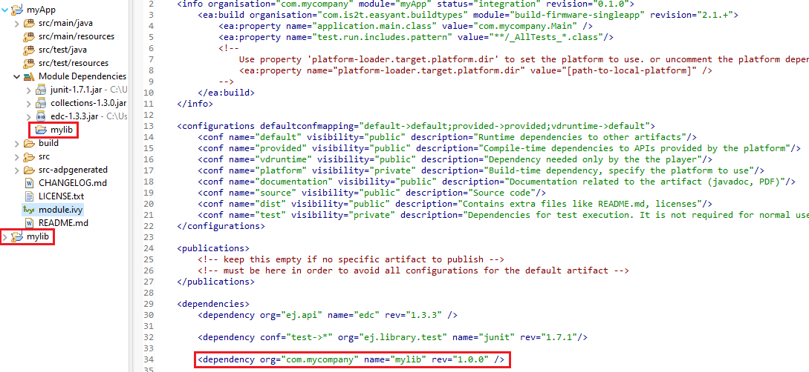
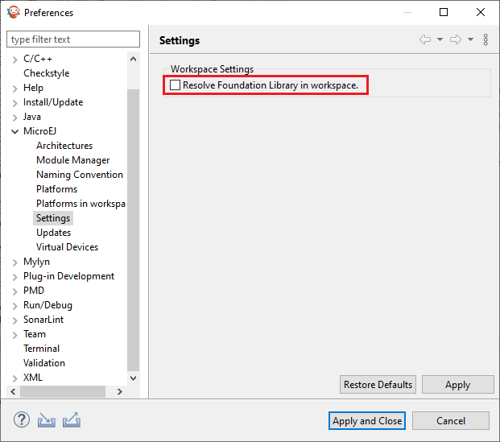

.. _resolve_dependencies_in_workspace:

---------------------------------
Resolve Dependencies in Workspace
---------------------------------

When resolving the modules' dependencies, if the project of a dependency is imported and opened in the same workspace as the module, 
the project is directly used for compilation and execution instead of using the dependency,
provided that the dependency's project has the same version as the one required by the module.

For example, suppose that the workspace contains a module ``myApp`` and its dependency ``mylib`` :

   A module and its dependency opened in the same workspace

If the ``mylib`` project's version is ``1.0.0``, it is used for compilation and execution.
Otherwise the published artifact is downloaded from the artifact repository.

To avoid a dependency to be resolved in the workspace, you can close the corresponding project or remove it from the workspace.

.. warning::
   If you open, close, import or remove a project, you must refresh the dependency resolution of other previously imported projects
   by clicking on the :guilabel:`Resolve All` button :

   .. figure:: images/mmm_shortcut_resolveAll.png
      :alt: Resolve all the workspace projects
      :align: center
      :scale: 100%
   
      Resolve all the workspace projects

.. _resolve_foundation_libraries_in_workspace:

-----------------------------------------
Resolve Foundation Libraries in Workspace
-----------------------------------------

A :ref:`Foundation Library <libraries>` is composed of : 

- An API project that contains Java classes, methods and fields used at compile time with their associated Javadoc,
  
- An Implementation project that contains the runtime code executed by the Platform and Low Level C header files

Beside Foundation Library projects, there is usually a :ref:`Mock <mock>` project that contains the implementation of native methods for simulation.

.. note::

   To learn how to setup a Foundation Library, please consult the How-to available on 
   `<https://github.com/MicroEJ/How-To/tree/master/FoundationLibrary-Get-Started>`_.

When the API is set as a dependency, the Implementation project is automatically used at runtime if it is opened in the workspace.

If a Mock project is also opened in the workspace, it is automatically used for execution on Simulator. 

.. note::

   When opened in the workspace, the Implementation project and the Mock project are used regardless of their version 
   or if they are set as dependencies.

To avoid the use of the Implementation project and the Mock project, 
uncheck the :guilabel:`Resolve Foundation Library in workspace` option in :guilabel:`Window` > :guilabel:`Preferences` > :guilabel:`MicroEJ` > :guilabel:`Settings`.

   Resolve Foundation Library in workspace

..
   | Copyright 2008-2023, MicroEJ Corp. Content in this space is free 
   for read and redistribute. Except if otherwise stated, modification 
   is subject to MicroEJ Corp prior approval.
   | MicroEJ is a trademark of MicroEJ Corp. All other trademarks and 
   copyrights are the property of their respective owners.
