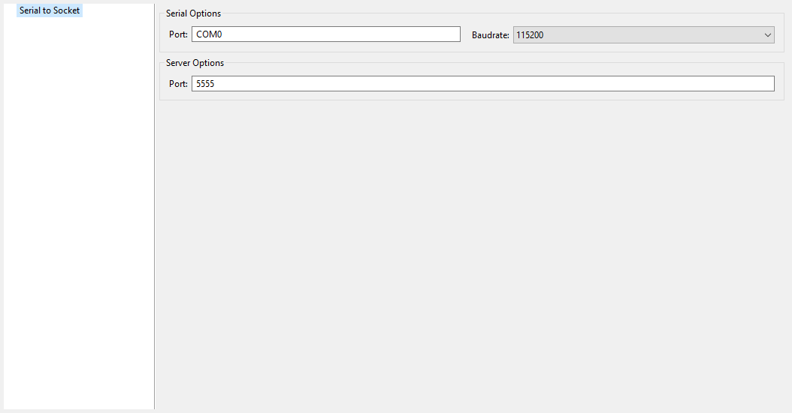

--------------------------
Category: Serial to Socket
--------------------------

Group: Serial Options
---------------------

Option(text): Port
^^^^^^^^^^^^^^^^^^

*Option Name*: ``serail.to.socket.comm.port``

*Default value*: ``COM0``

*Description*: Defines the COM port:

Windows - ``COM1``, ``COM2``, ``...``, ``COM*n*``

Linux - ``/dev/ttyS0``, ``/dev/ttyUSB0``, ``...``, ``/dev/ttyS*n*``,
``/dev/ttyUSB*n*``

Option(combo): Baudrate
^^^^^^^^^^^^^^^^^^^^^^^

*Option Name*: ``serail.to.socket.comm.baudrate``

*Default value*: ``115200``

*Available values*:

``9600``

``38400``

``57600``

``115200``

*Description*: Defines the COM baudrate.

Group: Server Options
---------------------

Option(text): Port
^^^^^^^^^^^^^^^^^^

*Option Name*: ``serail.to.socket.server.port``

*Default value*: ``5555``

*Description*: Defines the server IP port.

..
   | Copyright 2008-2023, MicroEJ Corp. Content in this space is free 
   for read and redistribute. Except if otherwise stated, modification 
   is subject to MicroEJ Corp prior approval.
   | MicroEJ is a trademark of MicroEJ Corp. All other trademarks and 
   copyrights are the property of their respective owners.
