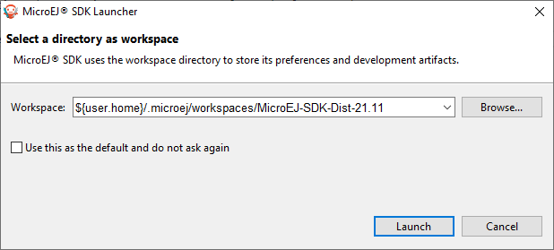
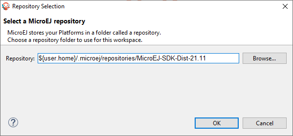

.. _startup:

Startup
=======

When starting the SDK, it prompts you to select the last used workspace or a default workspace on the first run. 

   Workspace selection

A workspace is the Eclipse main folder where are imported a set of projects containing the source code.

When loading a new workspace, the SDK prompts for the location of the MicroEJ repository, 
where Architectures, Platforms or Virtual Devices will be imported. 

   Repository selection

By default, the SDK suggests to point to the default repository on your operating system, 
located at ``${user.home}/.microej/repositories/[version]``. 
You can select an alternative location. Another common practice is to define a local
repository relative to the workspace, so that the workspace is
self-contained, without external file system links and can be shared
within a zip file.

..
   | Copyright 2008-2022, MicroEJ Corp. Content in this space is free 
   for read and redistribute. Except if otherwise stated, modification 
   is subject to MicroEJ Corp prior approval.
   | MicroEJ is a trademark of MicroEJ Corp. All other trademarks and 
   copyrights are the property of their respective owners.
