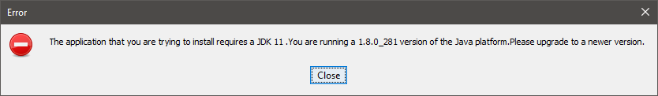
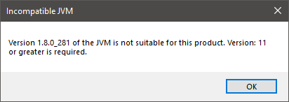

Troubleshooting
===============

Incompatible Default Java Version
---------------------------------

When launching the installer, you may get the following error: :guilabel:`The application you are trying to install requires a JDK11`.

Or when launching the SDK, you may get the following error: :guilabel:`Version: 11 or greater is required`.

The default Java version installed on your system is not compatible. You have two options:

- either install a JDK 11 as your default JVM. If you are on Windows OS, ensure you enabled ``JavaSoft (Oracle) registry keys`` during the JDK installation (see :ref:`get_jdk`),
- or install the :ref:`portable SDK Distribution <sdk_installation_portable>` if you don't want to modify your default JVM version. 
  
This latter case is recommended if you are installing SDK Dist. ``22.06`` while you already have active projects based on SDK Dist. ``21.11``.

.. _sdk_install_troubleshooting_windows:

Windows Specifics
-----------------

If you are using Windows Defender as your default antivirus software,
the SDK may be slowed down as it manipulates lots of JAR
files (which are ZIP files) that are regularly analyzed.

To improve the SDK experience, please find below a list of
folders that should be excluded from Windows Defender monitoring:

-  ``%USERPROFILE%\.eclipse``
-  ``%USERPROFILE%\.ivy2``
-  ``%USERPROFILE%\.microej``
-  ``%USERPROFILE%\.p2``
-  ``%USERPROFILE%\AppData\Local\Temp\microej``
-  ``C:\Program Files\MicroEJ`` or the custom directory where the SDK has been installed
-  your workspace(s) folder(s)

The exclusion page is available in the ``Settings`` application
(:guilabel:`Windows Security` > :guilabel:`Virus & threat protection` > :guilabel:`Manage settings` > :guilabel:`Exclusions` > :guilabel:`Add or remove exclusions`).

Linux Specifics
---------------

Starting the SDK on a linux distribution may produce
troubles such as missing content pages. This is related to incomplete
Eclipse SWT configuration (see `Eclipse GTK wiki
page <https://wiki.eclipse.org/SWT/Devel/Gtk/GtkVersion>`__).

One solution is to configure Eclipse as follows:

-  Add the next lines to ``MicroEJ-SDK.ini``, before
   ``-vmargs`` argument:

   ::

      --launcher.GTK_Version 2

-  Ensure GTK is correctly installed (``libwebkitgtk`` packet)
-  Configure the following environment variables

   ::

       MOZILLA_FIVE_HOME=/usr/lib/mozilla
       LD_LIBRARY_PATH=${MOZILLA_FIVE_HOME}:${LD_LIBRARY_PATH}

-  Restart the SDK
-  Check there is not more SWT/MOZILLA related errors
   (:guilabel:`Window` > :guilabel:`Show View` > :guilabel:`Other...` > :guilabel:`General` > :guilabel:`Error Log`)

MacOS Specifics
---------------

When launching the SDK using the ``.app`` file, you may encounter the following message::

   "MicroEJ-SDK-xx.xx" is damaged and can't be opened. You should move it to the Trash.

This is due to MacOS putting applications in quarantine when downloaded with a browser.
Use this command to remove the SDK application from quarantine::

   sudo xattr -rd com.apple.quarantine sdk.app

where ``sdk.app`` is the SDK file name.

..
   | Copyright 2008-2022, MicroEJ Corp. Content in this space is free 
   for read and redistribute. Except if otherwise stated, modification 
   is subject to MicroEJ Corp prior approval.
   | MicroEJ is a trademark of MicroEJ Corp. All other trademarks and 
   copyrights are the property of their respective owners.
