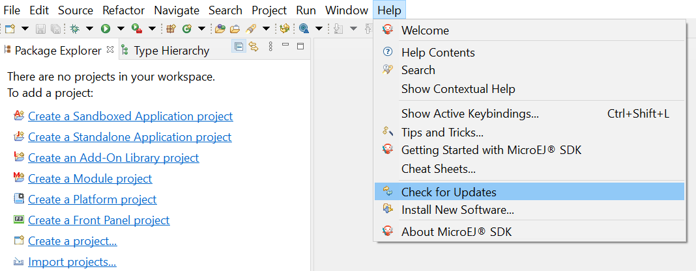
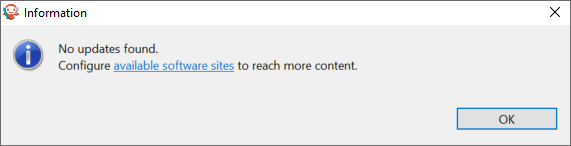
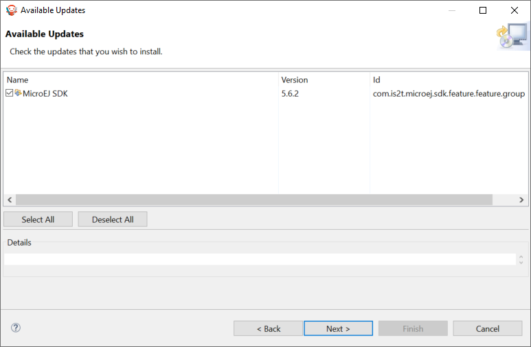
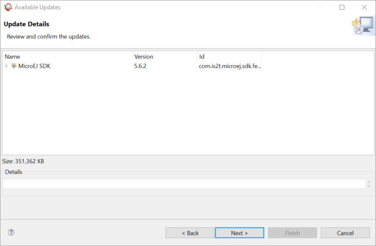
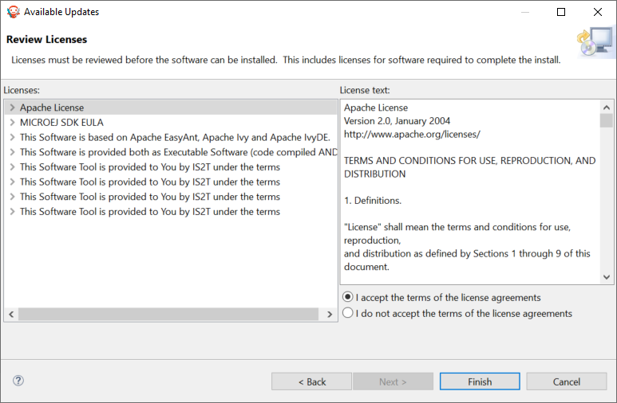
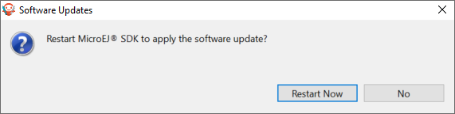

.. warning::

  This documentation is for SDK 5. The latest major version is :ref:`SDK 6 <sdk_6_user_guide>`.
  SDK 5 is in maintenance mode since the release of :ref:`SDK 5.8.0 <changelog-5.8.0>`.
  Consequently, as stated in the :ref:`SDK End User License Agreement (EULA) <sdk_eula>`, the SDK will reach the end of its life by July 2028.
  Contact :ref:`our support team <get_support>` for assistance with migrating to the new SDK, or your sales representative if you require an extension of SDK maintenance as a service.

.. _sdk_update:

Update SDK Version
------------------

Once you have an SDK Distribution installed, you can update the included SDK Version to a newer version.

.. note::

   If you want to know which SDK version is currently installed in your SDK Distribution, see the :ref:`get_sdk_version` chapter.

To update your SDK Distribution to a newer SDK version, follow the next steps:

- Select :guilabel:`Help` > :guilabel:`Check for updates`.

   Check for updates

- If your SDK is up-to-date, you will see the following screen:

   No update available

- If an update is available, you will see the following screen: 

   Update available

- Check the version you want to install. Then click on the :guilabel:`Next` button.
- Review and confirm the updates. Then click on the :guilabel:`Next` button.

   Review the updates

- Select :guilabel:`I accept the terms of the license agreements.`. Then click on the :guilabel:`Finish` button.

   Accept the terms of the license agreement

- Wait until the Software Update pop-up appears. Then click on the :guilabel:`Restart Now` button.

   Restart your SDK.

The update of your SDK is done. 

..
   | Copyright 2021-2025, MicroEJ Corp. Content in this space is free 
   for read and redistribute. Except if otherwise stated, modification 
   is subject to MicroEJ Corp prior approval.
   | MicroEJ is a trademark of MicroEJ Corp. All other trademarks and 
   copyrights are the property of their respective owners.
