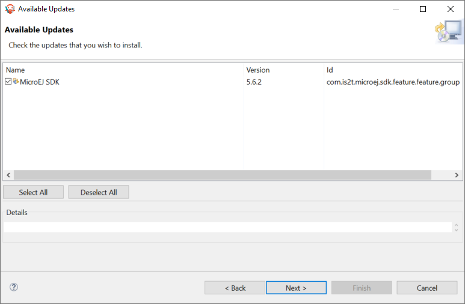
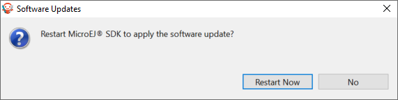

.. _sdk_update:

Update SDK Version
------------------

Once you have an SDK Distribution installed, you can update the included SDK Version to a newer version.

.. note::

   If you want to know which SDK version is currently installed in your SDK Distribution, see the :ref:`get_sdk_version` chapter.

To update your SDK Distribution to a newer SDK version, follow the next steps:

- Select :guilabel:`Help` > :guilabel:`Check for updates`.

.. figure:: images/installation_process/check_update.png
   :alt: End screen
   :align: center
   :scale: 75%

   Check for updates

- If your SDK is up-to-date, you will see the following screen:

.. figure:: images/installation_process/no_update.png
   :alt: End screen
   :align: center

   No update available

- If an update is available, you will see the following screen: 

   Update available

- Check the version you want to install. Then click on the :guilabel:`Next` button.
- Review and confirm the updates. Then click on the :guilabel:`Next` button.

.. figure:: images/installation_process/review_update.png
   :alt: End screen
   :align: center

   Review the updates

- Select :guilabel:`I accept the terms of the license agreements.`. Then click on the :guilabel:`Finish` button.

.. figure:: images/installation_process/license_update.png
   :alt: End screen
   :align: center

   Accept the terms of the license agreement

- Wait until the Software Update pop-up appears. Then click on the :guilabel:`Restart Now` button.

   Restart your SDK.

The update of your SDK is done. 

..
   | Copyright 2021-2023, MicroEJ Corp. Content in this space is free 
   for read and redistribute. Except if otherwise stated, modification 
   is subject to MicroEJ Corp prior approval.
   | MicroEJ is a trademark of MicroEJ Corp. All other trademarks and 
   copyrights are the property of their respective owners.
