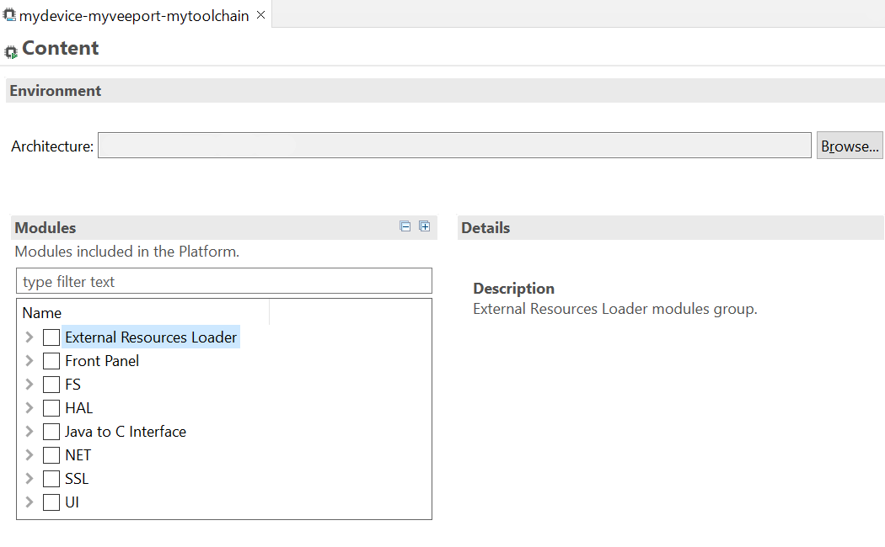

.. _new_platform_creation:

=================
VEE Port Creation
=================

This section describes the steps to create a new VEE Port with the SDK, 
and options to connect it to an external Board Support Package (BSP) as well as a third-party C toolchain. 

.. note::

   The creation of a VEE Port with this guide requires at least the version ``5.4.0`` of the SDK.

.. note::
   
   If you own a legacy VEE Port, you can either create your VEE Port again from scratch,
   or follow the :ref:`former_platform_migration` chapter.

.. _platform_configuration_creation:

VEE Port Project Creation
=========================

The first step is to create a VEE Port configuration project:

- Select :guilabel:`File` > :guilabel:`New` > :guilabel:`Project...` > :guilabel:`General` > :guilabel:`Project`,
- Enter a :guilabel:`Project name`. The name is arbitrary and can be changed later. The usual convention is ``[PLATFORM_NAME]-configuration``,
- Click on :guilabel:`Finish` button. A new empty project is created,
- Install the latest `Platform Configuration Additions <https://github.com/MicroEJ/VEEPortQualificationTools/blob/master/framework/platform/>`_
  by following instructions described at https://github.com/MicroEJ/VEEPortQualificationTools/blob/master/framework/platform/README.rst.

  - Files within the ``content-sdk-5`` folder must be copied to the configuration project folder.
  - Files within the ``content-architecture-7`` must be copied to the configuration project folder only if you are using an Architecture version ``7.x``.
    If you are using an Architecture version ``8.x``, the files are already included and **must not** be copied.

  You should get a MicroEJ Platform configuration project that looks like:

  .. figure:: images/platformConfigurationSkeleton.png
      :alt: MicroEJ Platform Configuration Project Skeleton
      :align: center

      MicroEJ Platform Configuration Project Skeleton

  .. note::
      
      The version of installed Platform Configuration Additions is indicated in the `CHANGELOG <https://github.com/MicroEJ/VEEPortQualificationTools/blob/master/framework/platform/content-sdk-5/build/CHANGELOG.md>`_ file. 

Architecture Selection
======================

The next step is to select a :ref:`MicroEJ Architecture <architecture_overview>` compatible with your device instructions set and C compiler.

MicroEJ Corp. provides MicroEJ Evaluation Architectures for most common instructions sets and compilers
at https://repository.microej.com/modules/com/microej/architecture. 

Please refer to the chapter :ref:`architectures_toolchains` for the details of ABI and compiler options.

If the requested MicroEJ Architecture is not available for evaluation or to get a MicroEJ Production Architecture,
please contact your MicroEJ sales representative or :ref:`our support team <get_support>`.

Once you know which Architecture to use, add it as a dependency of the VEE Port configuration project as described below:

- Edit the :ref:`mmm_module_description` ``module.ivy`` to declare the MicroEJ Architecture dependency:

  .. code-block:: xml
    :emphasize-lines: 3,4,5

    <dependencies>

        <dependency org="com.microej.architecture.[ISA].[TOOLCHAIN]" name="[UID]" rev="[VERSION]">
          <artifact name="[UID]" m:classifier="[USAGE]" ext="xpf"/>
        </dependency>
    
    </dependencies>

  The name of the module dependency needed for your Platform can be found in the chapter :ref:`architectures_toolchains`.
  Check the table of your corresponding Architecture and follow the link in the :guilabel:`Module` column.

  For example, to declare the MicroEJ Evaluation Architecture version ``7.14.0`` for Arm® Cortex®-M4 microcontrollers compiled with GNU CC toolchain:

  .. code-block:: xml
      :emphasize-lines: 3,4,5

      <dependencies>

          <dependency org="com.microej.architecture.CM4.CM4hardfp_GCC48" name="flopi4G25" rev="7.14.0">
            <artifact name="flopi4G25" m:classifier="eval" ext="xpf"/>
          </dependency>
      
      </dependencies>

And the module for this Architecture is located in the :ref:`Central Repository <central_repository>` at https://repository.microej.com/modules/com/microej/architecture/CM4/CM4hardfp_GCC48/flopi4G25/7.14.0/.

  .. note:: The Platform Configuration Additions allow to select the Architecture ``USAGE`` using the option ``com.microej.platformbuilder.architecture.usage``.  Edit the file ``module.properties`` to set the property to ``prod`` to use a Production Architecture and to ``eval`` to use an Evaluation Architecture.

.. _pack_import:

Pack Import
===========

:ref:`MicroEJ Pack <pack_overview>` provides additional features on top of the MicroEJ Architecture such as Graphical User Interface or Networking.

.. note::

   MicroEJ Packs are optional. You can skip this section if you intend to integrate MicroEJ runtime only with custom libraries.

To add a MicroEJ Pack, add it as a dependency of the VEE Port configuration project as described below:
  
- Edit the :ref:`mmm_module_description` ``module.ivy`` as follows:

  .. code-block:: xml
    :emphasize-lines: 3,6,9

      <dependencies>
        <!-- MicroEJ Architecture Specific Pack -->
        <dependency org="com.microej.architecture.[ISA].[TOOLCHAIN]" name="[UID]-[NAME]-pack" rev="[VERSION]"/>

        <!-- MicroEJ Generic Pack -->
        <dependency org="com.microej.pack.[NAME]" name="[NAME]-pack" rev="[VERSION]"/>

        <!-- Legacy MicroEJ Generic Pack -->
        <dependency org="com.microej.pack" name="[NAME]" rev="[VERSION]"/>

      </dependencies>

  For example, to declare the `MicroEJ Architecture Specific Pack UI
  version 13.0.4`_ for MicroEJ Architecture ``flopi4G25`` on Arm®
  Cortex®-M4 microcontrollers compiled with GNU CC toolchain:

  .. code-block:: xml
    :emphasize-lines: 3

    <dependencies>
        <!-- MicroEJ Architecture Specific Pack -->
        <dependency org="com.microej.architecture.CM4.CM4hardfp_GCC48" name="flopi4G25-ui-pack" rev="13.0.4"/>

    </dependencies>

  To declare the `MicroEJ Generic Pack Bluetooth version 2.1.0`_:

  .. code-block:: xml
    :emphasize-lines: 3

    <dependencies>
        <!-- MicroEJ Generic Pack  -->
        <dependency org="com.microej.pack.bluetooth" name="bluetooth-pack" rev="2.1.0"/>

    </dependencies>

  And to declare the `Legacy MicroEJ Generic Pack Net version 9.2.3`_:

  .. code-block:: xml
    :emphasize-lines: 3

    <dependencies>
        <!-- Legacy MicroEJ Generic Pack -->
        <dependency org="com.microej.pack" name="net" rev="9.2.3"/>

    </dependencies>

  .. warning::
    
    :ref:`MicroEJ Architecture Specific Packs <pack_architecture_specific>` and :ref:`Legacy MicroEJ Generic Packs <pack_generic_legacy>` provide Platform modules
    that are **not installed** by default. See :ref:`platform_module_configuration` section for more details.

.. _MicroEJ Architecture Specific Pack UI version 13.0.4: https://repository.microej.com/modules/com/microej/architecture/CM4/CM4hardfp_GCC48/flopi4G25-ui-pack/13.0.4/
.. _MicroEJ Architecture Specific Pack UI version 14.0.1: https://repository.microej.com/modules/com/microej/architecture/CM4/CM4hardfp_GCC48/flopi4G25-ui-pack/14.0.1/
.. _MicroEJ Generic Pack Bluetooth version 2.1.0: https://repository.microej.com/modules/com/microej/pack/bluetooth/bluetooth-pack/2.1.0/
.. _Legacy MicroEJ Generic Pack Net version 9.2.3: https://repository.microej.com/modules/com/microej/pack/net/9.2.3/

.. _platform_build:

VEE Port Build
==============

The VEE Port can be built either from the SDK or from the :ref:`MMM CLI <mmm_cli>`.
To build the VEE Port from the SDK, perform a regular :ref:`mmm_module_build`: 

  - Right-click on the VEE Port Configuration project,
  - Select :guilabel:`Build Module`.

To build the VEE Port from the MMM CLI:

  - Set the ``eclipse.home`` property to the path of your SDK, using ``-Declipse.home=<path>`` in the command line or using the :ref:`mmm_cli_shared_configuration`.
  
    By default, the SDK's path is one of the following directories:
  
    - on Windows: ``C:\Program Files\MicroEJ\MicroEJ-SDK-<YY.MM>\rcp``
    - on Linux: ``/home/<user>/MicroEJ/MicroEJ-SDK-<YY.MM>/rcp``
    - on macOS: ``/Applications/MicroEJ/MicroEJ-SDK-<YY.MM>/rcp/MicroEJ-SDK-<YY.MM>.app/Contents/Eclipse``
  
  - From the VEE Port Configuration project, execute the command: ``mmm``

In both cases, the build starts and the build logs are redirected to the integrated console.
Once the build is terminated, you should get the following message:

    .. code-block:: console
      :emphasize-lines: 3,4,5,6
      
      module-platform:report:
        [echo]     ============================================================================================================
        [echo]     Platform has been built in this directory 'C:\tmp\mydevice-Platform-[TOOLCHAIN]-0.1.0'.
        [echo]     To import this project in your MicroEJ SDK workspace (if not already available):
        [echo]      - Select 'File' > 'Import...' > 'General' > 'Existing Projects into Workspace' > 'Next'
        [echo]      - Check 'Select root directory' and browse 'C:\tmp\mydevice-Platform-[TOOLCHAIN]-0.1.0' > 'Finish'
        [echo]     ============================================================================================================

      BUILD SUCCESSFUL

      Total time: 43 seconds

Then, import the VEE Port directory to your SDK workspace as mentioned in the report. You should get a ready-to-use VEE Port project
in the workspace available for the MicroEJ Application project to run on. You can also check the VEE Port availability in:
:guilabel:`Window` > :guilabel:`Preferences` > :guilabel:`MicroEJ` > :guilabel:`Platforms in workspace`.

  VEE Port Project

This step is only required the first time the VEE Port is built, or if the VEE Port properties have changed (i.e, name, version). 
When the same VEE Port is built again, the Platform project should be automatically refreshed after a few seconds. 
In case of any doubt, right-click on the VEE Port project and select :guilabel:`Refresh` to get the new content.

.. _platform_module_configuration:

Platform Module Configuration
=============================

The primary mechanism for augmenting the capabilities of a Platform is to add modules to it.

A MicroEJ module is a group of related files (Foundation Libraries,
scripts, link files, C libraries, Simulator Mock, tools, etc.) that together
provide all or part of a Platform capability. 

A module can extend a Architecture with additional features such as:

- Runtime Capability (e.g. :ref:`multisandbox`, :ref:`section_externalresourceloader`) , 
- Foundation Library Implementation (e.g. :ref:`MicroUI <section_microui_installation>`, :ref:`NET <network_core>`),
- Simulator (e.g. :ref:`section_frontpanel`),
- Tool (e.g. :ref:`tool_javah`).

VEE Port modules provided by :ref:`MicroEJ Generic Packs <pack_generic>` are automatically installed during the :ref:`VEE Port build <platform_build>` 
and do not require extra configuration. They are not displayed in the VEE Port Editor.

VEE Port modules provided by :ref:`MicroEJ Architectures <architecture_overview>`, :ref:`MicroEJ Architecture Specific Packs <pack_architecture_specific>`
and :ref:`Legacy MicroEJ Generic Packs <pack_generic_legacy>` are **not installed** by default.
They must be enabled and configured using the VEE Port Editor.

Before opening the VEE Port Editor, the VEE Port must have been built once to let :ref:`mmm` resolve and download MicroEJ Architecture and Packs locally.
Then import them in the SDK as follows:

- Select :guilabel:`File` > :guilabel:`Import` > :guilabel:`MicroEJ` > :guilabel:`Architectures`,
- Browse :guilabel:`myplatform-configuration/target~/dependencies` folder (contains ``.xpf`` and ``.xpfp`` files once the VEE Port is built),
- Check the :guilabel:`I agree and accept the above terms and conditions...` box to accept the license,
- Click on :guilabel:`Finish` button. This may take some time.

Once imported, double-click on the :guilabel:`default.platform` file to open the VEE Port Editor.

From the VEE Port Editor, select the :guilabel:`Content` tab to access the
modules selection.  VEE Port modules can be selected/deselected from the :guilabel:`Modules` frame.

VEE Port modules are organized in groups.
When a group is selected, by default all its modules are selected.
To view all the modules making up a group, click on the Expand All icon on the top-right of the frame. 
This will let you select/deselect on a per-module basis. Note that individual module selection is not
recommended and that it is only available when the module has been
imported.

The description and contents of an item (group or module) are displayed
next to the list when an item is selected.

All the selected VEE Port modules will be installed in the VEE Port.

  VEE Port Configuration Modules Selection

Each selected VEE Port module can be customized by creating a :guilabel:`[module]`
folder (named after the module name), next to the :guilabel:`.platform` file definition. 
It may contain:

- A :guilabel:`[module].properties` file named after the module name.
  These properties will be injected in the execution context prefixed
  by the module name. Some properties might be needed for the
  configuration of some modules. Please refer to the modules
  documentation for more information.
- A :guilabel:`bsp.xml` file which provides additional information about the BSP
  implementation of Low Level APIs.

  This file must start with the node ``<bsp>``. It can contain several 
  lines like this one:
  ``<nativeName="A_LLAPI_NAME" nativeImplementation name="AN_IMPLEMENTATION_NAME"/>``

  where:

  -  ``A_LLAPI_NAME`` refers to a Low Level API native name. It is 
      specific to the MicroEJ C library which provides the Low Level API.

  -  ``AN_IMPLEMENTATION_NAME`` refers to the implementation name of the
      Low Level API. It is specific to the BSP; and more specifically, to
      the C file which does the link between the MicroEJ C library and the
      C driver.

  These files will be converted into an internal format during the
  MicroEJ Platform build.

-  Optional module specific files and folders

Modifying one of these files requires to :ref:`build the Platform <platform_build>` again.

.. note::

  It is possible to quickly rebuild the Platform from the Platform Editor if only the Platform module configuration has changed.
  Click on the :guilabel:`Build Platform` link on the :guilabel:`Overview` tab of the Platform Editor.

.. _platformCustomization:

VEE Port Customization
======================

The VEE Port configuration project can contain an optional :guilabel:`dropins` folder.
The full content of this folder will be copied in the VEE Port during the build. 
This feature allows to add or overwrite libraries, tools,
etc. into the VEE Port.

The dropins folder organization should respect the PlatVEE Portform files
and folders organization. For instance, the tools are located in the
sub-folder :guilabel:`tools`. Launch a VEE Port build without the dropins folder
to see how the VEE Port files and folders are organized. Then fill the
dropins folder with additional features and build again the VEE Port to
get a customized VEE Port.

Files in the dropins folder have priority. If one file has the same
path and name as a file already installed in the VEE Port, the file from the
dropins folder will be selected first.

The VEE Port build can also be customized by updating the :guilabel:`configuration.xml` file
next to the :guilabel:`.platform` file. This Ant script can extend one or
several of the extension points available. By default, you should not have to change 
the default configuration script.

Modifying one of these files requires to :ref:`build the Platform <platform_build>` again.

.. _platform_publication:

VEE Port Publication
====================

The publication of the built VEE Port to a :ref:`module repository <module_repository>` is disabled by default.
It can be enabled by setting the ``skip.publish`` property to ``false`` in the ``module.properties`` file of 
the VEE Port configuration project .

The publication is kept disabled by default in the project sources because developers usually use the locally built VEE Port in the workspace.
However, the publication is required in a Continuous Integration environment. 
This can be done by leaving the ``skip.publish`` property to ``true`` in the project sources 
and by overwriting it in the command launched by the Continuous Integration environment, for example:

.. code-block:: sh

  mmm publish shared -Dskip.publish=false

If the VEE Port is configured with :ref:`Full BSP connection <bsp_connection>`, the build script can be launched 
to validate that the BSP successfully compiles and links before the VEE Port is published. 
It can be enabled by setting the ``com.microej.platformbuilder.bsp.build.enabled`` property to ``true`` 
in the ``module.properties`` file of the VEE Port configuration project (defaults to ``false`` if not set).

BSP Connection
==============

In order to build the Executable of an Application, the BSP Connection must be configured.
Refer to the :ref:`bsp_connection` section for more details.

Platform API Documentation
==========================

The Platform API documentation provides a comprehensive HTML Javadoc that combines all the Foundation Library APIs.

It can be built using the following steps:

- Create a new :ref:`module repository project <module_repository>`.
- Enable module repository javadoc generation (see :ref:`module_repository_generate_javadoc`).
- Go to your Platform build directory and browse ``source/javaLibs`` and ``source/MICROJVM/javaLibs`` directories. 
  You will find Foundation Libraries implementations JAR files in the following pattern: ``<module_name>-<major>.<minor>.jar``.
  
  Example: ``EDC-1.3.jar``: ``module_name`` = ``edc``, ``major`` = ``1``, ``minor`` = ``3``.
- For each Foundation Library your want to include,

  - Retrieve its api module in either the :ref:`central_repository`, :ref:`developer_repository` or your custom repository. 
    Most of the Foundation Library APIs provided by MicroEJ are available under the ``ej.api`` organization.
    
    Example: EDC is on the Central Repository (https://repository.microej.com/modules/ej/api/edc/)
  - Get the latest available patch version corresponding to your ``<major>.<minor>`` version. 
    This allows to benefit from the latest javadoc fixes and updates for the corresponding version.
    
    Example: ``ej.api#edc#1.3.5``: ``patch``=``5``
  - Declare a dependency line in the module repository. 
    
    .. code-block:: xml

      <dependency conf="artifacts->*"  transitive="false" org="<org>" name="<module_name>" rev="<major>.<minor>.<patch>" />
  
    Example: 
  
    .. code-block:: xml

      <dependency conf="artifacts->*"  transitive="false" org="ej.api" name="edc" rev="1.3.5" />

- Build the module repository. 

The Platform API documentation is available in ``<module_repository_project>/target~/artifacts/<module_repository_name>-javadoc.zip``.    

.. _link_time_option:

Link-Time Option
================

It is possible to define custom :ref:`Application options <application_options>` that can be passed to the BSP through an ELF symbol defined at link-time, hence the term `link-time option`.
This allows to provide configuration options to the Application developer without the need to rebuild the BSP source code.

To define a link-time option, first choose an option name with only alphanumeric characters (``[a-zA-Z][a-zA-Z0-9]*`` without spaces). 

Proceed with the following steps by replacing ``[my_option]`` with your option name everywhere:

- Create a folder inside your :ref:`platformCustomization` part (e.g: ``[platform]-configuration/dropins/scripts/init-[my_option]``)
- Create an init script file and put it inside (e.g: ``[platform]-configuration/dropins/scripts/init-[my_option]/init-[my_option].xml`` file). 
  Here is the init script file template content: 

  .. code-block:: xml
	
    <project name="[my_option]-init">
      <target name="init/execution/[my_option]" extensionOf="init/execution" if="onBoard">
        <!-- Set option default value -->
        <property name="[my_option]" value="0"/>

        <!-- Create tmp dir -->
        <local name="link.files.dir"/>
        <microejtempfile deleteonexit="true" prefix="link[my_option]" property="link.files.dir"/>
        <mkdir dir="${link.files.dir}"/>
        <!-- Get tmp link file name -->
        <local name="link.[my_option]"/>
        <property name="link.[my_option]" value="${link.files.dir}/[my_option].lscf" />
        <echoxml file="${link.[my_option]}" append="false">
          <lscFragment>
            <defSymbol name="[my_option]" value="${[my_option]}" rootSymbol="true"/>
          </lscFragment>
        </echoxml>
        <!-- Add link file in linker's link files path -->
        <augment id="partialLink.lscf.path">
          <path location="${link.files.dir}"/>
          <path location="${jpf.dir}/link"/>
        </augment>
      </target>
    </project>

- In your BSP source code, define an ELF symbol ``[my_option]`` can then be used inside C files in your BSP with:
 	
  .. code-block:: c
  
    // Declare the symbol as an extern global
    extern int [my_option];
        
    void my_func(void){
       // Get the symbol value
       int [my_option]_value = ((int)(&[my_option]));
     
       // Get the symbol value
       if([my_option]_value == 1){
         ...
       }
       else{
         ...
       }
    }

.. warning::

    A Link-time option should avoid to be set to ``0``. 
    Some third-party linkers consider such symbols as undefined, even if they are declared.

..
   | Copyright 2008-2024, MicroEJ Corp. Content in this space is free 
   for read and redistribute. Except if otherwise stated, modification 
   is subject to MicroEJ Corp prior approval.
   | MicroEJ is a trademark of MicroEJ Corp. All other trademarks and 
   copyrights are the property of their respective owners.
