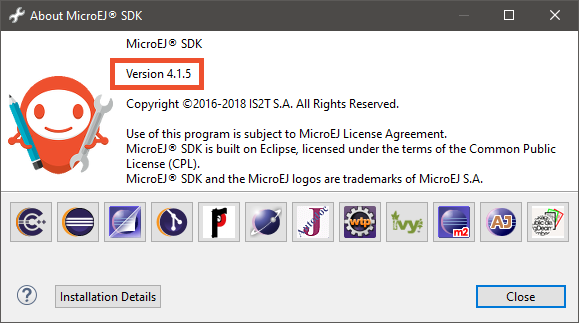
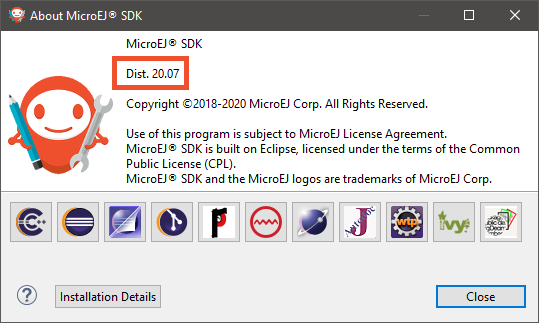
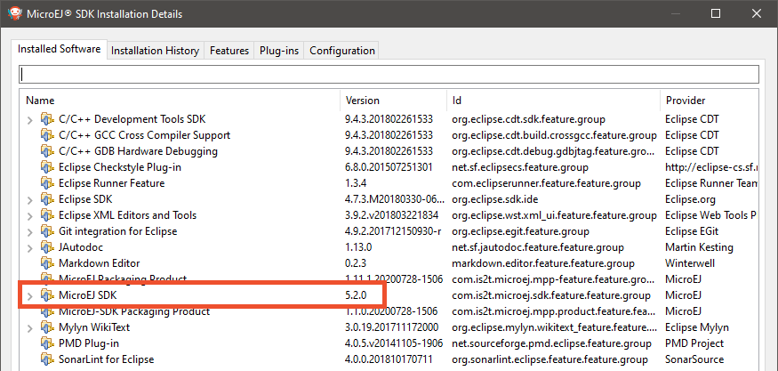

.. warning::

  This documentation is for SDK 5. The latest major version is :ref:`SDK 6 <sdk_6_user_guide>`.
  SDK 5 is in maintenance mode since the release of :ref:`SDK 5.8.0 <changelog-5.8.0>`.
  Consequently, as stated in the :ref:`SDK End User License Agreement (EULA) <sdk_eula>`, the SDK will reach the end of its life by July 2028.
  Contact :ref:`our support team <get_support>` for assistance with migrating to the new SDK, or your sales representative if you require an extension of SDK maintenance as a service.

.. _get_sdk_version:

SDK Version
===========

In the SDK, go to ``Help`` > ``About MicroEJ SDK`` menu.

In case of SDK ``4.1.x``, the SDK version is directly displayed, such as ``4.1.5``:

In case of SDK ``5.x``, the value displayed is the SDK distribution, such as ``19.05`` or ``20.07``:

To retrieve the SDK version that is currently installed in this distribution, proceed with the following steps:

   - Click on the ``Installation Details`` button,
   - Click on the ``Installed Software`` tab,
   - Retrieve the version of entry named ``MicroEJ SDK``.

  

..
   | Copyright 2021-2025, MicroEJ Corp. Content in this space is free 
   for read and redistribute. Except if otherwise stated, modification 
   is subject to MicroEJ Corp prior approval.
   | MicroEJ is a trademark of MicroEJ Corp. All other trademarks and 
   copyrights are the property of their respective owners.
