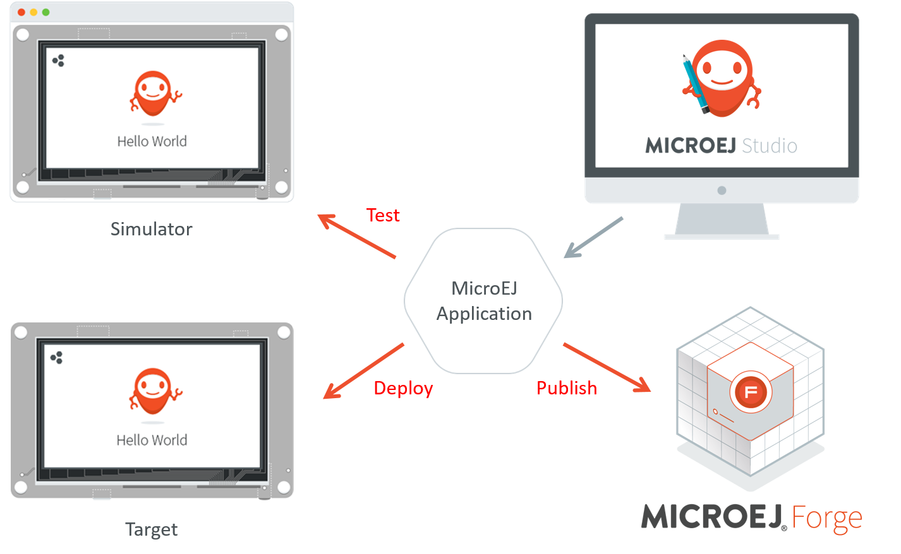

.. _chapter.microej.getting.started:

MicroEJ Studio Getting Started
==============================

.. _microej.introduction:

Introducing MicroEJ Studio and Virtual Devices
==============================================

MicroEJ Studio provides tools based on Eclipse to develop software
applications for MicroEJ-ready devices. MicroEJ Studio allows
application developers to write MicroEJ applications, run them on a
virtual (simulated) or real device, and publish them to a MicroEJ Forge
instance.

This document is an introduction to application development with MicroEJ
Studio. The purpose of MicroEJ Studio is to develop for targeted MCU/MPU
computers (IoT, wearable, etc.) and it is therefore a cross-development
tool.

Unlike standard low-level cross-development tools, MicroEJ Studio offers
unique services like hardware simulation, deployment to the target
hardware and final publication to a MicroEJ Forge instance.

Application development is based on the following elements:

-  MicroEJ Studio, the integrated development environment for writing
   applications. It is based on Eclipse and relies on the integrated
   Java compiler (JDT). It also provides a dependency manager for
   managing MicroEJ Libraries (see
   `??? <#section.ivy.dependency.manager>`__). The current version of
   MicroEJ Studio is built on top of Eclipse Oxygen
   (``https://www.eclipse.org/oxygen/``).

-  MicroEJ Virtual Device, a software package including the resources
   and tools required for building and testing an application for a
   specific MicroEJ-ready device. A Virtual Device will simulate all
   capabilities of the corresponding hardware board:

   -  Computation and Memory,

   -  Communication channels (e.g. Network, USB ...),

   -  Display,

   -  User interaction.

   Virtual Devices are imported into MicroEJ Studio within a local
   folder called MicroEJ Repository. Once a Virtual Device is imported,
   an application can be launched and tested on Simulator. It also
   provides a mean to locally deploy the application on a MicroEJ-ready
   device.

-  MicroEJ-ready device, a hardware device that has been previously
   programmed with a MicroEJ Firmware. A MicroEJ Firmware is a binary
   instance of MicroEJ runtime for a target hardware board.
   MicroEJ-ready devices are built using MicroEJ SDK. MicroEJ Virtual
   Devices and MicroEJ Firmwares share the same version (there is a 1:1
   mapping).

The following figure gives an overview of MicroEJ Studio possibilities:

   MicroEJ Application Development Overview

Perform Online Getting Started
==============================

MicroEJ Studio Getting Started is available on
``https://developer.microej.com/5/getting-started-studio.html``.

Starting from scratch, the steps to go through the whole process are:

1. Setup a board and test a MicroEJ Firmware:

   -  Select between one of the available boards;

   -  Download and install a MicroEJ firmware on the target hardware;

   -  Deploy and run a MicroEJ demo on board.

2. Setup and learn to use development tools:

   -  Download and install MicroEJ Studio;

   -  Download and install the corresponding Virtual Device for the
      target hardware;

   -  Download, build and run your first application on Simulator;

   -  Build and run your first application on target hardware.

The following figure gives an overview of the MicroEJ software
components required for both host computer and target hardware:

.. _section.application.publication:

Application Publication
=======================

.. _section.build.wadapps.package:

Build the WPK
-------------

When the application is ready for deployment, the last step in MicroEJ
Studio is to create the WPK (Wadapps PacKage) file that is intended to
be published on a MicroEJ Forge instance for end users.

In MicroEJ Studio, right-click on the Sandboxed Application project name
and select ``Build Module``.

The WPK build process will display messages in MicroEJ console, ending
up the following message:

``[echo] project hello published locally with version 0.1.0-RC201907091602``

``BUILD SUCCESSFUL``

``Total time: 1 minute 6 seconds``

.. _section.publish.on.a.microej.store:

Publish on a MicroEJ Forge Instance
-----------------------------------

The WPK file produced by the build process is located in a dedicated
``target~/artifacts`` folder in the project.

The ``.wpk`` file is ready to be uploaded to a MicroEJ Forge instance.
Please consult ``https://community.microej.com`` for more information.

.. _section.install.and.setup.studio:

Workspaces and Virtual Devices Repositories
===========================================

When starting MicroEJ Studio, it prompts you to select the last used
workspace or a default workspace on the first run. A workspace is a main
folder where to find a set of projects containing source code.

When loading a new workspace, MicroEJ Studio prompts for the location of
the MicroEJ repository, where the Virtual Devices will be imported. By
default, MicroEJ Studio suggests to point to the default MicroEJ
repository on your operating system, located at
``${user.home}/.microej/repositories/[version]``. You can select an
alternative location. Another common practice is to define a local
repository relative to the workspace, so that the workspace is
self-contained, without external file system links and can be shared
within a zip file.

.. _section.application.development:

Application Development
=======================

The following sections of this document shall prove useful as a
reference when developing applications for MicroEJ. They cover concepts
essential to MicroEJ applications design.

In addition to these sections, by going to
``https://developer.microej.com/``, you can access a number of helpful
resources such as:

-  Libraries from the MicroEJ Central Repository
   (``https://repository.microej.com/``);

-  Application Examples as source code from MicroEJ Github Repositories
   (``https://github.com/MicroEJ``);

-  Documentation (HOWTOs, Reference Manuals, APIs javadoc...).
