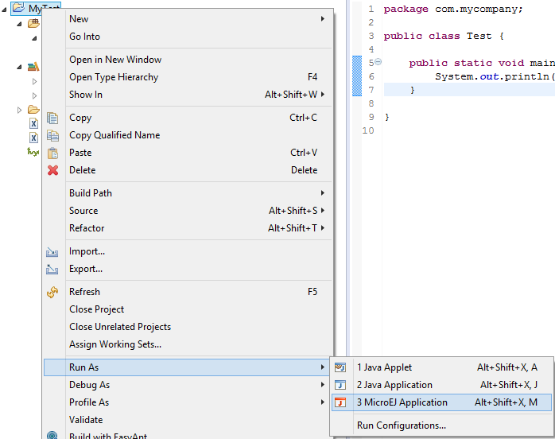
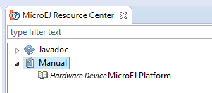

.. _chapter.microej.getting.started:

MicroEJ SDK Getting Started
###########################

.. _microej.introduction:

Introducing MicroEJ SDK
=======================

MicroEJ SDK provides tools based on Eclipse to develop software
applications for MicroEJ-ready devices. MicroEJ SDK allows application
developers to write MicroEJ applications and run them on a virtual
(simulated) or real device.

This document is a step-by-step introduction to application development
with MicroEJ SDK. The purpose of MicroEJ SDK is to develop for targeted
MCU/MPU computers (IoT, wearable, etc.) and it is therefore a
cross-development tool.

Unlike standard low-level cross-development tools, MicroEJ SDK offers
unique services like hardware simulation and local deployment to the
target hardware.

Application development is based on the following elements:

-  MicroEJ SDK, the integrated development environment for writing
   applications. It is based on Eclipse and is relies on the integrated
   Java compiler (JDT). It also provides a dependency manager for
   managing MicroEJ Libraries (see :ref:`section.ivy.dependency.manager`).
   The current version of MicroEJ SDK is built on top of Eclipse Oxygen
   (:http:`https://www.eclipse.org/oxygen/`).

-  MicroEJ Platform, a software package including the resources and
   tools required for building and testing an application for a specific
   MicroEJ-ready device. MicroEJ platforms are imported into MicroEJ SDK
   within a local folder called MicroEJ Platforms repository. Once a
   MicroEJ platform is imported, an application can be launched and
   tested on simulator. It also provides a means to locally deploy the
   application on a MicroEJ-ready device.

-  MicroEJ-ready device, an hardware device that will be programmed with
   a MicroEJ firmware. A MicroEJ firmware is a binary instance of
   MicroEJ runtime for a target hardware board.

Starting from scratch, the steps to go through the whole process are
detailed in the following sections of this chapter :

-  Download and install a MicroEJ Platform

-  Build and run your first application on simulator

-  Build and run your first application on target hardware

.. _section.install.and.setup.studio:

Setup MicroEJ SDK
=================

.. include:: sectionPlatform.rst

Build and Run an Application
============================

.. _microej.sample.applications:

Create a MicroEJ Standalone Application
---------------------------------------

-  Create a project in your workspace. Select :guilabel:`File` > :guilabel:`New` >
   :guilabel:`MicroEJ Standalone Application Project`.

   .. figure:: png/newApp1.png
      :alt: New MicroEJ Standalone Application Project
      :width: 80.0%
      :align: center

      New MicroEJ Standalone Application Project

-  Fill in the application template fields, the Project name field will
   automatically duplicate in the following fields. Click on :guilabel:`Finish`.
   A template project is automatically created and ready to use, this
   project already contains all folders wherein developers need to put
   content:

   -  ``src/main/java``: Folder for future sources

   -  ``src/main/resources``: Folder for future resources (images, fonts
      etc.)

   -  ``META-INF``: Sandboxed Application configuration and resources

   -  ``module.ivy``: Ivy input file, dependencies description for the
      current project

-  Right click on the source folder ``src/main/java`` and select
   :guilabel:`New` > :guilabel:`Package`. Give a name: ``com.mycompany``.
   Click on :guilabel:`Finish`.

   .. figure:: png/newApp8.png
      :alt: New Package
      :width: 80.0%
      :align: center

      New Package

-  The package ``com.mycompany`` is available under ``src/main/java`` folder.
   Right click on this package and select :guilabel:`New` > :guilabel:`Class`.
   Give a name: ``Test`` and check the box ``public static void main(String[]
   args)``. Click on :guilabel:`Finish`.

   .. figure:: png/newApp9.png
      :alt: New Class
      :width: 80.0%
      :align: center

      New Class

-  The new class has been created with an empty ``main()`` method. Fill
   the method body with the following lines:

   ::

      System.out.println("hello world!");

   .. figure:: png/newApp10.png
      :alt: MicroEJ Application Content
      :width: 80.0%
      :align: center

      MicroEJ Application Content

   The test application is now ready to be executed. See next sections.

.. _section.run.on.simulator:

Run on the Simulator
--------------------

To run the sample project on Simulator, select it in the left panel then right-click
and select :guilabel:`Run` > :guilabel:`Run as` > :guilabel:`MicroEJ Application`.

   MicroEJ Development Tools Overview

MicroEJ SDK console will display Launch steps messages.

::

    =============== [ Initialization Stage ] ===============
    =============== [ Launching on Simulator ] ===============
    hello world!
    =============== [ Completed Successfully ] ===============

    SUCCESS

.. _section.run.on.emb:

Run on the Hardware Device
--------------------------

Compile an application, connect the hardware device and deploy on it is
hardware dependant. These steps are described in dedicated documentation
available inside the MicroEJ Platform. This documentation is accessible
from the MicroEJ Resources Center view.

.. note::

   MicroEJ Resources Center view may have been closed. Click on
   :guilabel:`Help` > :guilabel:`MicroEJ Resources Center` to reopen it.

Open the menu :guilabel:`Manual` and select the documentation
``[hardware device] MicroEJ Platform``, where ``[hardware device]`` is
the name of the hardware device. This documentation features a guide to
run a built-in application on MicroEJ Simulator and on hardware device.

   MicroEJ Platform Guide

.. _section.application.development:

Application Development
=======================

The following sections of this document shall prove useful as a
reference when developing applications for MicroEJ. They cover concepts
essential to MicroEJ applications design.

In addition to these sections, by going to
:http:`https://developer.microej.com/`, you can access a number of helpful
resources such as:

-  Libraries from the MicroEJ Central Repository
   (:http:`https://repository.microej.com/`)

-  Application Examples as source code from MicroEJ Github Repositories
   (:http:`https://github.com/MicroEJ`)

-  Documentation (HOWTOs, Reference Manuals, APIs javadoc...)

