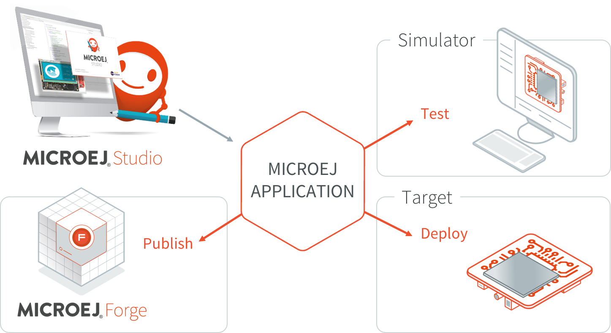

.. _studio_user_guide:

Studio/SDK User Guide
=====================

MicroEJ Studio/SDK provides tools based on Eclipse to develop software applications for MicroEJ-ready devices.
MicroEJ Studio/SDK allows application developers to write MicroEJ Applications and run them on a virtual (simulated) or real device.

The purpose of MicroEJ SDK is to develop for targeted MCU/MPU computers (IoT, wearable, etc.) and it is therefore a cross-development tool.
Unlike standard low-level cross-development tools, 
MicroEJ Studio/SDK offers unique services like hardware simulation and local deployment to the target hardware.

Application development is based on the following elements:

-  MicroEJ Studio/SDK, the integrated development environment for writing applications.
   It is based on Eclipse and relies on the integrated Java compiler (JDT).
   It also provides a dependency manager for managing MicroEJ Libraries (see :ref:`mmm`).
   The current distribution of MicroEJ SDK / Studio (``21.03``) is built on top of `Eclipse 2020-06 <https://www.eclipse.org/downloads/packages/release/2020-06/r/eclipse-ide-java-developers>`_.

-  MicroEJ Platform, a software package including the resources and
   tools required for building and testing an application for a specific
   MicroEJ-ready device. MicroEJ Platforms are imported into MicroEJ SDK
   within a local folder called MicroEJ Platforms repository. Once a
   MicroEJ Platform is imported, an application can be launched and
   tested on Simulator. It also provides a mean to locally deploy the
   application on a MicroEJ-ready device.

-  MicroEJ Virtual Device, a software package including the resources
   and tools required for building and testing an application for a
   specific MicroEJ-ready device. A Virtual Device will simulate all
   capabilities of the corresponding hardware board:

   -  Computation and Memory,

   -  Communication channels (e.g. Network, USB ...),

   -  Display,

   -  User interaction.

   Virtual Devices are imported into MicroEJ Studio within a local
   folder called MicroEJ Repository. Once a Virtual Device is imported,
   an application can be launched and tested on Simulator. It also
   provides a mean to locally deploy the application on a MicroEJ-ready
   device.

-  MicroEJ-ready device, a hardware device that has been previously
   programmed with a MicroEJ Firmware. A MicroEJ Firmware is a binary
   instance of MicroEJ runtime for a target hardware board.
   MicroEJ-ready devices are built using MicroEJ SDK. MicroEJ Virtual
   Devices and MicroEJ Firmwares share the same version (there is a 1:1
   mapping).

The following figure gives an overview of MicroEJ SDK / Studio possibilities:

   MicroEJ Application Development Overview

Starting from scratch, the steps to go through the whole process are
detailed in the following sections of this chapter :

-  :ref:`Download and install a MicroEJ Platform <platform_import>`

-  :ref:`Build and run your first Application on Simulator <simulator_execution>`

-  :ref:`Build and run your first Application on Device <device_build>`

.. toctree::
   :hidden:
   :maxdepth: 1

   install
   workspace
   systemRequirements
   sdkReleaseNotes
   sdkChangeLog
   sdkMigrationNotes
   version
   troubleshooting
   
..
   | Copyright 2021, MicroEJ Corp. Content in this space is free 
   for read and redistribute. Except if otherwise stated, modification 
   is subject to MicroEJ Corp prior approval.
   | MicroEJ is a trademark of MicroEJ Corp. All other trademarks and 
   copyrights are the property of their respective owners.
