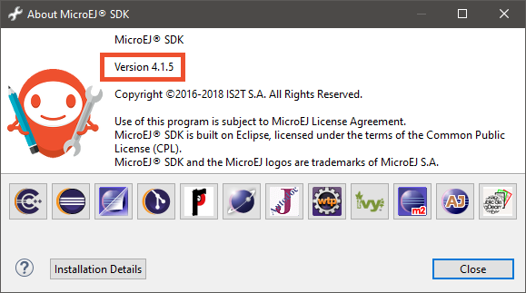
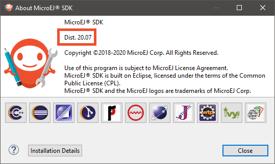
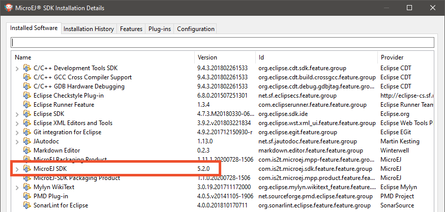

.. _get_sdk_version:

MicroEJ Studio/SDK Version
==========================

In MicroEJ Studio/SDK, go to ``Help`` > ``About MicroEJ SDK`` menu.

In case of MicroEJ SDK ``4.1.x``, the MicroEJ SDK version is directly displayed, such as ``4.1.5``:

In case of MicroEJ SDK ``5.x``, the value displayed is the MicroEJ SDK distribution, such as ``19.05`` or ``20.07``:

To retrieve the MicroEJ SDK version that is currently installed in this distribution, proceed with the following steps:

   - Click on the ``Installation Details`` button,
   - Click on the ``Installed Software`` tab,
   - Retrieve the version of entry named ``MicroEJ SDK`` (or ``MicroEJ Studio``).

  

..
   | Copyright 2021, MicroEJ Corp. Content in this space is free 
   for read and redistribute. Except if otherwise stated, modification 
   is subject to MicroEJ Corp prior approval.
   | MicroEJ is a trademark of MicroEJ Corp. All other trademarks and 
   copyrights are the property of their respective owners.
