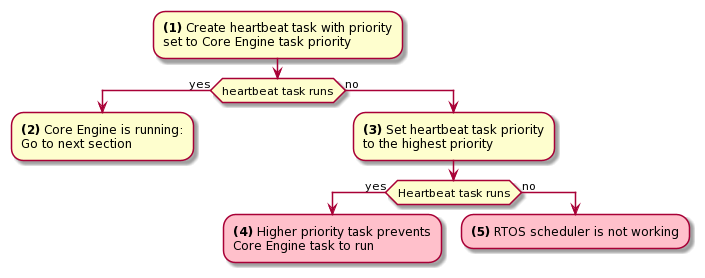

.. _training_debug_gui_application_freeze:

==============================
Debug a GUI Application Freeze
==============================

Description
===========

In this training, you will get insights on how to instrument a frozen GUI application.

Intended Audience
=================

This training is designed for Application developers who want to debug a GUI freeze in their application.

Prerequisites
=============

To get the most out of this training, participants should have a basic knowledge of
Java programming language and GUI development within MicroEJ environment.

Introduction
============

When an application User Interface freezes and becomes unresponsive, in most cases, one of the following conditions applies:

- An unrecoverable system failure occurred, like a HardFault, and the RTOS tasks are not scheduled anymore.
- The RTOS task that runs the Core Engine is never given CPU time (suspended or blocked).
- The RTOS task that runs the Core Engine is executing never-ending native code (infinite loop in native implementation for example).
- A Java method executes a long-running operation in the MicroUI thread (also called Display Pump thread).
- The application code is unable to receive or process user input events.

The following sections explain how to instrument the code to locate the issue when the UI freeze occurs.
The steps followed are:

1. Check if the RTOS properly schedules the Core Engine task.
2. Check if the Core Engine properly schedules all Java threads.
3. Check if the Core Engine properly schedules the MicroUI thread.
4. Check if Input Events are properly processed.

.. note::
   - The checks of the schedulers are possible with :ref:`systemview` and :ref:`MicroUI Debug Traces <microui_traces>`.
   - The Input Events check is possible with the :ref:`LLUI_INPUT_dump API <section_inputs_eventbuffer>`.

Check RTOS Tasks Scheduling
---------------------------

Let's start at low level by figuring out if the RTOS is scheduling tasks correctly.
If possible, use a debugger or :ref:`systemview`; if not, use the heartbeat task described below.

The following flow chart summarizes the investigation steps with a heartbeat task:

..
   @startuml
   :**(1)** Create heartbeat task with priority\nset to Core Engine task priority;
   if (heartbeat task runs) then (yes)
     :**(2)** Core Engine is running:\nGo to next section;
     kill
   else (no)
     :**(3)** Set heartbeat task priority\nto the highest priority;
     if (Heartbeat task runs) then (yes)
       #pink:**(4)** Higher priority task prevents\nCore Engine task to run;
       kill
     else (no)
       #pink:**(5)** RTOS scheduler is not working;
       kill
     endif
   endif
   @enduml  

**(1)** Make one of the RTOS tasks acts like a heartbeat: create a dedicated
task and make it report in some way at a regular pace (print a message
on standard output, blink an LED, use SystemView, etc.).
Set the heartbeat task priority to the same priority as the Core Engine task. 

**(2)** In this configuration, if the heartbeat is still running when the UI freeze occurs, we can go a step 
further and check whether the Core Engine is still scheduling Java threads or not. 
See next section :ref:`training_debug_gui_application_freeze.check_java_threads_scheduling`.

**(3)** If the heartbeat doesn't run when the UI freeze occurs, set the heartbeat task priority to the maximum priority.

.. warning:: 
   Some RTOS use a task to schedule the RTOS timers.
   The heartbeat task priority must be lower than the RTOS timers priority.

..

**(4)** In this configuration, if the heartbeat is still running when the UI freeze occurs, then an RTOS task with a 
priority higher than the Core Engine task keeps using the CPU. 
Use the RTOS specific tools to identify what is the faulty task.

**(5)** If the heartbeat doesn't run when the UI freeze occurs, then the RTOS scheduler is not scheduling anything. 
This can be caused by an RTOS timer task or an interrupt handler that never returns, or a crash of the RTOS scheduler.

.. _training_debug_gui_application_freeze.check_java_threads_scheduling:

Check Java Threads Scheduling
-----------------------------

As a reminder, the threading model implemented by Core Engine is called green thread: it defines a multi-threaded environment without relying on any native RTOS capabilities. 
Therefore, all Java threads run in a single RTOS task.
For more details, please refer to the :ref:`MicroEJ Core Engine<core_engine>` section.
A quick way to check if the Java threads are scheduled correctly is, here again, to make one of the threads print a heartbeat message. Copy/paste the following snippet in the ``main()`` method of the application:

.. code-block:: java

   TimerTask task = new TimerTask() {

       @Override
       public void run() {
           System.out.println("Alive");
       }
   };
   Timer timer = new Timer();
   timer.schedule(task, 10_000, 10_000);

This code creates a new Java thread that will print the message ``Alive``
on the standard output every 10 seconds.

Assuming no one canceled the ``Timer``, if the ``Alive`` printouts stop when the UI freeze occurs, then it can mean that:

- The Core Engine stopped scheduling the Java threads.
- Or that one or more threads with a higher priority prevent the threads with a lower priority from running.

Here are a few suggestions:

- Ensure no Java threads with a high priority prevent the scheduling of the other Java threads.
  For example, convert the above example with a dedicated thread with the highest priority:

  .. code-block:: java

     Thread thread = new Thread(new Runnable() {

     	@Override
     	public void run() {
     		while (true) {
     			try {
     				Thread.sleep(10_000);
     				System.out.println("Alive");
     			} catch (InterruptedException e) {
     				e.printStackTrace();
     			}
     		}
     	}
     });
     thread.setPriority(Thread.MAX_PRIORITY);
     thread.start();

- The RTOS task that runs the Core Engine might be suspended or
  blocked. Check if some API call is suspending the task or if a
  shared resource could be blocking it.

- When a Java native method is called, it calls its C counterpart function in the RTOS task that runs the Core Engine.
  While the C function is running, no other Java methods can run because the Core Engine waits for the C function to finish.
  Consequently, no Java thread can ever run again if the C function never returns.
  Therefore, spot any suspect native functions and trace every entry/exit to detect faulty code.

Please refer to :ref:`implementation_details` if you encounter issues
when implementing the heartbeat.

Check UI Thread Liveness
------------------------

Now, what if the ``Alive`` heartbeat runs while the UI is frozen?
Java threads are getting scheduled, but the UI thread (also called
Display Pump thread) does not process display events.

Let's make the heartbeat snippet above execute in the UI
thread. Simply wraps the ``System.out.println("Alive")`` with a
`callSerially()`_:

.. code-block:: java

   TimerTask task = new TimerTask() {

       @Override
       public void run() {
           System.out.println("TimerTask Alive");
           MicroUI.callSerially(new Runnable() {
           
               @Override
               public void run() {
                   System.out.println("UI Alive");
               }
           });
       }
       
       @Override
       public void uncaughtException(Timer timer, Throwable e) {
           // Default implementation of this method would cancel the task. 
           // Let's just ignore uncaught exceptions for debug purposes.
           e.printStackTrace();
       }
   };
   Timer timer = new Timer();
   timer.schedule(task, 10_000, 10_000);

In case this snippet prints ``TimerTask Alive`` but not ``UI alive`` when
the freeze occurs, then there are a few options:

-  The application might be processing a long operation in the UI
   thread, for example:

   -  infinite/indeterminate loops
   -  network/database access
   -  heavy computations
   -  `Thread.sleep()`_/`Object.wait()`_
   -  ``SNI_suspendCurrentJavaThread()`` in native call

   When doing so, any other UI-related operation will not be processed
   until completion, leading the display to be unresponsive. Any code
   that runs in the UI thread might be responsible. Look for code
   executed as a result of calls to:

   -  ``repaint()``: code in `renderContent()`_
   -  ``revalidate()``/``revalidateSubTree()``: code in
      ``validateContent()`` and ``setBoundsContent()``
   -  `handleEvent()`_
   -  `callSerially()`_: code wrapped in such calls will be executed
      in the UI thread

-  The UI thread has terminated.

As a general rule, avoid running extended operations in the UI thread,
follow the general pattern and use a dedicated thread/executor instead:

.. (QUESTION: use a sequence diagram to be more explicit?)

.. code-block:: java

   ExecutorService executorService = ServiceLoaderFactory.getServiceLoader().getService(ExecutorService.class, SingleThreadExecutor.class);
   executorService.execute(new Runnable() {

       @Override
       public void run() {
       
           // (... long non-UI operation ...)
           
           // optional: update the UI upon completion
           Display.getDefaultDisplay().callSerially(new Runnable() {
                       
           @Override
           public void run() {
                       // update display code (will be executed in UI thread)
           }
       });
       }
   });

.. _callSerially(): https://repository.microej.com/javadoc/microej_5.x/apis/ej/microui/MicroUI.html#callSerially-java.lang.Runnable-
.. _Thread.sleep(): https://repository.microej.com/javadoc/microej_5.x/apis/java/lang/Thread.html#sleep-long-
.. _Object.wait(): https://repository.microej.com/javadoc/microej_5.x/apis/java/lang/Object.html#wait--
.. _renderContent(): https://repository.microej.com/javadoc/microej_5.x/apis/ej/mwt/Widget.html#renderContent-ej.microui.display.GraphicsContext-int-int-
.. _handleEvent(): https://repository.microej.com/javadoc/microej_5.x/apis/ej/mwt/Widget.html#handleEvent-int-

Check Input Events Processing
-----------------------------

Another case worth looking at is whether the application is processing user input events as it should.
The UI may look "frozen" only because it doesn't react to input events. 
Replace the desktop instance with the one below to log all user inputs.

.. code-block:: java

   Desktop desktop = new Desktop() {

       @Override
       public EventHandler getController() {
           EventHandler controller = super.getController();
           return new EventHandler() {
           @Override
               public boolean handleEvent(int event) {
               System.out.println("Desktop.handleEvent() received event of type " + Event.getType(event));
               return controller.handleEvent(event);
               }
           };
       }
   };

It is also possible to display the content of MicroUI Event Buffer with the ``LLUI_INPUT_IMPL_log_XXX`` API.
Please refer to :ref:`the Event Buffer documentation <section_inputs_eventbuffer>` for more information.

.. _implementation_details:

Implementation Details
----------------------

Java Threads Creation
~~~~~~~~~~~~~~~~~~~~~

The number of threads in the MicroEJ Application must be sufficient to support the creation of additional threads when using `Timer`_ and `Thread`_.
The number of available threads can be updated in the launch configuration of the application (see :ref:`option_number_of_threads`).

If it is not possible to increase the number of available threads (for
example, because the memory is full), try to reuse another thread but
not the UI thread.

.. _Timer: https://repository.microej.com/javadoc/microej_5.x/apis/ej/bon/Timer.html
.. _Thread: https://repository.microej.com/javadoc/microej_5.x/apis/java/lang/Thread.html

UART Not Available
~~~~~~~~~~~~~~~~~~

If the UART output is not available, use another method to signal that
the heartbeat task is running (e.g., blink an LED, use SystemView).

..
   | Copyright 2021-2024, MicroEJ Corp. Content in this space is free 
   for read and redistribute. Except if otherwise stated, modification 
   is subject to MicroEJ Corp prior approval.
   | MicroEJ is a trademark of MicroEJ Corp. All other trademarks and 
   copyrights are the property of their respective owners.