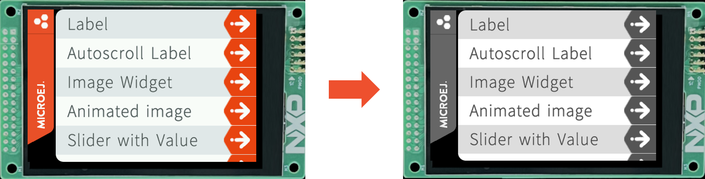

.. _training_display_formats:

==============================
Display Formats Considerations
==============================

Description
===========

In this training, you will get an overview of the considerations
to take into account when choosing a display format (e.g. RGB565, monochrome, CLUT, ...).

The below sections present the key considerations for choosing a display format,
using the widely-adopted RGB565 colored format as a reference point.

The following formats are presented:

- :ref:`training_monochrome_format_considerations`
- :ref:`training_8bpp_clut__format_considerations`

Intended Audience
=================

This training is designed for embedded system developers, hardware engineers,
and product designers who are responsible for choosing the appropriate display format
for their product.

Prerequisites
=============

To get the most out of this training, participants should have:

- A basic understanding of display technologies, color representation and depth,
- A basic understanding of MicroEJ GUI stack.

.. _training_monochrome_format_considerations:

Monochrome & Grayscale Format Considerations
============================================

First and foremost, grayscale displays can represent a range of
shades between black and white, while monochrome displays can only 
represent two colors: black and white. 

The below document assumes that a monochrome format is a
grayscale format with only two possible shades: black and white (1 bit per pixel).

The MicroUI stack supports the following grayscale formats by default:

- ``C4``: the pixel uses 4 bits-per-pixel (4BPP),
- ``C2``: the pixel uses 2 bits-per-pixel (2BPP),
- ``C1``: the pixel uses 1 bit-per-pixel (1BPP, aka monochrome).

See :ref:`Pixel Structure <display_pixel_structure_standard>` documentation for more information.

Application Considerations
--------------------------

**Testing a "Colored" Application on a Grayscale Display**

It is possible to test a "colored" application on a grayscale display.

The straightforward way is to :ref:`update the display format of the VEE Port <section_display_installation>`
to simulate the application using a grayscale format.

It is recommended to test with ``C4`` format first (instead of ``C1`` or ``C2``) to get a grayscale rendering.
Then, adapt the application resources to render properly in ``C1`` or ``C2``.

Example when switching from ``RGB565`` to ``C4`` format:

   RGB565 vs C4 Display Format

.. note:: 

    Conversion functions are used at runtime to convert the application colors to the proper display format
    (see :ref:`Pixel Structure <display_pixel_structure_standard>`)
        
        * Example: if a red rectangle is drawn, 
          the color will converted using the color conversion algorithm
          corresponding to the display format.

**Anti-Aliasing**

The anti-aliasing is managed like on colored displays.

To save CPU time, it is recommended to convert the Fonts and Images
to the display format to avoid useless blending at runtime
(e.g. if the display format is ``C2``, embed Fonts in ``1BPP`` or ``2BPP`` format).

**Detect Display Format at Runtime**

If needed, the APIs of the ``Display`` class can be used to detect the display
format on the application side (``isColor``, ``getPixelDepth``).

See `Display class documentation <https://repository.microej.com/javadoc/microej_5.x/apis/index.html?ej/microui/display/Display.html>`__.

**Fonts Considerations**

Anti-aliased fonts may have a bad rendering when it comes to 
displaying them in ``C1`` format (1BPP):

* ``4BPP`` font format:
  
  .. image:: images/training_display_format_4_bpp_font.png
     :alt: 4BPP Font Format

* ``1BPP`` font format:
  
  .. image:: images/training_display_format_1_bpp_font.png
     :alt: 1BPP Font Format

It is recommended to re-generate the Font files to have a good rendering in ``1BPP`` format.

Refer to :ref:`section.ui.Fonts` documentation to learn more about Fonts configuration.

Footprint Considerations
------------------------

The below document compares the footprint between
``RGB565`` (16BPP) and ``C1`` format (1BPP, monochrome).

.. warning:: 
    For ``C1`` format, be aware that memory alignment constraints can potentially increase the results
    presented below.

ROM Footprint
~~~~~~~~~~~~~

**Application Resources**

The application resources are the main item to consider in terms of footprint reduction:

For images, make sure to :ref:`set the images format <section_image_grayscale_raw>`
according to your display format.

Example with 3 images:

* Image A with size ``32x32``, respecting the display format (fully opaque, e.g. ``RGB585`` format)
* Image B with size ``32x32`` fully transparent (e.g. ``A8`` format)
* Image C with size ``32x32`` with a mix of colors and transparency (e.g. ``ARGB4444`` format)

* **Images footprint on a RGB565 display format (16BPP):**
    * Image A footprint embedded in RGB565 format (32x32x(**16**/8)) + header ~ 2kB
    * Image B footprint embedded in A8 format (32x32x(**8**/8)) + header  ~ 1 kB
    * Image C footprint embedded in ARGB4444 format (32x32x(**8**/8)) + header  ~ 2kB
* **Images footprint on a C1 display format (1BPP):**
    * Image A footprint embedded in C1 format (32x32x(**1**/8)) + header ~ 0.12 kB
    * Image B footprint embedded in A1 format (32x32x(**1**/8)) + header  ~ 0.12 kB
    * Image C footprint embedded in AC11 format (32x32x(**2**/8)) + header  ~ 0.25kB

For Fonts, make sure to :ref:`set the fonts format <fonts_list_grammar>` 
according to your display format.

Example with the `SourceSansPro_15px-600.ejf <https://github.com/MicroEJ/Example-Java-Widget/blob/7.6.0/com.microej.demo.widget/src/main/resources/fonts/SourceSansPro_15px-600.ejf>`__
font.

* **Font footprint on a RGB565 display format (16BPP):**
    * 4 bit-per-pixel format ~ 9.4kB (obtained by building an application and checking the :ref:`SOAR Map File <soar_map_file>`)
* **Font footprint on a C1 display format (1BPP):**
    * 1 bit-per-pixel format ~ 3.5kB (obtained by building an application and checking the :ref:`SOAR Map File <soar_map_file>`)

**UI Libraries**

There is no ROM footprint difference depending on the display format, the libraries are already optimized. 

Only the algorithms used in the application are embedded in the final executable.

**Graphical Engine**

Some algorithms of the Graphical Engine can be removed if not used by the application
(e.g. color conversion algorithms).
Check the :ref:`display_pixel_conversion` linker file configuration for more information.

Example with ``C1`` display format:

* If there are no images embedded in ``ARGB8888`` format in the application, 
  the color conversion algorithm from ``ARGB8888`` to ``C1`` can be removed.

Note that the Graphical Engine is already footprint optimized. 
Removing those algorithms will not reduce significantly its ROM footprint.

RAM Footprint
~~~~~~~~~~~~~

**Display Buffer Size**

The :ref:`Display Buffer Size <section_display_llapi>` 
can be significantly reduced when changing the display format.

Example:

* Let's assume a ``320 x 240`` SPI display is used (only 1 display buffer in RAM),
* ``RGB565`` display format (16 BPP):
    * Display buffer footprint: 320x240x(**16**/8) = 150kB
* ``C1`` display format (1 BPP):
    * Display buffer footprint: 320x240x(**1**/8) ~ 9.3kB

**Images Heap**

If the application uses the :ref:`images_heap`,
its size can be reduced as its now storing images with a lighter format.

Example of Images Heap sized to store a 100x100 image:

* ``RGB565`` display format: 100x100x(**16**/8) ~ 19.5Kb 
* ``C1`` display format: 100x100x(**1**/8) ~ 1.2Kb

.. _training_8bpp_clut__format_considerations:

8BPP CLUT Format Considerations
-------------------------------

Coming Soon!

..
   | Copyright 2024, MicroEJ Corp. Content in this space is free 
   for read and redistribute. Except if otherwise stated, modification 
   is subject to MicroEJ Corp prior approval.
   | MicroEJ is a trademark of MicroEJ Corp. All other trademarks and 
   copyrights are the property of their respective owners.