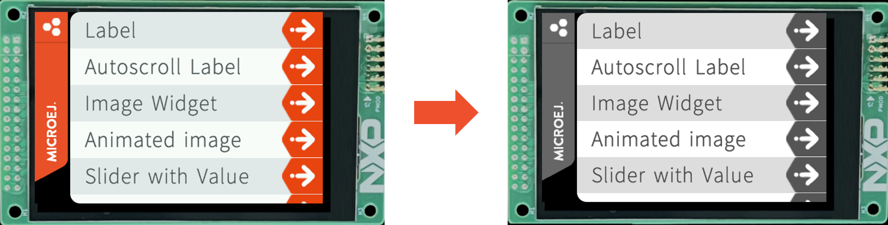

.. _training_grayscale_display_considerations:

================================
Grayscale Display Considerations
================================

Description
===========

In this training, you will get an overview of the considerations
to take into account when developing a GUI application using a grayscale display.

Intended Audience
=================

This training is designed for embedded system developers, hardware engineers,
and product designers who are responsible for choosing a display format
for their product.

Prerequisites
=============

To get the most out of this training, participants should have:

- A basic understanding of display technologies, color representation and depth,
- A basic understanding of MicroEJ Graphics Engine.

.. _training_monochrome_format_considerations:

Training
========

First and foremost, grayscale displays can represent a range of
shades between black and white. 

The MicroUI stack supports the following grayscale formats by default:

- ``C4``: the pixel uses 4 bits-per-pixel (4BPP),
- ``C2``: the pixel uses 2 bits-per-pixel (2BPP),
- ``C1``: the pixel uses 1 bit-per-pixel (1BPP, a.k.a monochrome).

See :ref:`Pixel Structure <display_pixel_structure_standard>` documentation for more information.

The below sections present the key considerations when choosing a grayscale display,
using the widely adopted ``RGB565`` colored format as a reference point.

Application Considerations
--------------------------

**Testing a "Colored" Application on a Grayscale Display**

It is possible to test a "colored" application on a grayscale display.

The straightforward way is to :ref:`update the display format of the VEE Port <section_display_installation>`
to simulate the application using a grayscale format.

It is recommended that the ``C4`` format be tested first to obtain a grayscale rendering.
Then, the application resources should be adapted to render properly in ``C1`` or ``C2``.

Example when switching from ``RGB565`` to ``C4`` format:

   RGB565 vs C4 Display Format

.. note:: 

    Conversion functions are used at runtime to convert the application colors to the proper display format
    (see :ref:`Pixel Structure <display_pixel_structure_standard>`)
        
    For example: if a red rectangle is drawn, 
    the color will be converted using the color conversion algorithm
    corresponding to the display format.

**Anti-Aliasing**

The anti-aliasing is managed like on colored displays.

It is recommended that the fonts and images be converted to the display format.
It allows you to anticipate a wrong blending if your resource has too many bit-per-pixels compared to the display.
(e.g. if the display format is ``C2``, embed your Fonts in ``1BPP`` or ``2BPP`` format instead of ``4BPP``).

**Detect Display Format at Runtime**

If needed, the APIs of the `Display <https://repository.microej.com/javadoc/microej_5.x/apis/index.html?ej/microui/display/Display.html>`__
class can be used to detect the display format on the application side (``isColor``, ``getPixelDepth``).

**Raster Fonts Considerations**

Anti-aliased raster fonts (``*.fnt``, ``*.ejf``) may have a bad rendering when it comes to 
displaying them in ``C1`` format (1BPP):

* ``4BPP`` font format:
  
  .. image:: images/training_display_format_4_bpp_font.png
     :alt: 4BPP Font Format

* ``1BPP`` font format:
  
  .. image:: images/training_display_format_1_bpp_font.png
     :alt: 1BPP Font Format

It is recommended that the font files be re-generated to have a good rendering in ``C1`` format.

Refer to :ref:`section.ui.Fonts` documentation to learn more about Fonts configuration.

Footprint Considerations
------------------------

The document below compares the footprint of ``RGB565`` (``16BPP``) and ``C1`` format (``1BPP``, monochrome).

.. warning:: 
    For the ``C1`` format, memory alignment constraints can potentially increase the results
    presented below.

.. tabs::

       .. tab:: ROM Footprint

        **Application Resources**
        
        The application resources are the main item to consider in terms of footprint reduction.

        For images, make sure to :ref:`set the image format <section_image_grayscale_raw>`
        according to your display format.

        Example with 3 images:

        * Image A with size ``32x32``, respecting the display format (fully opaque, e.g. ``RGB585`` format)
        * Image B with size ``32x32`` fully transparent (e.g. ``A8`` format)
        * Image C with size ``32x32`` with a mix of colors and transparency (e.g. ``ARGB4444`` format)

        Images footprint on a ``RGB565`` display format (``16BPP``):

        * Image A footprint embedded in ``RGB565`` format (32x32x(**16**/8)) + header ~ 2kB
        * Image B footprint embedded in ``A8`` format (32x32x(**8**/8)) + header  ~ 1 kB
        * Image C footprint embedded in ``ARGB4444`` format (32x32x(**8**/8)) + header  ~ 2kB
        
        Images footprint on a ``C1`` display format (``1BPP``):

        * Image A footprint embedded in ``C1`` format (32x32x(**1**/8)) + header ~ 0.12 kB
        * Image B footprint embedded in ``A1`` format (32x32x(**1**/8)) + header  ~ 0.12 kB
        * Image C footprint embedded in ``AC11`` format (32x32x(**2**/8)) + header  ~ 0.25kB

        For Fonts, make sure to :ref:`set the font format <fonts_list_grammar>` 
        according to your display format.

        Example with the `SourceSansPro_15px-600.ejf <https://github.com/MicroEJ/Example-Java-Widget/blob/7.6.0/com.microej.demo.widget/src/main/resources/fonts/SourceSansPro_15px-600.ejf>`__
        font:

        * Font footprint on a ``RGB565`` display format (``16BPP``):

            * 4 bit-per-pixel format ~ 9.4kB (obtained by building an application and checking the :ref:`SOAR Map File <soar_map_file>`)

        * Font footprint on a ``C1`` display format (``1BPP``):

            * 1 bit-per-pixel format ~ 3.5kB (obtained by building an application and checking the :ref:`SOAR Map File <soar_map_file>`)

        **UI Libraries**

        There is no ROM footprint difference depending on the display format, the libraries are already optimized. 

        Only the algorithms used in the application are embedded in the final executable.

        **Graphics Engine**

        Some Graphics Engine algorithms (e.g., color conversion algorithms) can be removed if the application does not use them.
        Check the :ref:`display_pixel_conversion` linker file configuration for more information.

        Example with ``C1`` display format:

        * If the application does not contain images embedded in ``ARGB8888`` format, the color conversion algorithm from ``ARGB8888`` to ``C1`` can be removed.

        .. note::
            Note that the Graphics Engine is already footprint-optimized. 
            Removing those algorithms will not significantly reduce its ROM footprint.

       .. tab:: RAM Footprint

        **Display Buffer Size**

        The :ref:`Display Buffer Size <section_display_llapi>` 
        can be significantly reduced when changing the display format.

        Example:

        * Let's assume a ``320 x 240`` SPI display is used (only 1 display buffer in RAM),
        * ``RGB565`` display format (``16BPP``):

            * Display buffer footprint: 320x240x(**16**/8) = 150kB

        * ``C1`` display format (``1BPP``):
        
            * Display buffer footprint: 320x240x(**1**/8) ~ 9.3kB

        **Images Heap**

        If the application uses the :ref:`images_heap`,
        its size can be reduced as it now stores images in a lighter format.

        Example of Images Heap sized to store a 100x100 image:

        * ``RGB565`` display format: 100x100x(**16**/8) ~ 19.5Kb 
        * ``C1`` display format: 100x100x(**1**/8) ~ 1.2Kb

..
   | Copyright 2024-2025, MicroEJ Corp. Content in this space is free 
   for read and redistribute. Except if otherwise stated, modification 
   is subject to MicroEJ Corp prior approval.
   | MicroEJ is a trademark of MicroEJ Corp. All other trademarks and 
   copyrights are the property of their respective owners.