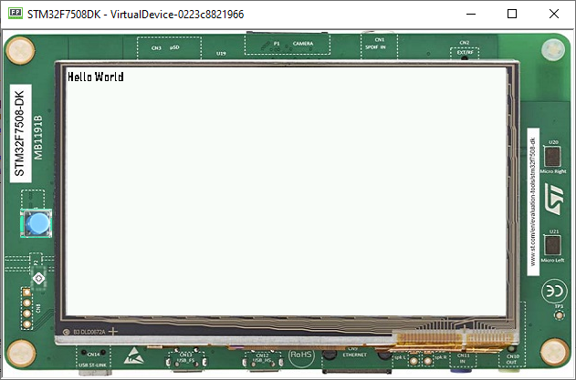

Fonts
=====

- Fonts are graphical resources that can be accessed with a call to ``ej.microui.display.Font.getFont()``.
  To be displayed, these fonts have to be converted at build-time from their source format to the display raw format by the font generator tool.
- Fonts, just like images, must be declared in a ``*.fonts.list`` file. 

Creating a font
---------------

- To create a font, go to the package you want to store your fonts in,
  usually :guilabel:`Resources`> :guilabel:`fonts`.
- Then :guilabel:`Right-Click` > :guilabel:`New` > :guilabel:`Other`> :guilabel:`MicroEJ` > :guilabel:`MicroEJ Font`:

  .. image:: images/microejfont.png
   :align: center 

- Then, type the name of the font:

  .. image:: images/fontname.png
   :align: center

- Click on :guilabel:`Finish`, the following window opens:

  .. image:: images/fonteditor.png
   :align: center

  .. note::
   It is important to have the font that you want already installed on your system.

- To import characters from a system font, click on :guilabel:`Import...` and the following opens:

  .. image:: images/importfonts1.png
   :align: center

- Click on :guilabel:`Next` and then select the font to use as shown below:

  .. image:: images/importfonts2.png
   :align: center

  .. note::

   If using a latin based alphabet, just leave the settings as they are and click on :guilabel:`Finish`, don't forget to adjust the height and baseline of the font.

- Click :guilabel:`Finish` and save the file. The font is imported in the .ejf file.

- Then just add the font to a ``myapp.fonts.list`` file in the ``src/main/resources`` source folder of your application:

  .. code::

     /fonts/NewFont.ejf

- More info in the  :ref:`section.ui.Fonts` section.

Adding the Font to a Label
--------------------------

To add the font, choose the font in the StyleSheet:

.. code:: java

   public static void main(String[] args) {
      MicroUI.start();
      Desktop desktop = new Desktop();
      Flow flow = new Flow(LayoutOrientation.VERTICAL);
      Label label = new Label("Hello World");
      Font font = Font.getFont("/fonts/NewFont.ejf");
      CascadingStylesheet css = new CascadingStylesheet();
      EditableStyle style = css.getSelectorStyle(new ClassSelector(BUTTON));
      flow.addChild(label);
      style.setFont(font);
      desktop.setStylesheet(css);
      desktop.setWidget(flow);
      desktop.requestShow();
   }

.. note::
 Don't forget to set the stylesheet to the desktop.

..
   | Copyright 2021-2022, MicroEJ Corp. Content in this space is free 
   for read and redistribute. Except if otherwise stated, modification 
   is subject to MicroEJ Corp prior approval.
   | MicroEJ is a trademark of MicroEJ Corp. All other trademarks and 
   copyrights are the property of their respective owners.

 