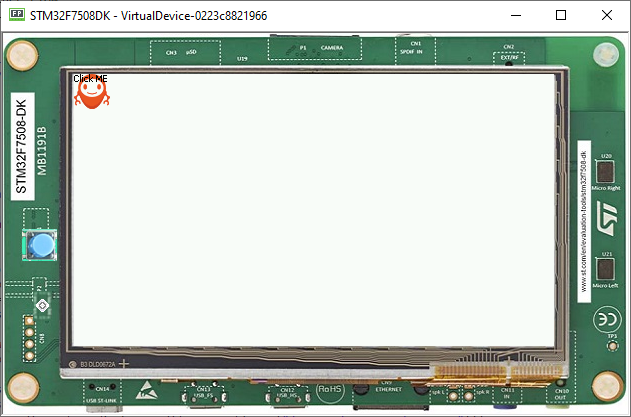

.. _ui-advanced-styling:

Advanced Styling
================

Using Images in Stylesheet
--------------------------

- Let's add a button to the application, with the MicroEJ logo as background.
- Since this background will apply to a specific button, introduce a new class selector that will select this button.

Class Selector
--------------

- Just like a class in CSS, it associates to every element that is from the same class.
- Define a class for the button as follows:

  .. code:: java

    private static final int BUTTON = 600;

- Bind the class ``BUTTON`` to the button widget:

  .. code:: java

    Button button = new Button("Click ME");
    button.addClassSelector(BUTTON);

- Retrieve the style for this class from the stylesheet and edit the attributes:

  .. code:: java

    EditableStyle style = css.getSelectorStyle(new ClassSelector(BUTTON));

- Finally, lets add an `Image Background`_ to this Button:

  .. code:: java

    style.setBackground(new ImageBackground(Image.getImage("/images/microej_logo.png")));

- And the result should be as follows:

  .. code:: java

    public class Main {
       private static final int BUTTON = 600;

       public static void main(String[] args) {
          MicroUI.start();
          Desktop desktop = new Desktop();
          Button button = new Button("Click ME");
          button.addClassSelector(BUTTON);

          Flow flow = new Flow(LayoutOrientation.VERTICAL);
          flow.addChild(button);

          CascadingStylesheet css = new CascadingStylesheet();
          EditableStyle style = css.getSelectorStyle(new ClassSelector(BUTTON));
          style.setBackground(new ImageBackground(Image.getImage("/images/microej_logo.png")));

          desktop.setStylesheet(css);
          desktop.setWidget(flow);
          desktop.requestShow();
       }
    }

.. _Image Background: https://repository.microej.com/javadoc/microej_5.x/apis/ej/mwt/style/background/ImageBackground.html

Combinator and Conditional Style
--------------------------------

- It is possible to combine two or more selectors using combinators.
- In this example the active state of the button will turn the text blue.

  .. code:: java

    CascadingStylesheet css = new CascadingStylesheet();
    Selector buttonSelector = new ClassSelector(BUTTON); 
    EditableStyle style = css.getSelectorStyle(buttonSelector);
    style.setBackground(new ImageBackground(Image.getImage("/images/microej_logo.png")));
    Selector activeSelector = new StateSelector(Button.ACTIVE);
    EditableStyle styleActive = css.getSelectorStyle(new AndCombinator(buttonSelector, activeSelector));
    styleActive.setColor(Colors.BLUE);  

- The class selector for the button has been extracted as a locale to be combined with the button active state selector.

**Next step:** :ref:`ui-event-handling`

..
   | Copyright 2021-2023, MicroEJ Corp. Content in this space is free 
   for read and redistribute. Except if otherwise stated, modification 
   is subject to MicroEJ Corp prior approval.
   | MicroEJ is a trademark of MicroEJ Corp. All other trademarks and 
   copyrights are the property of their respective owners.

 