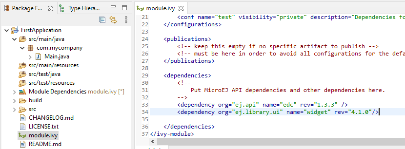

Create a GUI Application
========================

To create a new :ref:`Standalone Application <standalone_application>`:

#. Go to :guilabel:`File` > :guilabel:`New` > :guilabel:`Standalone Application Project`.
#. Fill out the project creation form, like in the example below:

.. image:: images/createStandaloneProject.png
   :align: center

The structure of the new project should look like this:

.. image:: images/structure.png
   :align: center

Add the Widget Dependency
-------------------------

The :ref:`Widget library <widget_library>` features a collection of widgets frequently used in GUIs.

To use the Widget library in the project:

#. Open the ``module.ivy`` file at the root of the project.
#. Add the following dependency: ``<dependency org="ej.library.ui" name="widget" rev="4.1.0"/>``, like below:

..
   | Copyright 2022, MicroEJ Corp. Content in this space is free 
   for read and redistribute. Except if otherwise stated, modification 
   is subject to MicroEJ Corp prior approval.
   | MicroEJ is a trademark of MicroEJ Corp. All other trademarks and 
   copyrights are the property of their respective owners.