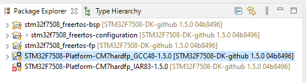

Environment Setup
=================

Start MICROEJ SDK
-----------------

#. Start MICROEJ SDK and select a workspace when prompted.

   .. note::

      If you are not familiar with Eclipse workspaces, select the default and press OK.
   
#. Select the MICROEJ repository when prompted.

   .. note::

      If you are not familiar with MICROEJ repositories, select the default and press OK.

Platform Setup
--------------

#. Clone the Platform sources for the STM32F7508-DK: ``git clone -b 1.5.0 https://github.com/MicroEJ/Platform-STMicroelectronics-STM32F7508-DK.git``.
#. Follow the `Platform Setup section <https://github.com/MicroEJ/Platform-STMicroelectronics-STM32F7508-DK/tree/1.5.0#platform-setup>`_ to import and build the Platform.

The workspace should now contain a Platform ready to be used for application development on STM32F7508-DK:

**Next step:** :ref:`ui-starting-microui`

..
   | Copyright 2021-2022, MicroEJ Corp. Content in this space is free 
   for read and redistribute. Except if otherwise stated, modification 
   is subject to MicroEJ Corp prior approval.
   | MicroEJ is a trademark of MicroEJ Corp. All other trademarks and 
   copyrights are the property of their respective owners.
