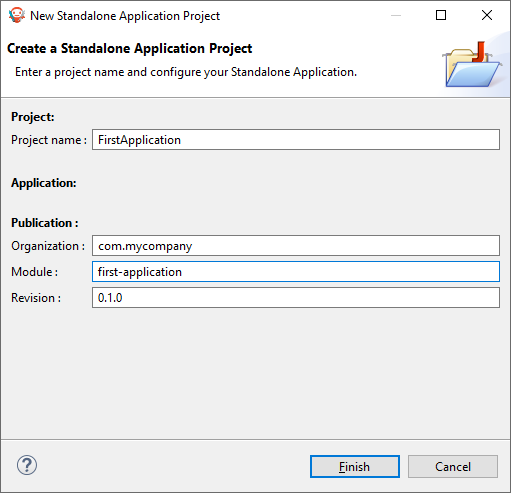
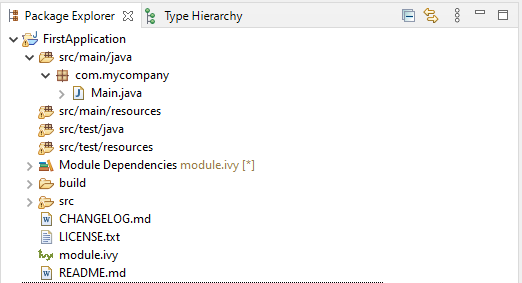

Setup your Environment
======================

Prerequisites
-------------

The :ref:`MICROEJ SDK <sdk_install>` must be installed.
Please check the :ref:`MICROEJ SDK requirements <system-requirements>`.

Download and Install
--------------------

#.  Download the installer package corresponding to your host computer OS: `Download MicroEJ SDK <https://repository.microej.com/packages/SDK/>`__.

#.  Unzip the downloaded installer package if needed and execute the installer.

Start the IDE for the First Time
--------------------------------

#. Start MICROEJ SDK and select a workspace. 

   .. note::

      If you are not familiar with Eclipse workspaces, select the default and press OK.
   
#. Select the MICROEJ repository. 

   .. note::

      If you are not familiar with MICROEJ repositories, select the default and press OK.

Prepare Platform Sources
------------------------

#. Download and unzip the platform sources for STM32F7508-DK by clicking on :guilabel:`Download` > :guilabel:`Download ZIP`: 
   `Go to the Github repository <https://github.com/MicroEJ/Platform-STMicroelectronics-STM32F7508-DK/tree/1.3.2>`__.
#. Follow the README to import the platform sources, activate your license and build your platform, in the Platform Setup section.
#. Once all the steps of the platform setup are done, a new Java project can be created.

Create a New Project
--------------------

Go to :guilabel:`File` > :guilabel:`New` > :guilabel:`Standalone Application Project`:

The project structure should look like this:

Featured Project: Widget Demo
-----------------------------

You can have a look at the widget demo project, which contains multiple samples of widgets and usage.

- `Widget Demo GitHub Repository <https://github.com/MicroEJ/Demo-Widget>`__

.. image:: images/widgetdemo.png
   :align: center

..
   | Copyright 2021-2022, MicroEJ Corp. Content in this space is free 
   for read and redistribute. Except if otherwise stated, modification 
   is subject to MicroEJ Corp prior approval.
   | MicroEJ is a trademark of MicroEJ Corp. All other trademarks and 
   copyrights are the property of their respective owners.
