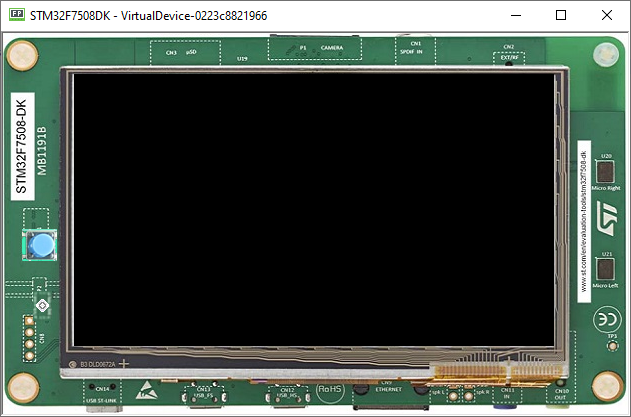
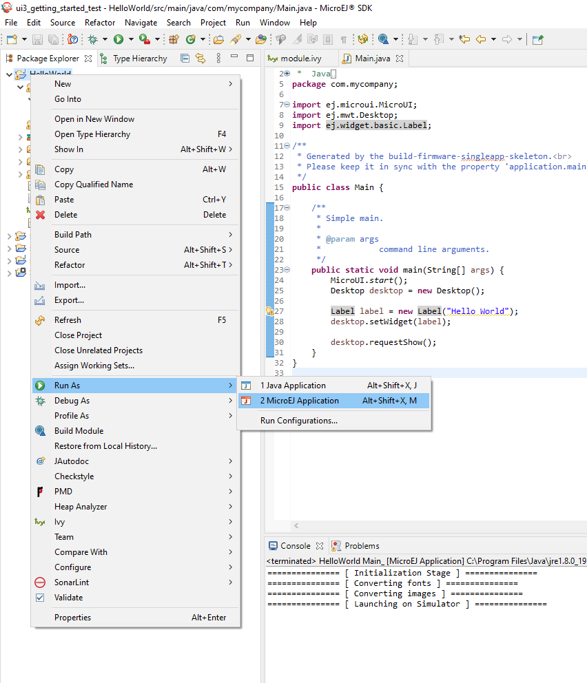
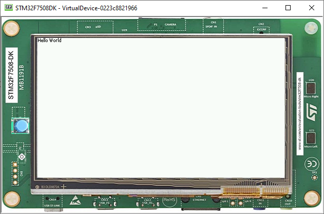

Starting MicroUI
====================

#. To get started, first we need to add MicroUI, a Foundation Library
   that provides an abstraction layer to access the low-level UI inputs
   and outputs.
#. Look for module.ivy, and replace dependencies with the following:

   .. code:: xml

       <dependencies>
           <dependency org="ej.api" name="microui" rev="3.0.3"/>
       </dependencies>

   .. note::

       There's no need to add EDC as a dependency for
       the MicroUI library. It will be automatically resolved with the
       correct version.

#. This call initializes the MicroUI framework and starts the UI Thread,
   which manages the user input and display events.

   .. code:: java

       public static void main(String[] args) {
           MicroUI.start();
       }
   .. note:: 

     MicroUI has to be started before any UI operations

#. To run your code on the Simulator, left click on the Project Go To :guilabel:`Run` > :guilabel:`Run As` > :guilabel:`MicroEJ Application` > :guilabel:`Select the device you added`
   

Widgets
-------

#. The widget library provides a collection of common widgets and
   containers. It is based on MWT, a base library that defines core
   type graphical elements for designing rich graphical user interface
   embedded applications.
#. Look for module.ivy, and replace dependencies with the following:

   .. code:: xml

       <dependencies>
           <dependency org="ej.library.ui" name="widget" rev="4.0.0" />
       </dependencies>

   .. note::

       There's no need to add MWT or MicroUI, as both
       are dependencies for the Widget library. They will be
       automatically resolved with the correct version. 
       
Desktop Usage 
--------------

#. A desktop is the top-level object that can be displayed on a Display.
   It may contain a widget, and at most one desktop is shown
   on a Display at any given time.
#. Desktop automatically triggers the layout and rendering phases for
   itself and its children.

   .. code:: java

    public static void main(String[] args) {
        MicroUI.start();

        Desktop desktop = new Desktop();
        desktop.requestShow();
    }

Displaying a Label
------------------

#. To add a label, just instantiate a ``Label`` object and add it to the
   desktop as the root widget.

   .. code:: java

    public static void main(String[] args) {
        MicroUI.start();
        Desktop desktop = new Desktop();

        Label label = new Label("Hello World");
        desktop.setWidget(label);

        desktop.requestShow();
    }

#. To run the code go to the **Main.java** file and right click it, hover over :guilabel:`Run As` and select :guilabel:`MicroEJ Application`

