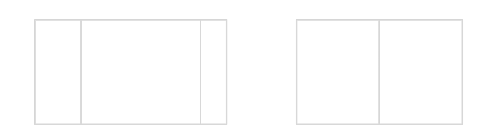
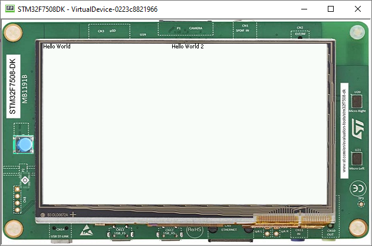

Using Layouts
=============

The lay out process determines the position and size of the widgets.
It depends on:

-  The layout of the containers: how the children are arranged within the containers.
-  The widgets content size: the size needed by the widgets for optimal display.

This process is started automatically when the desktop is shown.
It can also be triggered programmatically.

Using a Flow Layout
-------------------

The flow layout lays out any number of children horizontally or vertically, using multiple rows if necessary depending on the size of each child widget.

Creating a flow layout:

- First, instantiate a ``Flow`` container, then add two ``Label`` objets to this container. 
- Finally, add the ``Flow`` container to the ``Desktop``.

.. code:: java

   public static void main(String[] args) {
      MicroUI.start();
      Desktop desktop = new Desktop();
      Label label = new Label("Hello World");
      Label secondLabel = new Label("Hello World 2");

      Flow flowContainer = new Flow(LayoutOrientation.HORIZONTAL);
      flowContainer.addChild(label);
      flowContainer.addChild(secondLabel);

      desktop.setWidget(flowContainer);
      desktop.requestShow();
   }

Both of the labels will share the screen:

   
Using a Canvas
--------------

A canvas lays out any number of children freely.

To add a widget to a ``Canvas``, specify its position and size.

.. note::
   Using ``Widget.NO_CONSTRAINT`` sets the width and height to the optimal size of the widget.

.. code:: java

   public static void main(String[] args) {
      MicroUI.start();
      Desktop desktop = new Desktop();
      Label label = new Label("Hello World");
      Label label2 = new Label("Hello World 2");

      Canvas canvas = new Canvas();
      canvas.addChild(label, 0, 0, Widget.NO_CONSTRAINT, Widget.NO_CONSTRAINT);
      canvas.addChild(label2, 15, 15, Widget.NO_CONSTRAINT, Widget.NO_CONSTRAINT);

      desktop.setWidget(canvas);
      desktop.requestShow();
   }

.. image:: images/canvassample.png
 :align: center 

