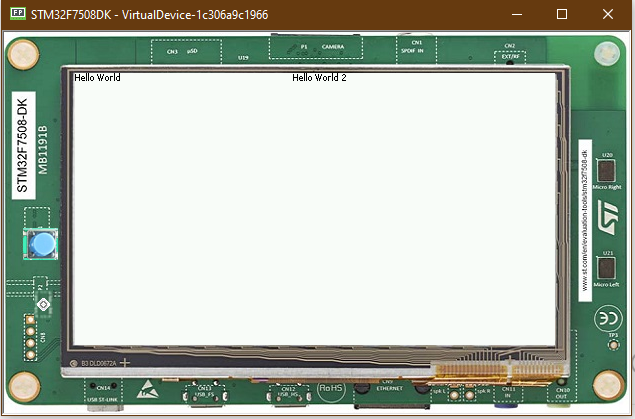
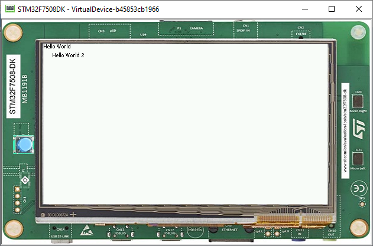

Using Layouts
=============

-  The lay out process determines the position and size of the widgets.
-  It depends on:

   -  the layout of the containers: how the children are arranged within
      the containers.
   -  the widgets content size: the size needed by the widgets for
      optimal display.
   -  This process is started automatically when the Desktop is shown.
      It can also be triggered programmatically.

Using Flow Layout
-------------------

-  Flow layout: lays out any number of children horizontally or
   vertically, using multiple rows if necessary depending on the size
   of each child widget 

   |image0|

-  Creating a Flow Layout
-  First, instantiate a ``Flow`` container, then add two ``Label`` objets to this container. 
-  Finally, add the ``Flow`` container to the ``Desktop``.

   .. code:: java

      public static void main(String[] args) {
         MicroUI.start();
         Desktop desktop = new Desktop();
         Label label = new Label("Hello World");
         Label secondLabel = new Label("Hello World 2");

         Flow flowContainer = new Flow(LayoutOrientation.HORIZONTAL);
         flowContainer.addChild(label);
         flowContainer.addChild(secondLabel);

         desktop.setWidget(flowContainer);
         desktop.requestShow();
      }

-  Both of the labels will share half of the screen 

   |image1|

   
Using Canvas
------------------

- Lays out any number of children freely.
- To add a widget to a ``Canvas``, specify its position and size.

   .. note::

    in this case, using Widget.NO\_CONSTRAINT sets the width and height to the optimal size of the widget

   .. code:: java

      public static void main(String[] args) {
         MicroUI.start();
         Desktop desktop = new Desktop();
         Label label = new Label("Hello World");
         Label label2 = new Label("Hello World 2");

         Canvas canvas = new Canvas();
         canvas.addChild(label, 0, 0, Widget.NO_CONSTRAINT, Widget.NO_CONSTRAINT);
         canvas.addChild(label2, 0, 15, Widget.NO_CONSTRAINT, Widget.NO_CONSTRAINT);

         desktop.setWidget(canvas);
         desktop.requestShow();
      }

   |image2| 

.. |image0| image:: images/flowexample.png

