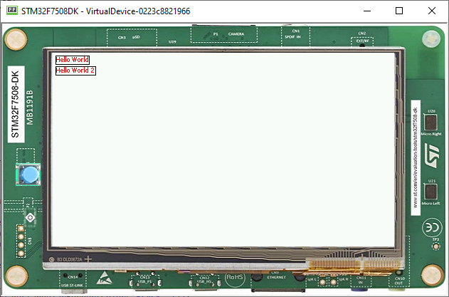

Style
=====

-  Instances of Desktop, Widget, and Container classes are semantic
   elements of the GUI, describing the structure and meaning of the
   content.
-  The Style API (ej.mwt.style) defines style options for widgets,
   allowing for a clear separation of the core structure (content) and
   the design aspects (colors, fonts, margin, padding, background,
   etc.).
   
   .. note::
    Some of the attributes are inspired by CSS, like Background,Border, Color, Dimension, Font, Alignment,Margin/Padding
    and also the CascadingStylesheet with the cascading algorithms,selectors and etc

Selectors
---------

-  Selectors determine the widget to which a style applies. There are three main types of selectors:

   -  Simple selectors (based on type,Class)
   -  Combinators (based on relationships)
   -  State Selectors (based on state) 

   .. note::
    More of this will be presented in the Advanced Styling step 

Usage
`````

-  Using a CascadingStylesheet, we can define a base style for all
   labels using a TypeSelector:

   .. code:: java

       CascadingStylesheet stylesheet = new CascadingStylesheet();
       EditableStyle style = stylesheet.getSelectorStyle(new TypeSelector(Label.class));

-  We can now change the style object options, in this sample, changing
   the base color to red and adding a black rectangular border of 1px
   thickness.

   .. code:: java

       style.setColor(Colors.RED);
       style.setBorder(new RectangularBorder(Colors.BLACK, 1));

-  For these options to take effect, bind the stylesheet to the desktop.

   .. code:: java

       desktop.setStylesheet(stylesheet);

-  The final code should look like this

   .. code:: java

      public static void main(String[] args) {
         MicroUI.start();
         Desktop desktop = new Desktop();
         Label label = new Label("Hello World");
         Label label2 = new Label("Hello World 2");

         Canvas canvas = new Canvas();
         canvas.addChild(label, 0, 0, Widget.NO_CONSTRAINT, Widget.NO_CONSTRAINT);
         canvas.addChild(label2, 0, 15, Widget.NO_CONSTRAINT, Widget.NO_CONSTRAINT);

         CascadingStylesheet stylesheet = new CascadingStylesheet();
         EditableStyle style = stylesheet.getSelectorStyle(new TypeSelector(Label.class));
         style.setColor(Colors.RED);
         style.setBorder(new RectangularBorder(Colors.BLACK, 1));

         desktop.setStylesheet(stylesheet);
         desktop.setWidget(canvas);
         desktop.requestShow();
      }

   |image2| 

Padding and Margin
~~~~~~~~~~~~~~~~~~

-  Using margin and padding its pretty simple. Adding margin and padding to widget is as follows

   .. code:: java

           style.setMargin(new UniformOutline(4));

|image0|

- Setting an oversized margin should look like this

..code:: java
         
   style.setMargin(new UniformOutline(10));
   
|image3|

-  Adding padding

   .. code:: java

           style.setPadding(new UniformOutline(2));

|image1|

- Oversizing the padding 

.. code:: java
   
   style.setPadding(new UniformOutline(15));

|image4|

- It's possible to see the widget ovelapping other when using canvas
  



