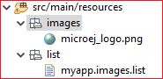
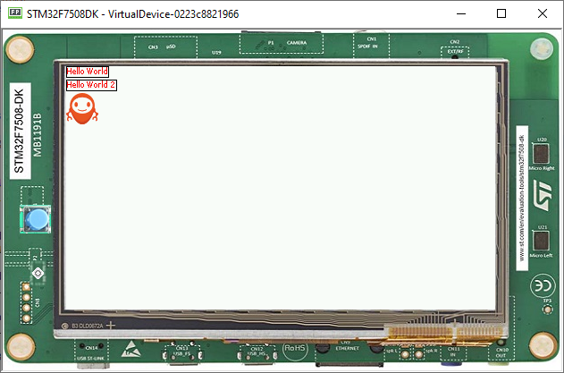

Images
======

Adding Images
----------------
- Create two packages on the Resources folder, one named list and another named images

- Create a resources list file, and add it to the list package at resources(myapp.images.list)

- copy the image to the resources/image package

- The structure should look like this:

|image0| 

-  Then go to the **myapp.images.list** and add the file

.. code::

    /images/microej_logo.png:ARGB4444

-  The image declaration in the .list file follows this pattern:

.. note:: the ARGB4444 mode was used because the image has a transparency, more info at `Images <https://docs.microej.com/en/latest/ApplicationDeveloperGuide/UI/MicroUI/images.html>`__

.. code::

    path:format

-  ``path`` is the path to the image file, relative to the ``resources`` folder.
-  ``format`` specifies how the image will be embedded in the application.

Displaying an image
-------------------

- To display this image, first create an instance of the widget ``ImageWidget``, specifying the path to the image in the constructor:

   .. code:: java

       ImageWidget image = new ImageWidget("/images/microej_logo.png");

- Add the widget to the canvas container by adding this line to the ``main`` of your application:

   .. code:: java

     canvas.addChild(image, 0, 30, Widget.NO_CONSTRAINT, Widget.NO_CONSTRAINT);

-  The final Main.java should look like this

   .. code:: java

       public static void main(String[] args) {
           MicroUI.start();
           Desktop desktop = new Desktop();
           Label label = new Label("Hello World");
           Label label2 = new Label("Hello World 2");

           Canvas canvas = new Canvas();
           canvas.addChild(label, 0, 0, Widget.NO_CONSTRAINT, Widget.NO_CONSTRAINT);
           canvas.addChild(label2, 0, 15, Widget.NO_CONSTRAINT, Widget.NO_CONSTRAINT);

           ImageWidget image = new ImageWidget("/images/microej_logo.png");
           canvas.addChild(image, 0, 30, Widget.NO_CONSTRAINT, Widget.NO_CONSTRAINT);

           CascadingStylesheet css = new CascadingStylesheet();
           EditableStyle style = css.getSelectorStyle(new TypeSelector(Label.class));
           style.setColor(Colors.RED);
           style.setBorder(new RectangularBorder(Colors.BLACK, 1));

           desktop.setStylesheet(css);
           desktop.setWidget(canvas);
           desktop.requestShow();
       }

   |image1| 

