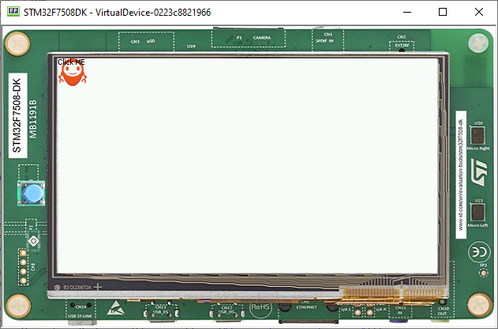

Advanced Styling
================

Imaging with stylesheets
------------------------

-  Let's add a button to the application, with the MicroEJ logo as background.
-  Since this background will apply to a specific button, introduce a new class selector that will select this button.

Class Selector
--------------

-  Just like a class on CSS, it associates to every element that is
   from the same class
-  Define a class for the button as follows:

   .. code:: java

    private static final int BUTTON = 600;

- Bind the class ``BUTTON`` to the button widget.

   .. code:: java

       Button button = new Button("Click ME");
       button.addClassSelector(BUTTON);

- Retrieve the style for this class from the stylesheet and edit the attributes:

   .. code:: java

       EditableStyle style = css.getSelectorStyle(new ClassSelector(BUTTON));

-  Finally, lets add an Image Background to this Button

   .. code:: java

       style.setBackground(new ImageBackground(Image.getImage("/images/mj.png")));

   And the result should be as follows

   .. code:: java

       public class Main {
           private static final int BUTTON = 600;

           public static void main(String[] args) {
            MicroUI.start();
            Desktop desktop = new Desktop();
            Button button = new Button("Click ME");
            button.addClassSelector(BUTTON);

            Flow flow = new Flow(LayoutOrientation.VERTICAL);
            flow.addChild(button);

            CascadingStylesheet css = new CascadingStylesheet();
            EditableStyle style = css.getSelectorStyle(new ClassSelector(BUTTON));
            style.setBackground(new ImageBackground(Image.getImage("/images/mj.png")));

            desktop.setStylesheet(css);
            desktop.setWidget(flow);
            desktop.requestShow();
            }
       }

   |image0| 

Combinator and Conditional Style
--------------------------------

-  It is possible to combine two or more Classes using a combinator
-  In this example the active state of the Button will turn the text red

   .. code:: java

       CascadingStylesheet css = new CascadingStylesheet();
       Selector imageButton = new ClassSelector(BUTTON); 
       EditableStyle style = css.getSelectorStyle(imageButton);
       style.setBackground(new ImageBackground(Image.getImage("/images/mj.png")));
       Selector activeSelector = new StateSelector(Button.ACTIVE);
       EditableStyle styleActive = css.getSelectorStyle(new AndCombinator(imageButton, activeSelector));
       styleActive.setColor(Colors.RED);  

- Instead of directly instantiating classSelector in the get selector style, the ClassSelector has been exposed to be combined with the ButtonActive selector

    |image1|

