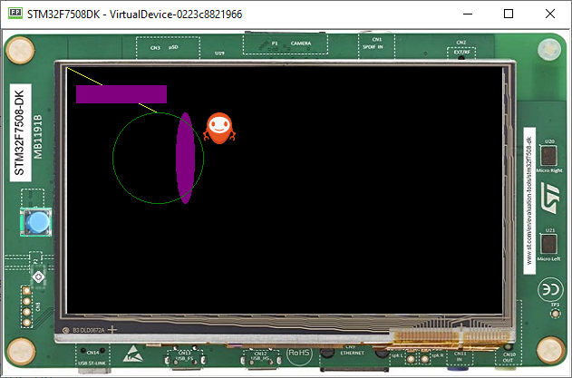
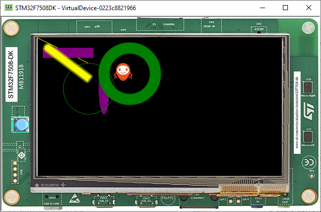

Basic drawing/Drawing on screen
===============================

-  It is also possible to have access to a drawable interface using the
   Display object that represents a pixelated version of the Display

.. code:: java
    
    public static void main(String[] args){
       Displayable myDisplayable = new Displayable() {

           @Override
           protected void render(GraphicsContext g) {
               // draws a yellow line.
               g.setColor(Colors.YELLOW);
               Painter.drawLine(g, 0, 0, 100, 50);
           }

           @Override
           public boolean handleEvent(int event) {
               return false;
           }
       };

    Display.getDisplay().requestShow(myDisplayable);
   }
   
-  This should draw a line from the coordinates of the display (0,0) going to (100,50) 
   
   |image0|
 
Drawing basic shapes
---------------------------

-  It is also possible to also draw geometric objects using the Painter class 
-  The code below paints each component the selected color(Yellow, Purple,Green)
-  The drawLine Method receives the starting and finishing point in x and y coordinates
-  Fill rectangle and ellipse methods receive x and y coordinates and also width and height
-  draw circle receives x and y and it's diameter 

   .. code:: java

       g.setColor(Colors.YELLOW);
       Painter.drawLine(g, 0, 0, 100, 50);

       g.setColor(Colors.PURPLE);
       Painter.fillRectangle(g, 10, 20, 100, 20);
       Painter.fillEllipse(g, 120, 50, 20, 100);

       g.setColor(Colors.GREEN);
       Painter.drawCircle(g, 50, 50, 100);

   |image1|
       
Drawing images
----------------------

-  Drawing the image as shown in step 3:

   .. code:: java

       Image image = Image.getImage("/images/mj.png");
       // draws the image at x,y coordinates (150, 50).
       Painter.drawImage(g, image, 150, 50);

   |image2|

Drawing Thick Shapes
--------------------
-  The ShapePainter Class offers a set of static methods to render thick shapes
-  The code below shows how to draw a Thick Faded line

   .. code:: java

       //draws a thick yellow line. 
       g.setColor(Colors.YELLOW);
       ShapePainter.drawThickFadedLine(g, 20, 20, 100, 80, 10, 6, Cap.ROUNDED, Cap.PERPENDICULAR);

       // draws a thick green circle.
       g.setColor(Colors.GREEN);
       ShapePainter.drawThickFadedCircle(g, 130, 20, 100, 20, 2);

   |image3|

.. |image0| image:: images/drawline.PNG
.. |image1| image:: images/geometry.png

