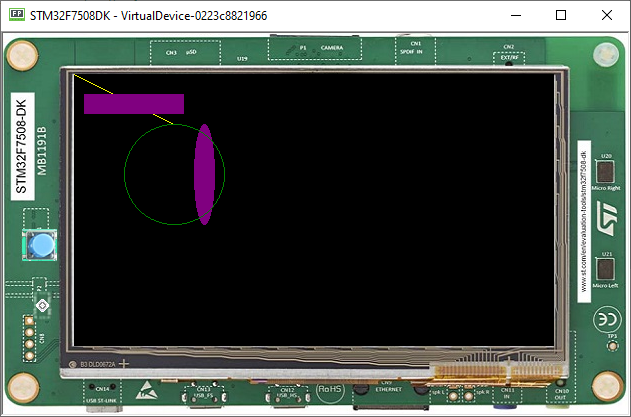

Basic drawing/Drawing on screen
===============================

-  It is also possible to have access to a drawable interface using the
   Display object that represents a pixelated version of the Display

.. code:: java

    Displayable myDisplayable = new Displayable() {

        @Override
        protected void render(GraphicsContext g) {
            // draws a yellow line.
            g.setColor(Colors.YELLOW);
            Painter.drawLine(g, 0, 0, 100, 50);
        }

        @Override
        public boolean handleEvent(int event) {
            // handles input events. We'll address this later.
            return false;
        }
    };

    Display.getDisplay().requestShow(myDisplayable);

-  This should draw a line from the coordinates of the display (0,0) going to (100,50) 
   
   |image0|
 
Geometric objects
-----------------

-  It is also possible to also draw geometric objects using Displayable

   .. code:: java

       g.setColor(Colors.YELLOW);
       Painter.drawLine(g, 0, 0, 100, 50);

       g.setColor(Colors.PURPLE);
       Painter.fillRectangle(g, 10, 20, 100, 20);
       Painter.fillEllipse(g, 120, 50, 20, 100);

       g.setColor(Colors.GREEN);
       Painter.drawCircle(g, 50, 50, 100);

   |image1|
       
Images can also be set
----------------------

-  Adding the image as shown in step 3

   .. code:: java

       Image image = Image.getImage("/images/mj.png");
       // draws the image at x,y coordinates (50, 50).
       Painter.drawImage(g, image, 150, 50);

   |image2|

Drawing Thick Shapes
--------------------

-  Drawing thick shapes is very straight forward 

   .. code:: java

       //draws a thick yellow line. 
       g.setColor(Colors.YELLOW);
       ShapePainter.drawThickFadedLine(g, 20, 20, 100, 80, 10, 6, Cap.ROUNDED, Cap.PERPENDICULAR);

       // draws a thick green circle.
       g.setColor(Colors.GREEN);
       ShapePainter.drawThickFadedCircle(g, 130, 20, 100, 20, 2);

   |image3|

.. |image0| image:: images/drawline.PNG

.. |image2| image:: images/imagedrawable.png
.. |image3| image:: images/thickshapes.png
