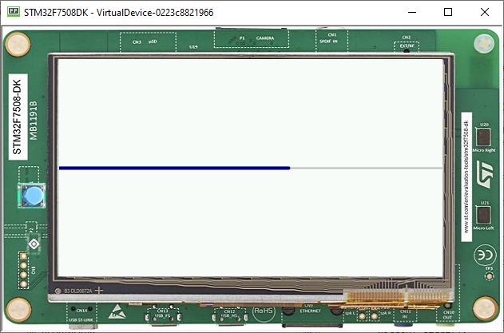

Creating Widgets
================

-  To create a Widget, you need to create a Class that extends widget
   superclass
-  In this example, you are going to create a simple progress bar

.. note::
    The computeContentOptimalSize and renderContent methods should be overridden

    .. code:: java

        public class MyProgressBarWidget extends Widget {
            @Override
            protected void computeContentOptimalSize(Size size) {
                // TODO Auto-generated method stub
            }

            @Override
            protected void renderContent(GraphicsContext g, int contentWidth, int contentHeight) {
                // TODO Auto-generated method stub
            }
        }

Setting Up
----------

-  Let's use the progress bar with a fixed size

   .. code:: java

       protected void computeContentOptimalSize(Size size) {
           size.setSize(200,50);
       }

-  Then, let's create the progress bar, first, it is important to add a
   Progress value

   .. code:: java

       private float progressValue = 0.3f;

-  Now, let's implement the renderContent method

   .. code:: java

    protected void renderContent(GraphicsContext g, int contentWidth, int contentHeight) {
        // draws the remaining bar: a 1 px thick grey line, with 1px of fading.
        g.setColor(Colors.SILVER);
        int halfHeight = contentHeight / 2;
        ShapePainter.drawThickFadedLine(g, 0, halfHeight, contentWidth, halfHeight, 1, 1, Cap.ROUNDED, Cap.ROUNDED);

        // draws the progress bar: a 3 px thick blue line, with 1px of fading.
        g.setColor(Colors.NAVY);
        int barWidth = (int) (contentWidth * this.progressValue);
        ShapePainter.drawThickFadedLine(g, 0, halfHeight, barWidth, halfHeight, 3, 1, Cap.ROUNDED, Cap.ROUNDED);
    }

-  Finally, let's create a method to set the progress on the ProgressBar

   .. code:: java

       public void setProgress(float progress) {
           this.progressValue = progress;
       }

Using with Animator
-------------------

-  Using the code made in the previous Animation tutorial, doing the modifications below, it is
   possible to see the progress bar animated

   .. code:: java

    public static void main(String[] args) {
        MicroUI.start();
        Desktop desktop = new Desktop();
        final MyProgressBarWidget pb = new MyProgressBarWidget();
        Flow flow = new Flow(LayoutOrientation.VERTICAL);
        flow.addChild(pb);

        Animation progressBarAnimation = new Animation() {

            float progress = 0.3f;

            @Override
            public boolean tick(long currentTimeMillis) {
                pb.setProgress(this.progress += 0.001f);
                pb.requestRender();
                return true;
            }
        };
        Animator animator = new Animator();
        animator.startAnimation(progressBarAnimation);
        desktop.setWidget(flow);
        desktop.requestShow();
    }

   |image0|

