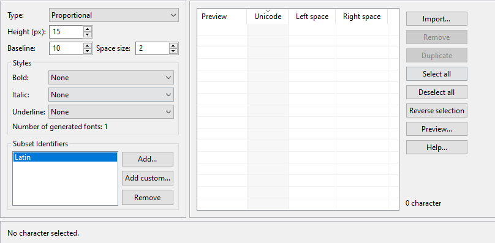

Fonts
=====

-  Fonts are graphical resources that can be accessed with a call to
   ej.microui.display.Font.getFont(). To be displayed, these fonts have
   to be converted at build-time from their source format to the display
   raw format by the font generator tool.
-  Fonts, just like images, must be declared in a ``*.fonts.list`` file. 

Creating a font
---------------

-  To create a font, go to the package you want to store your fonts in,
   normally :guilabel:`Resources`> :guilabel:`fonts`.
-  Then :guilabel:`Right-Click` > :guilabel:`New` > :guilabel:`Other`> :guilabel:`MicroEJ` > :guilabel:`MicroEJ Font`:

-  Then, select the name of the font:

.. image:: images/fontname.png
    :align: center

- Click on :guilabel:`Finish`, the following window should open:

.. note::
 It is important to have the font that you want installed on your system already.

- To choose what font you will use you click on :guilabel:`Import...` and the following should open:

.. image:: images/importfonts1.png
    :align: center

- Here you will click on :guilabel:`Next` and then select the font you want to use as shown below:

.. image:: images/importfonts2.png
    :align: center

.. note::

   If you are using a latin based alphabet, just leave the settings as they are and click :guilabel:`Finish`, don't Forget to adjust the height and baseline of the font.

- Click :guilabel:`Finish` and save the file. The font should be imported in the .ejf file.

- Then just add the font to a myapp.fonts.list file you'll create resources sources folder of your application:

   .. code::

      /fonts/NewFont.ejf

Adding the Font to a Label
--------------------------

-  To add the font, you must change the font in the StyleSheet:

.. code:: java

   public class Main {
      private static final int BUTTON = 600;

      public static void main(String[] args) {
         MicroUI.start();
         Desktop desktop = new Desktop();
         Flow flow = new Flow(LayoutOrientation.VERTICAL);
         Label l = new Label("Hello World");
         l.addClassSelector(BUTTON);
         Font font = Font.getFont("/fonts/NewFont.ejf");
         CascadingStylesheet css = new CascadingStylesheet();
         EditableStyle style = css.getSelectorStyle(new ClassSelector(BUTTON));
         flow.addChild(l);
         style.setFont(font);
         desktop.setStylesheet(css);
         desktop.setWidget(flow);
         desktop.requestShow();
      }
   }

.. note::
   Don't forget to add the Stylesheet to the Desktop.

.. image:: images/font.png
    :align: center 
