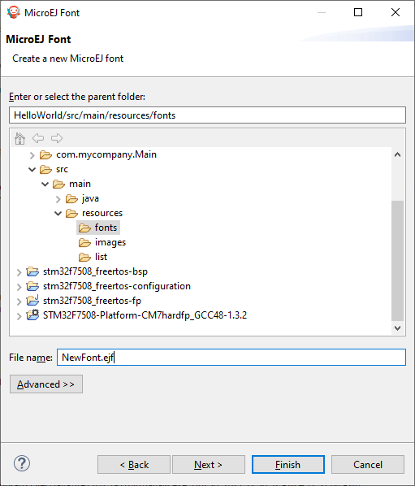
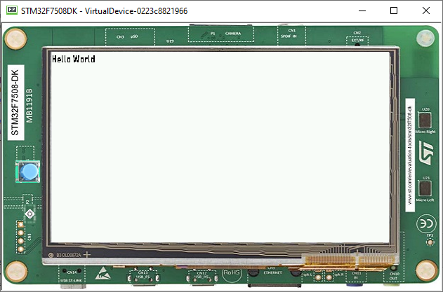
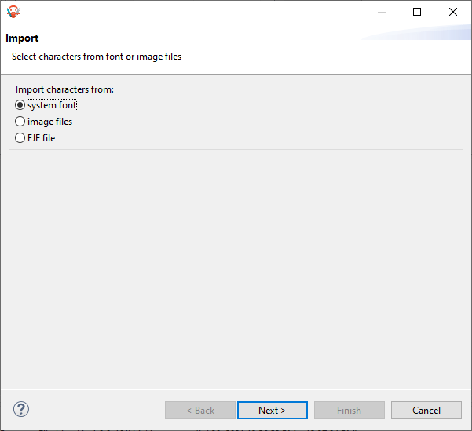
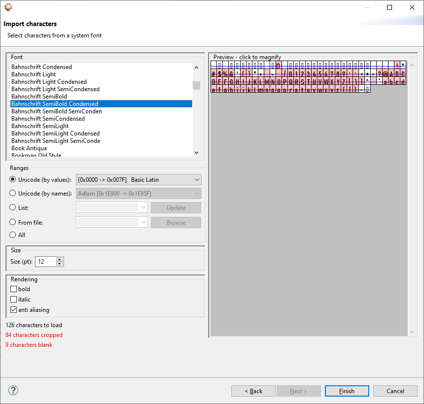

Fonts
=====

-  Fonts are graphical resources that can be accessed with a call to
   ej.microui.display.Font.getFont(). To be displayed, these fonts have
   to be converted at build-time from their source format to the display
   raw format by the font generator tool.
-  Fonts, just like images, must be declared at the \yourapp.fonts.list 

Creating a font
---------------

-  To create a font, go to the package you want to store your fonts in,
   Normally **Resources-> fonts**
-  Then **Right-Click->New->Other->MicroEJ->MicroEJ Font**

|image4| 

-  Then, select the name of the font

|image0|

- After that, the following window should open

|image1|

.. note::
 It is important to have the font that you want installed at the system already

- To choose what font you will use you click on **Import...** and the following should open

|image5|

- Here you will click on **Next** and then select the font you want to use as shown below

|image6|

.. note::

   If you are using a latin based alphabet, just leave the settings as they are and click finish

- Click finish and save the file. The font should be imported in the .ejf file

- Then just add the font to the \yourapp.font.list file

   .. code::

      /fonts/NewFont.ejf

Adding the font to a Label
--------------------------

-  To add the font, you simple change the font on a StyleSheet

.. code:: java

   public class Main {
      private static final int BUTTON = 600;

      public static void main(String[] args) {
         MicroUI.start();
         Desktop desktop = new Desktop();
         Flow flow = new Flow(LayoutOrientation.VERTICAL);
         Label l = new Label("Hello World");
         l.addClassSelector(BUTTON);
         Font font = Font.getFont("/fonts/NewFont.ejf");
         CascadingStylesheet css = new CascadingStylesheet();
         EditableStyle style = css.getSelectorStyle(new ClassSelector(BUTTON));
         flow.addChild(l);
         style.setFont(font);
         desktop.setStylesheet(css);
         desktop.setWidget(flow);
         desktop.requestShow();
      }
   }

.. note::
   Don't forget to add the Style to the Desktop

|image3| 

.. note::
   The font used was FiraCode

.. |image1| image:: images/fonteditor.png
.. |image2| image:: images/selectsysfont.PNG

.. |image4| image:: images/microejfont.PNG

