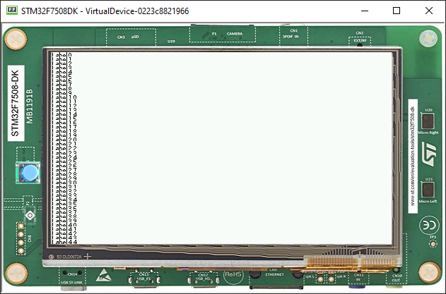

Scroll List
===========

List
----

-  A list is a Container that resizes each of its children accordingly.
-  Naturally, it shows some issues if you add too many components.
-  Adding 45 item to a List shows the following result:

.. code:: java

	public static void main(String[] args) {
		MicroUI.start();
		Desktop desktop = new Desktop();

		Flow flow = new Flow(LayoutOrientation.VERTICAL);

		List list = new List(LayoutOrientation.VERTICAL);
		for (int i = 0; i < 45; i++) {
			Label lbl = new Label("Label" + i);
			lbl.addClassSelector(LIST_ITEM);
			list.addChild(lbl);
		}

		flow.addChild(list);

		desktop.setWidget(flow);
		desktop.requestShow();
	}

-  Using MicroEJ, it is possible to create a Scrollable List to avoid this issue.

Scrollable List
---------------

-  It is possible to create our own components, for example a Scrollable Container.
-  The full implementation of the class is available at `Widget Demo <https://github.com/MicroEJ/Demo-Widget/tree/master/com.microej.demo.widget/src/main/java/com/microej/demo/widget/scrollablelist/widget>`__
-  Copy the classes in your project.
-  The use is pretty simple:

.. code:: java 

   public class Main {
      private static final int LIST_ITEM = 600;

      public static void main(String[] args) {
         MicroUI.start();
         Desktop desktop = new Desktop();
         Label label = new Label("Hello World");
         Label label2 = new Label("Hello World 2");
         ScrollableList list = new ScrollableList(LayoutOrientation.VERTICAL);
         for (int i = 0; i < 45; i++) {
            Label lbl = new Label("Label" + i);
            lbl.addClassSelector(LIST_ITEM);
            list.addChild(lbl);
         }
         CascadingStylesheet css = new CascadingStylesheet();
         Scroll scroll = new Scroll(LayoutOrientation.VERTICAL);
         scroll.setChild(list);
         desktop.setStylesheet(css);
         desktop.setWidget(scroll);
         desktop.requestShow();
      }
   }

- Using the scroll container (called Scroll), then adding the ScrollableList as a Child.
- It should look like this:

.. image:: images/scrollbar.png
    :align: center
