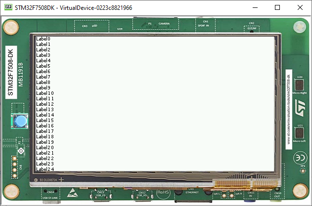

Scroll List
===========

List
----

-  A list is a Container that resizes each of its children accordingly
-  Naturally, It shows some issues if you add too many components
-  Using as an example the code used before, adding
   20 components shows the following result 

-  Using MicroEJ, it is possible to create a Scrollable List to avoid this issue

.. code:: java

   List list = new List(LayoutOrientation.VERTICAL);
   for (int i = 0; i < 45; i++) {
      Label lbl = new Label("Label" + i);
      lbl.addClassSelector(BUTTON);
      list.addChild(lbl);
   }

.. image:: images/listsample.png
    :align: center

Scrollable List
---------------

-  It is possible to create our own components, so, for example, it is
   possible to use a Scrollable Container
-  The full implementation of the class is available at `Widget Demo <https://github.com/MicroEJ/Demo-Widget/tree/master/com.microej.demo.widget/src/main/java/com/microej/demo/widget/scrollablelist/widget>`__
-  The usage is pretty simple 

.. code:: java 

   public class Main {
      private static final int BUTTON = 600;

      public static void main(String[] args) {
         MicroUI.start();
         Desktop desktop = new Desktop();
         Label label = new Label("Hello World");
         Label label2 = new Label("Hello World 2");
         ScrollableList list = new ScrollableList(LayoutOrientation.VERTICAL);
         for (int i = 0; i < 45; i++) {
            Label lbl = new Label("Label" + i);
            lbl.addClassSelector(BUTTON);
            list.addChild(lbl);
         }
         CascadingStylesheet css = new CascadingStylesheet();
         Scroll scroll = new Scroll(LayoutOrientation.VERTICAL);
         scroll.setChild(list);
         desktop.setStylesheet(css);
         desktop.setWidget(scroll);
         desktop.requestShow();
      }
   }

- Using the scroll container(Called Scroll), then adding the ScrollableList as a Child 
- It should look like this

