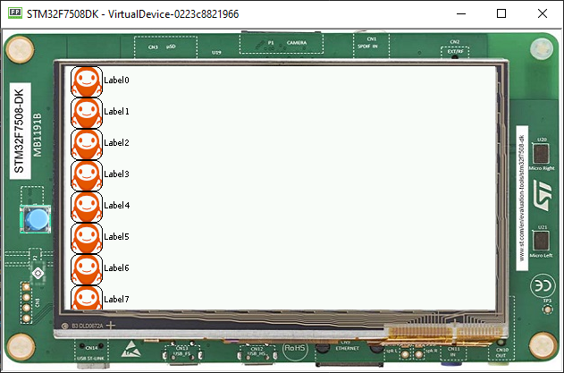

Creating a Contact List using Scroll List
=========================================

Creating the contact widget
---------------------------

-  As explained in Creating Widget , it is possible to create our own widget by
   just extending the Widget class
-  First, let's create a constructor with all the things that we are
   going to need for this

.. code:: java

    public ContactWidget(String contactname, Image img) {
        this.cname = contactname;
        this.img = img;
    }

-  Then, overriding the two abstract methods of Widget

.. code:: java

    @Override
    protected void computeContentOptimalSize(Size size) {
        // TODO Auto-generated method stub
        Font f = getStyle().getFont();
        int width = f.stringWidth(this.cname);
        int height = f.getHeight() * 2;
        size.setSize(width, (int) (height * 2.5));

    }

.. code:: java

    @Override
    protected void renderContent(GraphicsContext g, int contentWidth, int contentHeight) {
        // TODO Auto-generated method stub

        g.setColor(Colors.WHITE);
        int x0 = 0;
        int y0 = 0;
        int x1 = contentWidth;
        int y1 = contentHeight;
        int circleRadius = contentHeight * 7 / 10;
        ShapePainter.fillPolygon(g, new int[] { x0, y0, x0, y1, x1, y1, x1, y0 });
        g.setColor(Colors.BLACK);
        StringPainter.drawStringAtPoint(g, this.cname, getStyle().getFont(), circleRadius + 15, contentHeight / 2, 0, 0);
        g.setColor(Colors.BLACK);
        ImagePainter.drawImageInArea(g, this.img, contentWidth * 1 / 100, contentHeight / 4, 1, 1, 0, 0);
        ShapePainter.drawThickCircle(g, contentWidth * 1 / 100, contentHeight / 4, circleRadius, 2);

    }

-  Then, simply add it to the List used in the last step

   .. code:: java

        for (int i = 0; i < 45; i++) {
            list.addChild(new ContactWidget("Label" + i, Image.getImage("/images/mj.png")));
        }

- The class should be as follows

   .. code:: java
   
    public class ContactWidget extends Widget {

        String cname;
        Image img;

        public ContactWidget(String contactname, Image img) {
            this.cname = contactname;
            this.img = img;
        }

        @Override
        protected void computeContentOptimalSize(Size size) {
            Font f = getStyle().getFont();
            int width = f.stringWidth(this.cname);
            int height = f.getHeight() * 2;
            size.setSize(width, (int) (height * 2.5));

        }

        @Override
        protected void renderContent(GraphicsContext g, int contentWidth, int contentHeight) {
            g.setColor(Colors.WHITE);
            int x0 = 0;
            int y0 = 0;
            int x1 = contentWidth;
            int y1 = contentHeight;
            int circleRadius = contentHeight * 7 / 10;
            ShapePainter.fillPolygon(g, new int[] { x0, y0, x0, y1, x1, y1, x1, y0 });
            g.setColor(Colors.BLACK);
            StringPainter.drawStringAtPoint(g, this.cname, getStyle().getFont(), circleRadius + 15, contentHeight / 2, 0, 0);
            g.setColor(Colors.BLACK);
            ImagePainter.drawImageInArea(g, this.img, contentWidth * 1 / 100, contentHeight / 4, 1, 1, 0, 0);
            ShapePainter.drawThickCircle(g, contentWidth * 1 / 100, contentHeight / 4, circleRadius, 2);

        }
    }

- And it should look like this:

|image0|

