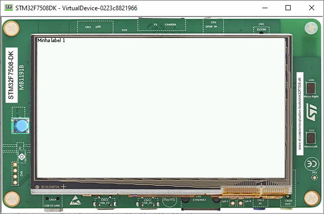
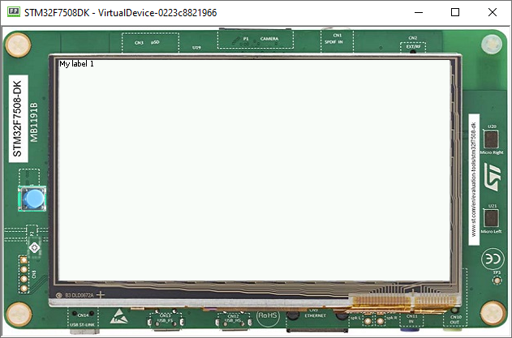

Internationalization
====================

Using PO Files
--------------
- PO files are a good way to handle Internationalization
- Documentation is available `here <https://www.gnu.org/software/gettext/manual/gettext.html#PO-Files>`__
- In this example, let's create two PO files for two different languages(English and Portuguese) and add them to **resources/nls**

- Label_en_us.po

.. code:: po

    msgid ""
    msgstr ""
    "Language: en_US\n"
    "Language-Team: English\n"
    "MIME-Version: 1.0\n"
    "Content-Type: text/plain; charset=UTF-8\n"

    msgid "Label1"
    msgstr "My label 1"

    msgid "Label2"
    msgstr "My label 2"

- Labels_pt_br.po

.. code:: po

    msgid ""
    msgstr ""
    "Language: pt_BR\n"
    "Language-Team: Portuguese\n"
    "MIME-Version: 1.0\n"
    "Content-Type: text/plain; charset=UTF-8\n"

    msgid "Label1"
    msgstr "Minha label 1"

    msgid "Label2"
    msgstr "Minha label 2"

- These PO files have to be converted to be usable by the application
- In order to let the build system know which PO files to process, they must be referenced in MicroEJ Classpath myapp.nls.list file

Configuring NLS in MicroEJ
--------------------------
- First add those two dependencies

.. code:: xml

    <dependency org="ej.library.runtime" name="nls" rev="3.0.1"/> 
    <dependency org="com.microej.library.runtime" name="nls-po" rev="2.2.0"/>

- Then, let's create a myapp.nls.list file, and put it in the **resources/list** folder. The file should look like this

.. code::

    com.mycompany.myapp.Labels

.. note::

  For each line, PO files whose name starts with the interface name (Messages and Labels in the example) are retrieved from the MicroEJ Classpath and used to generate:

  - a Java interface with the given FQN, containing a field for each msgid of the PO files
  - a NLS binary file containing the translations
 
Usage
-----
- Import the interface set in the nls.List file 
  
.. code::

    import com.mycompany.myapp.Labels;

- Then, Check which languages are available, and set the Locale

.. code:: java
    
    for (String l : Labels.NLS.getAvailableLocales()) {
        System.out.println(l);
    }
    System.out.println(Labels.NLS.getCurrentLocale());
    Labels.NLS.setCurrentLocale("pt_BR"); 

- Finally, set the String to a label. the code should look like this
 
.. code:: java

    public static void main(String[] args) {
        MicroUI.start();
        Desktop desktop = new Desktop();
        Labels.NLS.setCurrentLocale("pt_BR");
        // for english locale uncomment the line below and comment the pt_BR locale setter call
        // Labels.NLS.setCurrentLocale("en_US");
        Label label = new Label(Labels.NLS.getMessage(Labels.Label1));
        desktop.setWidget(label);
        desktop.requestShow();
    }

- The result should look like this

- Setting the locale to "en_us" the result should be as follows

