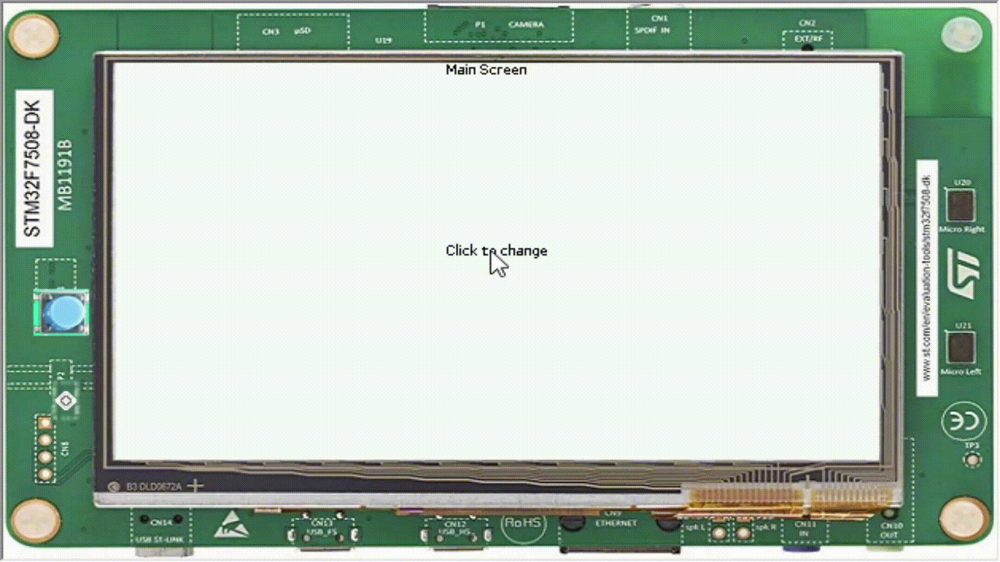

Transitions
===========

- All apps need some animation, be it on its components or when changing screens. In this step you will learn how to make screen transition animations.
- All the code needed for this tutorial can be found `here <link>`__.

Motion
------

- The most important thing for the transition is the motion, it is responsible for calculating how the animation will be made, there are various Motion functions, but in this transition we are using the ``QuadEaseOutFunction``

.. code:: java

    private static Motion createMotion(boolean forward) {
        int width = Display.getDisplay().getWidth();
        if (forward) {
            return new Motion(QuadEaseOutFunction.INSTANCE, width, 0, DURATION);
        } else {
            return new Motion(QuadEaseOutFunction.INSTANCE, 0, width, DURATION);
        }
    }

- In this case we are using the motion function QuadEaseOut to calculate where the X will be at each given frame when it is moving foward - from the width of the screen to the start of the screen - or backwards, which inverts the starting and ending points.
- After creating the motion you will need to make sure that the result from the motion is updated on the screen to where you want it to be. This can be made by overwriting the tick method and using its ``value`` to set the position of the ``Desktop``.

.. code:: java

    @Override
    public void tick(int value, boolean finished) {
        if (finished) {
            this.newDesktop.requestShow();
        } else {
            this.currentPosition = value;
            requestRender();
        }
    }

.. note::
    ``currentPosition`` is an int variable created to represent the position updated from the ``Motion``.

- With the updated value you can now update the screen with the current position of the ``Desktop``.

.. code:: java

    @Override
    protected void render(GraphicsContext gc) {
        Display display = Display.getDisplay();
        int displayWidth = display.getWidth();
        int displayHeight = display.getHeight();

        int currentPosition = this.currentPosition;

        if (this.forward) {
            renderNewDesktop(gc, currentPosition, currentPosition, displayWidth - currentPosition);
        } else {
            int lastPosition = this.lastPosition;
            Painter.drawDisplayRegion(gc, lastPosition, 0, displayWidth - currentPosition, displayHeight,
                    currentPosition, 0);
            renderNewDesktop(gc, 0, lastPosition, currentPosition - lastPosition);
        }

        this.lastPosition = currentPosition;
    }

    private void renderNewDesktop(GraphicsContext gc, int x, int clipX, int clipWidth) {
        gc.setClip(clipX, 0, clipWidth, gc.getHeight());
        gc.setTranslation(x, 0);

        Desktop newDesktop = this.newDesktop;
        newDesktop.setAttached();
        Widget widget = newDesktop.getWidget();
        assert (widget != null);
        widget.render(gc);
    }

.. note::
    Same as ``currentPosition``, ``lastPosition`` is used to calculate the position to draw the ``Desktop``.

Changing screen
---------------

- To change the screen you need to request for the display to show the Desktop instance you want, that could be done by calling ``requestShow(desktop)`` 

.. code:: java

    Display.getDisplay().requestShow(desktop);

- Now to use the animation that we created when changing the screen.

.. code:: java

    public static void main(String[] args) {
        MicroUI.start();
        mainScreen = new Desktop();
        Label title = new Label("Main Screen");
        Button changeScreen = new Button("Click to change the screen");
        Canvas canvas = new Canvas();
        int titleWidth = 64;
        int buttonWidth = 64;
        int buttonHeigth = 24;
        int titleX = Alignment.computeLeftX(titleWidth, 0, Display.getDisplay().getWidth(), Alignment.HCENTER);
        int buttonX = Alignment.computeLeftX(buttonWidth, 0, Display.getDisplay().getWidth(), Alignment.HCENTER);
        int buttonY = Alignment.computeTopY(buttonHeigth, 0, Display.getDisplay().getHeight(), Alignment.VCENTER);
        canvas.addChild(title, titleX, 0, titleWidth, Widget.NO_CONSTRAINT);
        canvas.addChild(changeScreen, buttonX, buttonY, buttonWidth, buttonHeigth);
        changeScreen.setOnClickListener(new OnClickListener() {

            @Override
            public void onClick() {
                NewDesktop newDesktop = new NewDesktop();
                TransitionDisplayable displayable = new TransitionDisplayable(newDesktop, true);
                Display.getDisplay().requestShow(displayable);
            }
        });
        mainScreen.setWidget(canvas);
        mainScreen.requestShow();
    }

- And it should look like this

|image0|

