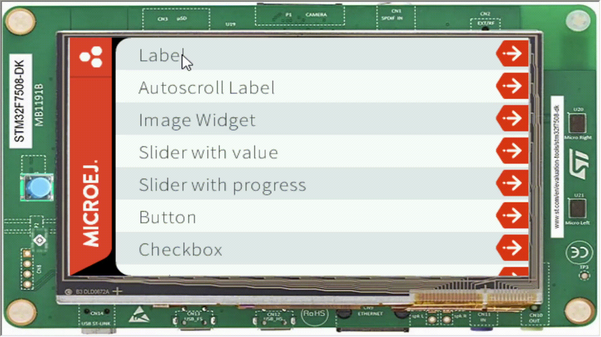

Menu
====

- Menus are a good way of showing what your app has to offer, it can display a preview of what you want to show so the user can choose from it.
- All the code used on this article can be found `here <https://github.com/MicroEJ/Demo-Widget/>`__

Menu Items
----------

- First you will need to have a class that represents the items you will show. This class should be responsible for receiving the click event used for transition to the other parts of your app and should also have a title to indicate what it is.

.. code:: java

    public class MenuItem extends Label {

        private @Nullable OnClickListener onClickListener;

        /**
            * Creates a button with the given text to display.
            *
            * @param text
            *            the text to display.
            */
        public MenuItem(String text) {
            super(text);

            this.onClickListener = null;
        }

        /**
            * Sets the listener on the click events of this button.
            *
            * @param listener
            *            the listener to set.
            */
        public void setOnClickListener(@Nullable OnClickListener listener) {
            this.onClickListener = listener;
        }

        @Override
        public void onShown() {
            setEnabled(true);
        }

        @Override
        public boolean handleEvent(int event) {
            int type = Event.getType(event);
            if (type == Pointer.EVENT_TYPE) {
                int action = Buttons.getAction(event);
                if (action == Buttons.RELEASED) {
                    handleClick();
                    return true;
                }
            }

            return super.handleEvent(event);
        }

        /**
            * Handles a click event.
            */
        public void handleClick() {
            OnClickListener listener = this.onClickListener;
            if (listener != null) {
                listener.onClick();
            }
        }
    }

- To display all the items you could populate a ``ScrollableList`` with all the items and set it's OnClickListener to transition the screen, on this example it can be done using:

.. code:: java

    public Widget getContentWidget() {
        ScrollableList list = new ScrollableList(LayoutOrientation.VERTICAL);
        int numPages = Pages.getNumPages();
        for (int i = 0; i < numPages; i++) {
            final Page page = Pages.getPage(i);
            MenuItem goToPage = new MenuItem(page.getName());
            goToPage.addClassSelector(LIST_ITEM);
            list.addChild(goToPage);
            goToPage.setOnClickListener(new OnClickListener() {
                @Override
                public void onClick() {
                    Navigation.showPage(page);
                }
            });
        }

        Scroll scroll = new Scroll(LayoutOrientation.VERTICAL);
        scroll.setChild(list);
        return scroll;
    }

.. note::
    ``Page`` and ``ScrollableList`` are components created for this tutorial. All the code used to create them are available on the `Demo Widget github <https://github.com/MicroEJ/Demo-Widget/>`__

- With this you now have a component that can be used as a Menu to allow the user to navigate on your app.

|image0|

