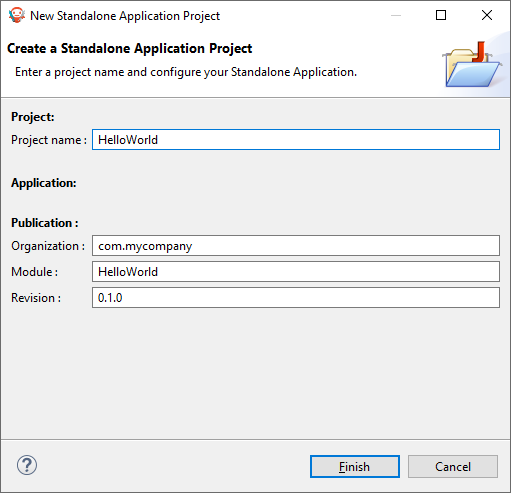

Start your first MicroEJ GUI application in 15 Minutes
======================================================

Prerequisites
-------------

- Supported Operating System: MICROEJ SDK runs on the following operating systems: Windows (7, 8, 8.1, 10), Linux, macOS.
- A Java™ Runtime Environment 8 is needed on your host computer for running MICROEJ SDK Dist. 21.03. [Download Java™ Runtime Environments]

Download and Install
--------------------

#.  Download the installer package corresponding to your host computer OS `MicroEJ SDK <https://repository.microej.com/packages/SDK/>`__

#.  Unzip the downloaded installer package if needed and execute the installer.

Start the IDE for the first time
--------------------------------

#. Start MicroEJ SDK and select a workspace. 

   .. note::

      If you are not familiar with Eclipse workspaces, select the default and press OK.
   
#. Select the MicroEJ repository to import MicroEJ Architectures
   from. 

   .. note::

      If you are not familiar with MicroEJ repositories, select the default and press OK.

Prepare platform sources
------------------------

#. Download and unzip the platform sources for  STM32F7508 
   - `Github <https://github.com/MicroEJ/Platform-STMicroelectronics-STM32F7508-DK>`__

#. Select the :guilabel:`File` > :guilabel:`Import` > :guilabel:`General` > :guilabel:`Existing Projects into Workspace` 
#. click on :guilabel:`Select archive file` and browse for the previously
   extracted folder to locate the **MicroEJ Platform Reference
   Implementation file(e.g.STM32F7508-KUVW3-platformSource.zip)** then
   import all available Eclipse projects,and then click :guilabel:`Finish`

.. image:: images/workspace.png 
   :align: center

Create your license
-------------------

#. Go to `license.microej.com <https://license.microej.com>`__ and create a new account.
#. After receiving the confirmation e-mail, login to your account and
   click on :guilabel:`Activate a License.`
#. Set Product P/N: to 9PEVNLDBU6IJ.
#. To get your UID from the MicroEJ SDK, select :guilabel:`Window` > :guilabel:`Preferences` > :guilabel:`MicroEJ` > :guilabel:`Architectures` > :guilabel:`click on one of the available architectures and press Get UID`. 

.. raw:: html

   

           <video width="960" height="540" muted="on" controls="controls" >
                   <source src="https://developer.microej.com/wp-content/uploads/2020/04/sdk_sc_2-get-your-uid.mp4" type="video/mp4">
           </video>
   

#. Wait for the e-mail confirmation and download the attached zip file
   that contains your activation key. 

   .. note::
   
      You should receive your activation key by email in less than 5 minutes. If not, please contact support@microej.com.

Activate your license
---------------------

#. Back in MicroEJ SDK, select the :guilabel:`Window` > :guilabel:`Preferences` > :guilabel:`MicroEJ` menu
   and press Add... to select the downloaded activation key archive
   file.
#. Go to Architectures sub-menu and check that all architectures are now
   activated (green check). 

.. raw:: html

   

           <video width="960" height="540" muted="on" controls="controls" >
                   <source src="https://developer.microej.com/wp-content/uploads/2020/04/generate-you-activation-key.mp4" type="video/mp4">
           </video>
   

Build Your Platform
-------------------

#. Inside the :guilabel:`stm32f7508_freertos-configuration` project, open the
   **.platform** File MicroEJ platform configuration file. From this
   MicroEJ platform configuration file, click on the link Build Platform
   
.. image:: images/buildplat.png
   :align: center

#. The message should say build successful and the platform you builded should be seen at the sdk

Create a New Project
--------------------

#. First, Go to :guilabel:`File` > :guilabel:`New` > :guilabel:`Standalone Application Project`

#. The Project Structure should look like this:

.. image:: images/structure.png
   :align: center

Featured project Demo Widget
------------------------------

You can have a look at the demo widget project, which contains multiple samples of widgets and usages

- `Widget Demo GitHub Repository <https://github.com/MicroEJ/Demo-Widget>`__

.. image:: images/widgetdemo.png
   :align: center

